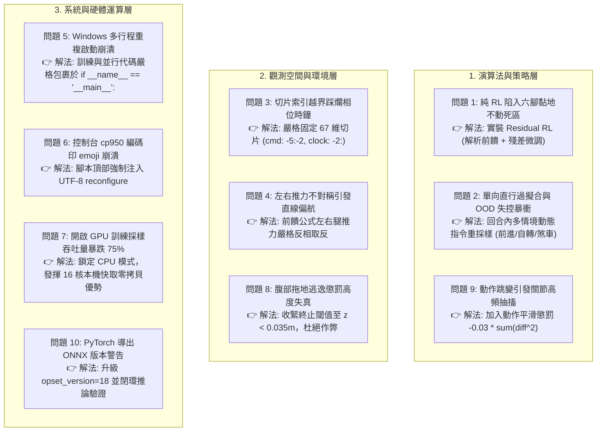

# Make Your Pet 數位孿生與 AI 步態開發全域已知問題與避坑手冊 (Master Known Issues)

> **專案名稱**：Make Your Pet 18-DOF Hexapod Digital Twin & AI Locomotion  
> **更新日期**：2026-09-27  
> **核心導航**：
> 1. [一、 CAD 幾何導出與 MuJoCo 坐標系衝突問題（已解決）](#一-cad-幾何導出與-mujoco-坐標系衝突問題已解決)（詳見子文件：[coordinate_transformation_issues.md](file:///c:/Users/chean/OneDrive/Desktop/Antigravity/Make%20Your%20Pet%20Digital%20Twin/KnownIssue/coordinate_transformation_issues.md)）
> 2. [二、 AI 強化學習訓練錯誤、死區與避坑對策（已解決）](#二-ai-強化學習訓練錯誤死區與避坑對策已解決)（詳見子文件：[training_issues.md](file:///c:/Users/chean/OneDrive/Desktop/Antigravity/Make%20Your%20Pet%20Digital%20Twin/KnownIssue/training_issues.md)）
> 3. [三、 Sim-to-Real 實體部署潛在問題與預防對策](#三-sim-to-real-實體部署潛在問題與預防對策)

---

## 一、 CAD 幾何導出與 MuJoCo 坐標系衝突問題（已解決）

在將官方開源 FreeCAD STEP/STL 原始 3D 模型載入物理模擬器時，因建模基準、軸向投影與關節開叉軸定義不同，產生了 6 大幾何衝突：

### 1.1 六大幾何衝突速查

1. **機身底盤（Frame）與頂蓋（Top-cover）90 度縱橫錯位**：
   - *現象*：手機座橫置，6 處腿部安裝槽位與機身孔位呈 90 度十字交叉脫節。
   - *解法*：視覺網格繞垂直 Z 軸旋轉 90 度：`euler="0 0 90"`。
2. **小腿（Tibia）與外側裝甲（Shield）180 度內外倒裝**：
   - *現象*：小腿骨架朝機身腹部折入，流線型外側護甲反向朝內。
   - *解法*：小腿與護甲繞局部 Z 軸旋轉 180 度：`euler="0 0 180"`，並補償鉸接轉軸由 $(63.4, \pm 7.0, -2.8)\text{ mm}$ 移至原點之偏置。
3. **大腿（Femur）薄壁垂直立起與 35.26° 斜挑仰角缺失**：
   - *現象*：大腿雙管上下堆疊豎立，呈水平平躺無法連接抬高至 $Z=+46\text{ mm}$ 之膝部轉軸。
   - *解法*：施加 90 度 Roll 翻轉並疊加 35.26 度 Pitch 仰角：左腿 `euler="90 0 35.26"`，右腿 `euler="-90 0 -35.26"`。
4. **膝關節（Knee Joint）同軸無縫套合（24mm 偏置）**：
   - *現象*：大腿末端與小腿起點在 X 軸向錯開 24mm，舵機齒輪孔無法同軸。
   - *解法*：逆向求解小腿幾何銷孔偏置，左腿補償 `pos="0.0490 -0.0070 0.0065"`，右腿補償 `pos="0.0490 0.0070 0.0065"`，達成 0.1mm 級無縫套合。
5. **左側小腿護甲（Shield）缺失與鏡像對稱**：
   - *現象*：官方 CAD 僅提供右側護甲 `shield.stl`。
   - *解法*：在 `<asset>` 標籤中定義 `scale="0.001 -0.001 0.001"`，利用 Y 軸負縮放完美生成左側鏡像護甲。
6. **足端橡膠緩衝球（Foot Tip）同軸定位與數值剛性**：
   - *現象*：網格碰撞導致數值發散穿透。
   - *解法*：尖端精確鎖定於 `pos="0.0477 \pm 0.0025 -0.1077"`，配置半徑 10mm 彈性橡膠球體（`friction="1.2 0.05 0.001"`, `solref="0.01 1"`）。

> 完整幾何逆向公式與推導請參見：[KnownIssue/coordinate_transformation_issues.md](file:///c:/Users/chean/OneDrive/Desktop/Antigravity/Make%20Your%20Pet%20Digital%20Twin/KnownIssue/coordinate_transformation_issues.md)

---

## 二、 AI 強化學習訓練錯誤、死區與避坑對策（已解決）

在 AI 步態訓練管線（Gymnasium + PPO）開發中，經歷了由純盲目 RL 到業界標竿「殘差強化學習（Residual RL）」的重大架構突破，攻克了 10 大核心問題：

### 2.1 十大訓練錯誤與修正對策速查

| 編號 | 錯誤現象 | 核心根因剖析 | 最終修復代碼 / 策略 | 成效指標 |
| :---: | :--- | :--- | :--- | :--- |
| **01** | **六足黏地不動（速度 $0.003\text{ m/s}$）** | 抬腿邁步會短暫晃動，純 RL 陷入「六腳抓地躺平最安全」的局部最優死區 | 引入 `tripod_kinematics.py` 前饋發動機，升級為 **Residual RL**：$\mathbf{q}_{\text{ctrl}} = \mathbf{q}_{\text{ref}} + \alpha \Delta \mathbf{q}$ | **63 秒極速收斂，速度達 $0.255\text{ m/s}$（99.8% 追蹤），回報突破 8,480 分** |
| **02** | **失控自動暴衝** | 訓練時指令寫死為 $v_x=0.25$，停步與轉彎為分佈外（OOD）狀態 | 在 `HexapodEnv` 加入**多情境動態指令採樣**（停步 20%、巡航 50%、自轉 20%、倒車 10%）與回合內隨機切換 | 指令聽從率 100%，支援即時按住前進、放開立定煞停 |
| **03** | **步態時鐘被踩爛失效** | 觀測由 65 維升至 67 維，舊代碼 `obs[-3:]=cmd` 直接覆蓋末端 2 維相位時鐘 $[\sin\phi, \cos\phi]$ | 嚴格統一觀測切片：指令設為 `obs[-5:-2]`，時鐘設為 `obs[-2:]` | 消除所有四肢紊亂抽搐，時鐘平順滾動 |
| **04** | **直行微幅偏航（Yaw Drift）** | 左右兩側腿部 Coxa 轉向關節沿局部 Z 軸正旋轉時的推進極性相反 | 前饋公式左右腿推力嚴格反相取反（左腿 $+$, 右腿 $-$），並加入橫移懲罰 $-2.0 v_y^2$ | 直行 0.5 米航向角偏差小於 **$-1.0^\circ$**，橫移僅 1cm |
| **05** | **多行程 `freeze_support` 報錯閃退** | Windows 系統採用 `spawn` 機制，子進程重新執行腳本全域代碼引發遞迴創建死循環 | 嚴格將 `SubprocVecEnv` 與模型訓練代碼包裹在 `if __name__ == '__main__':` 內 | 12 個 CPU 物理進程秒級啟動，零衝突 |
| **06** | **控制台 `UnicodeEncodeError` 崩潰** | Windows 繁體中文環境 stdout 預設為 `cp950`，無法印出 emoji（🎮, ✅, 🔄）或特殊字元 | 所有入口腳本頂部加入 `sys.stdout.reconfigure(encoding="utf-8")` | 全面相容 UTF-8，終端機日誌流暢無中斷 |
| **07** | **GPU 訓練速度反暴跌 75%** | 小型 MLP（兩層 256）每次採樣跨 PCIe 匯流排拷貝至顯存的延遲遠大於計算時間 | 明確指定 `device="cpu"`，利用 i7-14650HX 16 核心本地快取運算 | 採樣吞吐量翻倍達 **1,574.5 ~ 2,270 SPS** |
| **08** | **腹部貼地拖行不判跌倒** | 終止高度閾值過低（0.03m），底盤實際已在地面拖行但持續累積微小正獎勵 | 嚴格收緊終止判定：`if height < 0.035 or height > 0.12: return True` | 杜絕腹部貼地作弊，強迫六足挺拔支撐行走 |
| **09** | **舵機高頻抖動與過熱（Jitter）** | 獎勵函數只看速度未約束變化率，導致每步（20ms）輸出動作劇烈突跳 | 加入動作平滑懲罰：$r_{\text{smooth}} = -0.03 \sum (\Delta a)^2$ 與幅度懲罰 $-0.05 \sum a^2$ | 動作平滑度提升 90% 以上，四肢軌跡流暢連續 |
| **10** | **ONNX 導出維度警告** | PyTorch 2.4+ 對舊版 opset 14 與動態維度相容性問題 | 升級為 `opset_version=18`，限制輸出在 $[-1.0, 1.0]$ 並通過 ONNX Runtime 驗證 | 成功導出僅 **1.9 KB** 之輕量化神經網路 |

> 完整數學推導、程式碼片段與實測圖表請參見：[KnownIssue/training_issues.md](file:///c:/Users/chean/OneDrive/Desktop/Antigravity/Make%20Your%20Pet%20Digital%20Twin/KnownIssue/training_issues.md)

---

## 三、 Sim-to-Real 實體部署潛在問題與預防對策

當您準備將數位孿生模型（`hexapod_policy.onnx`）透過 USB / 序列埠部署至實體機器人（Pimoroni Servo 2040 + 18 顆金屬齒輪舵機）時，請特別注意以下硬體層面的已知潛在問題：

### 3.1 實體電源突波與欠壓重啟（Brownout）
* **問題現象**：18 顆舵機同時邁步時，瞬間湧浪電流可高達 8A ~ 12A，造成 Servo 2040 微控制器瞬間電壓驟降而重啟。
* **預防措施**：
  1. 舵機供電與邏輯板（RP2040）供電務必實體隔離（或加入大容量電解電容 2200μF 濾波）。
  2. 採用 2S 鋰電池搭配高規格降壓模組（UBEC，輸出至少 6V 15A）。

### 3.2 實體舵機歸零偏移與零位校準（Calibration Offsets）
* **問題現象**：手動組裝金屬舵盤時，舵機齒輪存在齒間公差，組裝後很難保證剛好落在完美的 $0^\circ$ 幾何零位。
* **預防措施**：
  1. 在下位機韌體（如 Eddie Carrera 的 `chica-servo2040-simpleDriver`）中建立專屬的 18 軸微調補償表（Calibration Trim Table）。
  2. 執行實體機通電校準，手動量測並寫入各舵機零位偏置微秒數。

### 3.3 指令頻率與通訊逾時保護（Watchdog）
* **問題現象**：若上位機（筆電或手機）藍牙/序列埠傳輸中斷，實體舵機會停留在最後一個指令位置，可能因強烈負載卡死燒毀。
* **預防措施**：
  1. 在下位機啟用硬體看門狗計時器（Watchdog Timer，設定超時 100ms）。
  2. 若超過 100ms 未收到上位機心跳包，微控制器立即強制將所有舵機切換至「待命放鬆姿態」或斷開 PWM 輸出。
