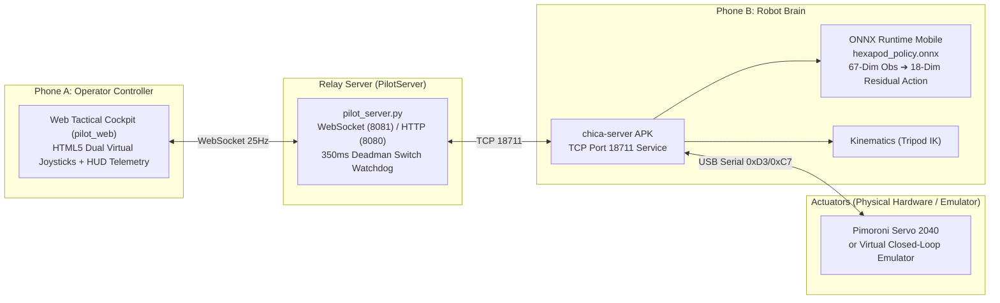

# 📱 Make Your Pet Hexapod: Dual-Phone Teleoperation & Locomotion Mode Operations Manual

> **Repository**: `Make Your Pet Digital Twin`  
> **Applicable Modules**: `chica-server-main` (Android App) / `MakeYourPet-DigitalTwin-Server` (Tactical Web HUD) / `MakeYourPet-DigitalTwin` (MuJoCo Twin)  
> **Language**: English  
> **Date**: 2026-10-02  

---

## 📑 Table of Contents

1. [System Architecture Overview](#1-system-architecture-overview)
2. [Phone B: Onboard Server Screen Breakdown](#2-phone-b-onboard-server-screen-breakdown)
3. [Phone A: Tactical Web Pilot HUD Breakdown](#3-phone-a-tactical-web-pilot-hud-breakdown)
4. [Locomotion Modes & Switching Guide](#4-locomotion-modes--switching-guide)
5. [Hardware-Free Simulation & Closed-Loop Verification Guide](#5-hardware-free-simulation--closed-loop-verification-guide)
6. [FAQ & Troubleshooting](#6-faq--troubleshooting)

---

## 1. System Architecture Overview



### Architecture Description
- **Phone A (Pilot Cockpit / Controller)**: The smartphone or PC browser held by the operator. Loads a landscape tactical HUD interface providing dual virtual touch joysticks and real-time electrical/gait status telemetry.
- **Relay Server (Pilot Relay Server)**: Runs on a PC or edge gateway, providing static web hosting, WebSocket control signal bridging, and a 350 ms Deadman safety watchdog cutoff.
- **Phone B (Onboard Robot Brain)**: Mounted on the back of the robot, running the `chica-server` native Android application. Gathers sensor attitude/IMU data, executes ONNX neural network inference, blends kinematic trajectories, and drives 18 servo motors via USB serial.

---

## 2. Phone B: Onboard Server Screen Breakdown

When opening the `chica-server` app on Phone B, the screen locks into an immersive, high-contrast dashboard display:

| Region | Element / Label | Visual Display & Value | Functional Description |
| :--- | :--- | :--- | :--- |
| **Top Bar** | `Camera` | Button (Gray / Highlighted) | Toggles the Android onboard camera preview stream. |
| | `Policy` | Button | Opens the project privacy policy in the system browser. |
| | `Config` | Button | Pops up a text dialog to inspect and edit `config-2040.txt` servo calibration values and pin mappings. |
| **Center HUD** | `V:` (Voltage) | Green / Yellow / Red float<br>(Displays `---` when disconnected) | Real-time 2S LiPo battery voltage (6.0V–8.4V). Turns yellow warning (<6.4V) and red critical cutoff warning (<6.0V). |
| | `I:` (Current) | Float (Amperes A) | Total 18-channel load current. Triggers buzzer alarm on overload (>8A / 10A). |
| | `BPS:` (Baud / Rate) | Integer (Bytes/sec) | Serial port communication rate. Healthy (>100 BPS) shows green; stall/abnormal shows red. |
| | `IP:` (Address) | IPv4 text | Current local area network IP address of Phone B for pairing with relay and controller. |
| | **Foot Contact Blocks** | Left 3 blocks (L1–L3)<br>Right 3 blocks (R1–R3) | Stance shows Red; Swing shows Black. Dynamically visualizes alternating tripod gait phases. |
| | **Warning Badges** | Red background with yellow `[V]` / `[I]` box | Flashing warning icons popping up during low voltage or motor stall overcurrent. |
| | **Joystick Feedback Panels** | Dual black boxes with crosshairs at the bottom | Left box green/cyan dot indicates translation vector; right box green/blue dot displays forward velocity and yaw rate. |
| **Bottom Bar** | `Block` | Button (Cyan when enabled) | Locks / unlocks the gait output loop. |
| | `Torque` | Button (Cyan when enabled) | Physical Servo 2040 power relay switch (P0 pin). Cyan indicates servo power is energized. |
| | `Exit` | Button | Safely cuts motor power and terminates the application process. |

---

## 3. Phone A: Tactical Web Pilot HUD Breakdown

When the operator accesses `http://<IP>:8080` in a smartphone browser on Phone A, the landscape tactical cockpit is presented:

### 3.1 Top Tactical Status Bar
- **Connection Badges**:
  - `ROBOT: ONLINE / OFFLINE`: Connection state of Phone B's onboard TCP 18711 service.
  - `LINK: CONNECTED / DISCONNECTED`: Connection state between the browser and PilotServer WebSocket (Port 8081).
- **Gait Mode Selectors**:
  - `[🧠 ONNX AI Gait]`: Highlighted green, activates the 18-DOF reinforcement learning residual gait.
  - `[📐 Analytical Tripod Gait]`: Analytical geometric tripod gait.
- **Quick Action Buttons**:
  - `⚡ RELAY`: Remotely switches the servo power supply relay.
  - `🦿 STAND / SIT`: Toggles between ready-to-walk stand pose and tucked sit sleep pose.
  - `🛑 E-STOP`: Highest-priority emergency stop button (cuts motor power and brakes immediately).

### 3.2 Central Dashboard
1. **🔋 Battery Voltage Card**:
   - Displays real-time total voltage, percentage progress bar, and estimated average single-cell voltage (`~3.8V / cell`).
   - Features `NORMAL`, `LOW WARN` (6.4V), and `CUTOFF` (6.0V) status badges.
2. **🕷️ Six-Leg Contact Topology Matrix**:
   - Top-down view showing L1–L3 and R1–R3 foot contact sensor status (`DOWN` green indicates stance, `AIR` gray indicates swing).
   - Displays communication telemetry rate (`BPS`).
3. **⚡ Total Load Current Card**:
   - Displays real-time amperage, categorizing status into `IDLE` (<1.5A), `WALKING` (1.5–8.0A), and `OVERLOAD` (>8.0A) warning.

### 3.3 Auxiliary Controls & Sensitivity Bar
- **`CRAB MODE`**: Unlocks lateral translation (enables strafing along the left stick's X-axis).
- **`HIGH CLEARANCE`**: Elevates robot chassis clearance to step over rough obstacles.
- **`CALIBRATE`**: Tares and recalibrates all six foot-ground contact sensor baselines to zero.
- **`SPEED GAIN`**: `0.5x ~ 1.5x` slider to fine-tune linear and rotational responsiveness.

### 3.4 Dual Virtual Touch Joysticks
- **Left Stick (Translation Vector)**:
  - Push Up / Down: Controls forward / reverse speed ($v_x \in [-0.35, +0.35]\text{ m/s} \times \text{Gain}$).
  - Push Left / Right (when Crab Mode is enabled): Controls lateral strafe speed ($v_y \in [-0.20, +0.20]\text{ m/s} \times \text{Gain}$).
- **Center Deadman Safety Mechanism**:
  - Once hands release the joysticks, the system automatically dispatches a `stop` (`walkclear`) within 50 ms, bringing the robot to a stable standstill brake.
- **Right Stick (Yaw Angular Velocity)**:
  - Push Left / Right: Controls in-place counter-clockwise / clockwise yaw rate ($\omega_z \in [-0.65, +0.65]\text{ rad/s} \times \text{Gain}$).

---

## 4. Locomotion Modes & Switching Guide

### 4.1 Terminology Mapping

| Category | Official Project Term | Colloquial Term | Computational Architecture & Features |
| :--- | :--- | :--- | :--- |
| **AI Neural Network Mode** | **ONNX AI Gait**<br>(ONNX Locomotion) | ONNX Walking Mode | • 67-dim state inputs (IMU, error kinematics, gait clock)<br>• `hexapod_policy.onnx` infers 18-dim residual actions<br>• Dynamically adapts foothold placement and terrain compliance |
| **Traditional Pre-programmed Mode** | **Analytical Tripod Gait** | Pre-programmed Mode | • Pure geometric sinusoidal / cycloidal trajectory generator<br>• Fixed tripod frequency (1.0Hz / 1.5Hz / 2.0Hz / 2.5Hz)<br>• Simple structure, minimal computational overhead on flat terrain |

> [!NOTE]
> The term **"pre-programmed mode"** frequently used by operators is completely appropriate and universal in multilegged robotics! In the codebase, it corresponds to the traditional inverse-kinematics tripod gait (`Analytical Tripod Gait`).

### 4.2 Three Switching Methods

#### Method 1: One-Click Toggle in Web Cockpit (Recommended)
On Phone A's browser top mode bar:
- Click **`[🧠 ONNX AI Gait]`**: Switches to neural residual gait, automatically sending `onnx on`; subsequent walking dispatches `walkonnx:<turn>,<forward>,0`.
- Click **`[📐 Analytical Tripod Gait]`**: Switches to traditional pre-programmed gait, automatically sending `onnx off`; subsequent walking dispatches `walk2:<turn>,<forward>,0`.

#### Method 2: Low-Level TCP Protocol Commands (Port 18711)
When connecting to Phone B directly via Python, ROS, or command-line Netcat:
```bash
# Switch to ONNX AI Gait
echo "onnx on" | nc <PHONE_B_IP> 18711
# Or directly send ONNX locomotion packet (turn_rate, forward_speed, animation_index)
echo "walkonnx:0.0,0.5,0" | nc <PHONE_B_IP> 18711

# Switch to traditional pre-programmed gait (Disable ONNX)
echo "onnx off" | nc <PHONE_B_IP> 18711
# Or send standard tripod walking packet (walk2 denotes standard 2.0Hz tripod gait)
echo "walk2:0.0,0.5,0" | nc <PHONE_B_IP> 18711
```

#### Method 3: PC MuJoCo Digital Twin Workbench (`demo.py`)
When running the MuJoCo simulator on PC:
- Press the **`M`** key on your keyboard: Instantly toggles between **ONNX Reinforcement Learning Residual Gait** and **Traditional Geometric Tripod Gait**.
- The console will output: `[MODE] Switched to ONNX Policy Gait` or `[MODE] Switched to Kinematic Tripod Gait`.

---

## 5. Hardware-Free Simulation & Closed-Loop Verification Guide

This project includes a complete **Software-in-the-Loop (SITL) hardware emulator**, allowing you to experience 100% of the teleoperation, visual dashboard, and gait transitions directly on a PC even without physical robot hardware!

### Step 1: Start Relay Server and Virtual Servo Loop Simulation
Open PowerShell or Terminal and execute:
```powershell
# Launch PilotServer (including Web services and mock dynamic telemetry; --mock or --mock-telemetry are supported)
python MakeYourPet-DigitalTwin-Server/pilot_server.py --mock
```
The server will start listening on port `8080` (HTTP) and `8081` (WebSocket).

### Step 2: Open Browser to Experience the Tactical Cockpit
1. Open your browser and navigate to: `http://localhost:8080`
2. Resize the browser window to **landscape widescreen**.
3. You will observe:
   - Top status badges showing `ROBOT: ONLINE` and `LINK: CONNECTED`.
   - Battery voltage updating in real-time at `~7.40V`.
   - Click and drag the **left virtual joystick** with your mouse:
     - The central six-leg contact matrix will begin regularly toggling between `DOWN` and `AIR` (simulating tripod gait stepping).
     - Release the mouse: The central Deadman mechanism immediately triggers `STOP (WALKCLEAR)`.
   - Click **`[🧠 ONNX AI Gait]`** and **`[📐 Analytical Tripod Gait]`** at the top, and watch the command stream seamlessly switch between `walkonnx:` and `walk2:`!

### Step 3: Run Full-System 8-Stage Automated Closed-Loop Regression Tests
Verify that all communication links, numerical boundaries, safety watchdogs, and ONNX matrices are intact:
```powershell
python MakeYourPet-DigitalTwin-Server/tools/run_regression_tests.py --all
```
Test suite covers:
- 41 unit and integration test assertions.
- 8-stage virtual closed-loop simulation (handshake, ONNX locomotion, tripod gait, Deadman e-stop, overcurrent protection, etc.). All passing indicates full system readiness!

---

## 6. FAQ & Troubleshooting

### Q1: When installing the App on Phone B, is it normal for Voltage and Current to show `---`?
**Answer**: Absolutely normal! If Phone B is not yet connected to the physical Pimoroni Servo 2040 board via USB-OTG, or the virtual emulator has not been launched, the ADC sensors cannot receive packets and will safely display `---`. Once connected, the telemetry will stream live.

### Q2: What is the perceptible difference between ONNX gait and Tripod gait during physical locomotion?
- **Analytical Tripod (Pre-programmed Mode)**: The stride frequency is regular and as clockwork-precise as a pendulum. It performs excellently on flat surfaces, but can slip or get stuck if encountering 1–2 cm bumps or inclines.
- **ONNX AI Gait**: Endowed with dynamic adaptability. When encountering obstacles or resistance, joint positions are dynamically adjusted based on IMU feedback to tune swing height and touchdown compliance, resulting in more biomimetic locomotion.

### Q3: When releasing the Deadman switch, does the robot instantly collapse to the floor?
**Answer**: No. The system implements a "Soft Deceleration Decay" mechanism: when releasing controls to trigger `walkclear`, residual actions decay frame-by-frame by $0.85\times$ with exponential moving average (EMA) filtering. Any airborne legs will gently step back down to the ground within 150 ms, maintaining a stable, six-legged standing pose.
