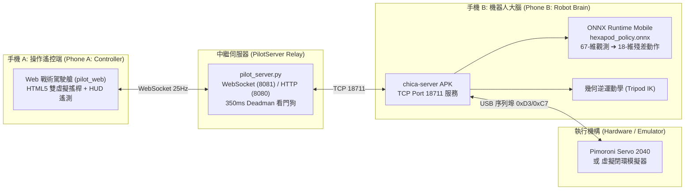

# 📱 Make Your Pet Hexapod: 雙手機遙控與步態切換操作手冊
## Dual-Phone Teleoperation & Locomotion Mode Operations Manual

> **專案儲存庫 (Repository)**: `Make Your Pet Digital Twin`  
> **適用模組 (Applicable Modules)**: `chica-server-main` (Android App) / `MakeYourPet-DigitalTwin-Server` (Pilot Web HUD) / `MakeYourPet-DigitalTwin` (MuJoCo Twin)  
> **語言 (Languages)**: 繁體中文 (Traditional Chinese) / English  
> **更新日期 (Date)**: 2026-10-02  

---

## 📑 目錄 / Table of Contents

1. [系統架構概覽 / System Architecture Overview](#1-系統架構概覽--system-architecture-overview)
2. [手機 B：機載伺服器畫面詳解 / Phone B: Onboard Server Screen Breakdown](#2-手機-b機載伺服器畫面詳解--phone-b-onboard-server-screen-breakdown)
3. [手機 A：戰術 Web 遙控 HUD 畫面詳解 / Phone A: Tactical Web Pilot HUD Breakdown](#3-手機-a戰術-web-遙控-hud-畫面詳解--phone-a-tactical-web-pilot-hud-breakdown)
4. [步態模式與切換指南 / Locomotion Modes & Switching Guide](#4-步態模式與切換指南--locomotion-modes--switching-guide)
5. [無實體機虛擬閉環驗證指南 / Hardware-Free Simulation & Verification Guide](#5-無實體機虛擬閉環驗證指南--hardware-free-simulation--verification-guide)
6. [常見問題與避坑手冊 / FAQ & Troubleshooting](#6-常見問題與避坑手冊--faq--troubleshooting)

---

## 1. 系統架構概覽 / System Architecture Overview



### 【繁體中文】架構說明
- **手機 A (Phone A - 遙控駕駛艙)**：操作者持有的手機或電腦瀏覽器，開啟橫向戰術 HUD 介面，提供虛擬觸控雙搖桿與即時電氣/步態狀態回饋。
- **中繼伺服器 (Pilot Relay Server)**：運行於 PC 或邊緣網關，負責靜態網頁託管、WebSocket 控制訊號中繼與 350 ms 安全看門狗斷線防護。
- **手機 B (Phone B - 機器人本體機載大腦)**：固定於機器人背部的手機，運行 `chica-server` 原生 Android 應用程式。負責感測器姿態採集、ONNX 神經網路推論、幾何步態融合，並透過 USB 序列埠驅動 18 顆伺服舵機。

### 【English】Architecture Summary
- **Phone A (Pilot Controller)**: Handheld phone or PC browser used by the operator. Loads the landscape tactical HUD with dual virtual touch joysticks and live telemetry.
- **Pilot Relay Server**: Runs on a PC or edge gateway, providing HTTP hosting, WebSocket command forwarding, and a 350 ms Deadman watchdog cutoff.
- **Phone B (Onboard Robot Brain)**: Mounted on the robot, running the `chica-server` Android APK. Assembles the 67-dim observation vector, executes ONNX neural inference, blends tripod kinematics, and drives 18 servos via USB serial.

---

## 2. 手機 B：機載伺服器畫面詳解 / Phone B: Onboard Server Screen Breakdown

當在手機 B 上開啟 `chica-server` App 時，螢幕會鎖定於沉浸式全螢幕（Immersive Mode）高對比儀表介面：

| 區域 (Region) | 元件 / 標籤 (Element) | 視覺呈現與數值 (Visual Display) | 功能說明 (Description - zh-TW) | Description (en) |
| :--- | :--- | :--- | :--- | :--- |
| **頂部工具列**<br>*(Top Bar)* | `Camera` | 按鈕 (灰色/反白) | 切換 Android 機載鏡頭預覽畫面。 | Toggles onboard camera preview stream. |
| | `Policy` | 按鈕 | 呼叫系統瀏覽器開啟專案隱私條款。 | Opens project privacy policy in browser. |
| | `Config` | 按鈕 | 彈出文字對話框，可直接手動檢視與儲存 `config-2040.txt` 舵機校準與引腳映射。 | Pops up text dialog to inspect/edit `config-2040.txt` calibrations. |
| **中央儀表區**<br>*(Center HUD)* | `V:` (電壓) | 綠色/黃色/紅色浮點數<br>(未連接顯示 `---`) | 2S 鋰電池即時電壓 (6.0V~8.4V)。低於 6.4V 轉黃色預警，低於 6.0V 轉紅色危險。 | Real-time 2S LiPo voltage. Turns yellow (<6.4V) and red (<6.0V). |
| | `I:` (電流) | 浮點數 (安培 A) | 18 通道總負載電流。過載 (>8A/10A) 會發出蜂鳴警報。 | Total load current. Alerts trigger on overcurrent (>8A/10A). |
| | `BPS:` (頻率) | 整數 (Bytes/sec) | 序列埠通訊速率。連線健康 (>100 BPS) 呈綠色，異常呈紅色。 | Serial communication rate. Green (>100 BPS), red on stall. |
| | `IP:` (位址) | IPv4 位址文字 | 手機 B 當前的區域網路 IP，供中繼端與控制器連線。 | Current LAN IP address of Phone B for pairing. |
| | **足端著地塊**<br>*(Touch Blocks)* | 左側 3 方塊 (L1~L3)<br>右側 3 方塊 (R1~R3) | 著地 (Stance) 顯示紅色，騰空 (Swing) 顯示黑色。動態呈現三角步態交替。 | Visualizes foot contacts: Red = Stance (grounded), Black = Swing (airborne). |
| | **告警標誌**<br>*(Warnings)* | 紅底黃字 `[V]` / `[I]` 方塊 | 當電壓過低或電流堵轉時跳出的緊急警告圖示。 | Flashing warning icons during undervoltage or overcurrent stall. |
| | **搖桿反饋面板**<br>*(Joystick Panels)* | 底部雙黑色方框與十字軸 | 左框綠點/青點顯示姿態向量；右框綠點/藍點顯示當前行進速度與偏航角速度。 | Dual crosshair plots illustrating translation and yaw velocity inputs. |
| **底部控制列**<br>*(Bottom Bar)* | `Block` | 按鈕 (啟用時青色) | 鎖定/解鎖步態輸出迴圈。 | Locks/unlocks gait generation loop. |
| | `Torque` | 按鈕 (啟用時青色) | 實體 Servo 2040 Relay 繼電器開關 (P0 引腳)。青色表示舵機已通電。 | Controls hardware power relay (P0). Cyan indicates servos powered. |
| | `Exit` | 按鈕 | 安全切斷動力並結束 App 進程。 | Safely cuts power and exits application. |

---

## 3. 手機 A：戰術 Web 遙控 HUD 畫面詳解 / Phone A: Tactical Web Pilot HUD Breakdown

由操作者手持手機 A，瀏覽器進入 `http://<IP>:8080` 呈現之橫向操縱介面：

### 3.1 頂部戰術狀態欄 (Tactical Header)
- **連線燈號 (Status Badges)**:
  - `ROBOT: ONLINE / OFFLINE`: 機載手機 B TCP 18711 連線狀態。
  - `LINK: CONNECTED / DISCONNECTED`: 瀏覽器與 PilotServer WebSocket (8081) 鏈路狀態。
- **步態模式切換籤 (Gait Selectors)**:
  - `[🧠 ONNX AI Gait]`: 綠色高亮，啟用 18-DOF 強化學習殘差步態。
  - `[📐 Analytical Tripod Gait]`: 幾何三角解析步態。
- **快控動作鍵 (Tactical Actions)**:
  - `⚡ RELAY`: 遙控開關舵機供電繼電器。
  - `🦿 STAND / SIT`: 切換待命站立姿態與收腿蹲坐休眠姿態。
  - `🛑 E-STOP`: 最高優先級急停鈕（切斷電機並煞車）。

### 3.2 中央儀表板 (HUD Dashboard)
1. **🔋 電池電壓卡 (Battery Voltage Card)**:
   - 顯示即時總電壓、百分比進度條與單芯平均估算電壓 (`~3.8V / cell`)。
   - 具備 `NORMAL`、`LOW WARN` (6.4V)、`CUTOFF` (6.0V) 狀態標籤。
2. **🕷️ 六足踩踏拓撲 (Leg Contact Matrix)**:
   - 俯視圖呈現 L1~L3 與 R1~R3 的接地感應器狀態（`DOWN` 綠色 vs `AIR` 灰色）。
   - 顯示通訊更新頻率 (`BPS`)。
3. **⚡ 負載電流卡 (Total Current Card)**:
   - 顯示即時安培數，區分 `IDLE` (<1.5A)、`WALKING` (1.5~8.0A) 與 `OVERLOAD` (>8.0A) 警告。

### 3.3 輔助開關與倍率調整 (Auxiliary Controls Bar)
- **`CRAB MODE`**: 開啟橫向平移（解鎖左搖桿 X 軸橫著走）。
- **`HIGH CLEARANCE`**: 高底盤避障模式（機身抬高以跨越碎石障礙）。
- **`CALIBRATE`**: 六足觸地感測器基準值重新歸零。
- **`SPEED GAIN`**: `0.5x ~ 1.5x` 類比滑桿，微調前進與旋轉靈敏度。

### 3.4 雙虛擬觸控搖桿 (Dual Virtual Joysticks)
- **左搖桿 (Left Stick - 平移向量)**:
  - 向上/下推：控制前進/後退速度 ($v_x \in [-0.35, +0.35]\text{ m/s} \times \text{Gain}$)。
  - 向左/右推 (開啟 Crab)：控制側向橫移速度 ($v_y \in [-0.20, +0.20]\text{ m/s} \times \text{Gain}$)。
- **中央 Deadman 安全開關 (Deadman Switch Box)**:
  - 只要雙手離開搖桿，系統在 50 ms 內發送 `stop` (`walkclear`)，機器人即刻四平八穩立定煞車。
- **右搖桿 (Right Stick - 轉向角速度)**:
  - 向左/右推：原地逆時針/順時針旋轉角速度 ($\omega_z \in [-0.65, +0.65]\text{ rad/s} \times \text{Gain}$)。

---

## 4. 步態模式與切換指南 / Locomotion Modes & Switching Guide

### 4.1 名稱定義對照 (Terminology Mapping)

| 概念分類 | 專案正式術語 | 使用者口語稱呼 | 運算架構與特點 |
| :--- | :--- | :--- | :--- |
| **AI 神經網路模式** | **ONNX AI Gait**<br>*(或 ONNX Locomotion)* | ONNX 行走模式 | • 67 維狀態輸入（IMU、姿態誤差、步態時鐘）<br>• `hexapod_policy.onnx` 推論 18 維殘差動作<br>• 自動依據地形調節落足點與減震 |
| **傳統預編程模式** | **Analytical Tripod Gait**<br>*(三角解析步態)* | Pre-programmed Mode<br>*(預先寫好的步態)* | • 純幾何正弦/擺線軌跡產生器<br>• 固定三角步頻 (1.0Hz / 1.5Hz / 2.0Hz / 2.5Hz)<br>• 結構簡單，平坦地面運算開銷極低 |

> [!NOTE]
> 使用者所稱呼的 **"pre-programmed mode"** 在六足機器人領域完全合適且通用！在程式碼中對應為傳統的幾何逆運動學三角步態（`Analytical Tripod Gait`）。

### 4.2 三種層級切換方式 (Switching Methods)

#### 方法 1：在 Web 遙控端介面一鍵點擊切換 (最推薦)
在 Phone A 瀏覽器頂端模式欄：
- 點擊 **`[🧠 ONNX AI Gait]`**：切換為神經網路殘差步態，自動發送 `onnx on`，後續行走傳送 `walkonnx:<turn>,<forward>,0`。
- 點擊 **`[📐 Analytical Tripod Gait]`**：切換為傳統預編程步態，自動發送 `onnx off`，後續行走傳送 `walk2:<turn>,<forward>,0`。

#### 方法 2：底層 TCP 通訊協定指令切換 (Port 18711)
若透過 Python、ROS、或終端 Netcat 直連手機 B：
```bash
# 切換為 ONNX AI 步態
echo "onnx on" | nc <PHONE_B_IP> 18711
# 或直接下發 ONNX 行走封包 (轉向率, 前進速度, 動畫索引)
echo "walkonnx:0.0,0.5,0" | nc <PHONE_B_IP> 18711

# 切換為傳統預編程步態 (關閉 ONNX)
echo "onnx off" | nc <PHONE_B_IP> 18711
# 或下發標準三角行走封包 (walk2 表示標準 2.0Hz 三角步態)
echo "walk2:0.0,0.5,0" | nc <PHONE_B_IP> 18711
```

#### 方法 3：PC 端的 MuJoCo 數位孿生工作台 (`demo.py`)
在電腦上運行 MuJoCo 模擬器時：
- 按下鍵盤 **`M`** 鍵：在 **ONNX 強化學習殘差步態** 與 **傳統幾何三角步態** 之間即時 Toggle 切換。
- 終端將顯示：`[MODE] Switched to ONNX Policy Gait` 或 `[MODE] Switched to Kinematic Tripod Gait`。

---

## 5. 無實體機虛擬閉環驗證指南 / Hardware-Free Simulation & Verification Guide

本專案具備完整的**硬體級軟體模擬器 (Software-in-the-Loop)**，即使沒有實體機器人，也能在電腦上體驗 100% 完整的遙控、畫面與步態交替行為！

### 步驟 1：啟動中繼伺服器與虛擬舵機閉環模擬
打開命令提示字元 (PowerShell / Terminal)，執行：
```powershell
# 啟動 PilotServer (包含 Web 服務與動態虛擬遙測，--mock 或 --mock-telemetry 均可)
python MakeYourPet-DigitalTwin-Server/pilot_server.py --mock
```
伺服器將在 `8080` (HTTP) 與 `8081` (WebSocket) 啟動監聽。

### 步驟 2：打開瀏覽器體驗戰術駕駛艙
1. 在瀏覽器打開：`http://localhost:8080`
2. 將瀏覽器視窗拉為**橫向寬螢幕**。
3. 您將看到：
   - 頂部狀態顯示 `ROBOT: ONLINE` 與 `LINK: CONNECTED`。
   - 電池電壓即時顯示 `~7.40V`。
   - 用滑鼠按住拖動**左側虛擬搖桿**：
     - 中間的六足矩陣會開始規律交替顯示 `DOWN` 與 `AIR`（模擬三角步態踩踏）。
     - 放開滑鼠：中央 Deadman Switch 立即觸發 `STOP (WALKCLEAR)`。
   - 點擊頂部的 **`[🧠 ONNX AI Gait]`** 與 **`[📐 Analytical Tripod Gait]`**，觀察指令流由 `walkonnx:` 與 `walk2:` 無縫切換！

### 步驟 3：執行全系統 8 階段自動化閉環回歸測試
驗證整個通訊鏈路、數值邊界、安全看門狗與 ONNX 矩陣是否完好：
```powershell
python MakeYourPet-DigitalTwin-Server/tools/run_regression_tests.py --all
```
測試涵蓋：
- 41 項單元與整合測試
- 8 階段虛擬閉環模擬（連線、ONNX 行走、三角步態、Deadman 急停、過流防護等），全部通過即代表全系統運作正常！

---

## 6. 常見問題與避坑手冊 / FAQ & Troubleshooting

### Q1: 手機 B 上安裝 App 後，電壓電流都顯示 `---` 是正常的嗎？
**答**：完全正常！如果手機尚未透過 USB-OTG 連接至 Pimoroni Servo 2040 實體板，或者尚未啟動虛擬模擬器，ADC 感測器讀取不到封包，系統會安全地顯示 `---`。一旦連線成功，即會即時更新。

### Q2: 實體機行走時，ONNX 步態與三角步態有何體感差異？
- **Analytical Tripod (幾何預編程)**：步頻規律，像鐘擺一樣精確固定；在極平整桌面表現優異，但若遇到 1~2 公分凸起或斜坡容易打滑卡住。
- **ONNX AI Gait**：具備動態自適應性，遇到障礙物或阻力時，關節會根據 IMU 姿態回饋動態微調抬腿高度與落地柔順度，行進更具仿生感。

### Q3: Deadman Switch 放手後，機器人會瞬間趴下嗎？
**不會**。專案已實作「軟平滑減速停步」（Soft Deceleration Decay）：當放手觸發 `walkclear` 時，殘差動作以 $0.85\times$ 逐幀衰減並套用 EMA 濾波，懸空的腿會在 150 ms 內溫和踏回地面，保持穩健的六足立定姿態。
