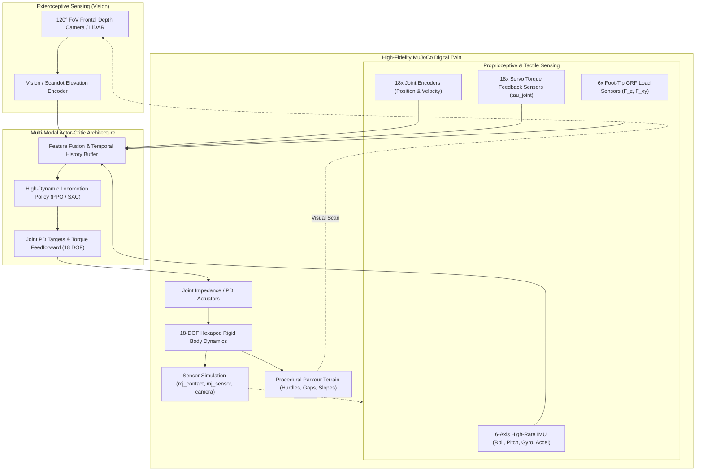
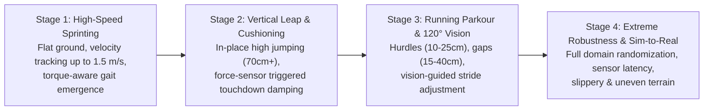
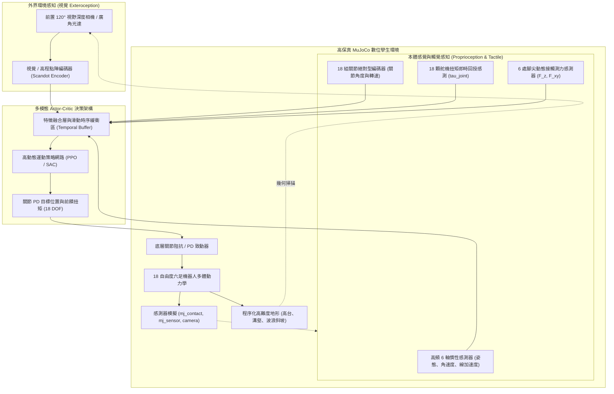
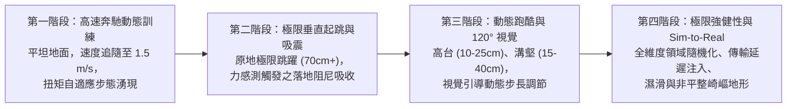

# Advanced Dynamic Locomotion & Parkour Training
## 18-DOF Hexapod Digital Twin with Multi-Modal Perception & High-Bandwidth Actuation

---

## 1. Executive Summary & Vision

This directory (`train_advance_movement`) houses the next-generation reinforcement learning (RL) framework for the **Make Your Pet 18-DOF Hexapod Digital Twin**. 

While the baseline modules focused on canonical tripod walking (`train_walking`) and fixed-trajectory residual jumping (`train_jumping`), this module operates under an **unlimited research budget premise**, assuming industrial/research-grade tier hardware capabilities:
1. **Foot-Tip 3-Axis Contact Force Sensors**: High-frequency downward and shear ground reaction force (GRF) measurement at each tiptoe.
2. **Joint-Level Actuator Torque Sensing**: Real-time closed-loop torque feedback ($\tau$) and effort monitoring across all 18 servos.
3. **120° Field of View (FoV) Frontal Visual Perception**: Wide-angle forward-facing depth perception / scandots array for dynamic obstacle detection, hurdle clearance, and gap leaping.

With this sensor suite, the hexapod transcends steady-state crawling, enabling agile, dynamic behaviors such as **high-speed sprinting with dynamic gait transitions**, **running take-off jumps (Parkour)**, **gap leaping**, and **active touch-down impact compliance**.



---

## 2. Hardware & Sensing Specification (Unlimited-Budget Assumption)

In contrast to consumer-grade hobby servos with open-loop PWM control, this environment assumes top-tier mechatronic hardware:

| Subsystem | Specification & Sensor Specs | Simulation Implementation in MuJoCo | Role in Dynamic Movement |
| :--- | :--- | :--- | :--- |
| **Foot-Tip Contact Force** | 3-Axis dynamic force sensors / micro-load cells at each tiptoe ($F_x, F_y, F_z$), sampling at 500 Hz | `<sensor><touch .../>` and `<force .../>` at `col_tip_*` | Enables instantaneous touchdown detection, thrust impulse optimization, and adaptive compliance during landing |
| **Joint Torque Feedback** | Integrated strain-gauge / current-based joint torque sensors on all 18 servos ($\tau_1 \dots \tau_{18}$) | `<sensor><jointactuatorfrc .../>` or reading `data.actuator_force` | Allows impedance control, slip detection, load distribution monitoring, and torque-limiting safety regimes |
| **Frontal Vision System** | Forward-mounted RGB-D / wide-angle Depth Camera with **120° horizontal FoV**, range 0.1m–5.0m | Camera sensor `<camera name="front_cam" fovy="75" .../>` + scandot heightfield sampling grid | Provides forward obstacle topography, gap edge locations, and hurdle geometry for proactive take-off timing |
| **Actuator Dynamics** | High-torque, high-speed brushless DC (BLDC) quasi-direct drive servos (peak torque: $5.0\text{ N}\cdot\text{m}$, speed: $12\text{ rad/s}$) | Extended `forcerange="-5.0 5.0"`, high bandwidth PD controller ($K_p=25.0, K_d=2.0$) | Enables instantaneous explosive push-off and dynamic stance stabilization |
| **Base Inertial Suite** | Tactical-grade 6-DOF IMU (accelerometer + gyroscope) with hardware sensor fusion | `<sensor><accelerometer .../><gyro .../><framequat .../></sensor>` | Robust estimation of base orientation, linear acceleration, and angular momentum |

---

## 3. Core Locomotion Challenges & Target Skills

### 3.1 Dynamic High-Speed Sprinting with Gait Emergence
- **Beyond Fixed Tripod**: At higher forward velocities ($v_x > 0.8\text{ m/s}$), rigid tripod kinematics cause ground impact bouncing and motor saturation.
- **Torque & GRF Adaptation**: Using real-time torque feedback, the policy detects foot slip and redistributes contact forces across legs, naturally discovering wave gaits, bounding patterns, or flight phases.

### 3.2 Running Jump & Momentum Transfer (Parkour)
- **Horizontal-to-Vertical Conversion**: Converts kinetic energy from forward sprinting into vertical thrust via an anticipatory braking step ("Plant Step"):
  $$\Delta E_k = \frac{1}{2} m (v_x^2 + v_z^2) \longrightarrow \text{Max Apex Height } h_{\text{apex}} \ge 70\text{ cm}$$
- **120° Vision-Triggered Stutter-Stepping**: The 120° FoV camera tracks oncoming obstacles. The robot automatically adjusts stride length to place feet at the optimal take-off distance before a barrier or chasm.

### 3.3 Active Landing Impact Absorption
- **Soft Touchdown**: Rather than landing with high joint stiffness, the foot-tip force sensors trigger an instantaneous compliance mode (damping surge) upon detecting contact thresholds ($F_z > 5\text{ N}$), preventing chassis bottoming-out and servo gear damage.

---

## 4. Multi-Modal RL Formulation

### 4.1 Observation Space ($\mathcal{S}_t \in \mathbb{R}^{148}$)

The observation vector combines proprioceptive kinematics, dynamic joint efforts, tactile contact forces, and wide-angle visual topography:

```
[Observation Vector Breakdown: 148 Dimensions]
├── 1. Base Kinematics (16D)
│   ├── Base Linear Velocity (v_x, v_y, v_z) [3D]
│   ├── Base Angular Velocity (omega_x, omega_y, omega_z) [3D]
│   ├── Projected Gravity Vector (R^T * g) [3D]
│   ├── Chassis Clearance Height (z_trunk) [1D]
│   └── Base Orientation Euler (Roll, Pitch, Yaw) [3D]
├── 2. Joint Proprioception & Torque Feedback (54D)
│   ├── Joint Angles (q - q_nominal) [18D]
│   ├── Joint Angular Velocities (dq) [18D]
│   └── Joint Measured Output Torques (tau_meas) [18D]  <-- SERVO TORQUE FEEDBACK
├── 3. Foot Contact Dynamics & Ground Reaction Forces (24D)
│   ├── Foot Contact Binary Flags (c_1 ... c_6) [6D]
│   └── 3D Foot-Tip Ground Reaction Forces (F_x, F_y, F_z) x 6 [18D]  <-- FOOT SENSORS
├── 4. Frontal Visual Perception (120° FoV Scandots) (48D)
│   └── 120° Horizontal Arc Scandots Grid (4 rings x 12 radial rays) [48D] <-- 120° VISION
├── 5. Commands & Temporal Buffer (6D)
│   ├── Target Velocity Commands (v_x_cmd, v_y_cmd, yaw_cmd) [3D]
│   └── Jump Trigger / Target Leap Distance [3D]
```

#### 120° Vision Field Geometry
The frontal visual field is sampled over a 120-degree horizontal fan ($[-60^\circ, +60^\circ]$ relative to trunk heading):
- **Radial Distance**: 4 concentric arcs at $r \in \{0.3\text{m}, 0.6\text{m}, 1.2\text{m}, 2.0\text{m}\}$.
- **Angular Resolution**: 12 rays spaced every $10^\circ$.
- **Values**: Relative elevation difference $\Delta z = z_{\text{terrain}}(r, \theta) - z_{\text{foot\_nominal}}$.

```
             \                 +X (Forward)                /
              \                     ▲                     /
               \                    │                    /
                \       •     •     •     •     •       /   r = 2.0m
                 \         •     •     •     •         /    r = 1.2m
                  \           •     •     •           /     r = 0.6m
                   \             •  •  •             /      r = 0.3m
                    \               ▲               /
                     \           [ROBOT]           /
                      \                           /
                       ◄────── 120° FoV ─────────►
```

### 4.2 Action Space ($\mathcal{A}_t \in \mathbb{R}^{18}$)
The policy outputs normalized continuous actions $a_t \in [-1, 1]^{18}$, which map directly to target joint positions fed to the low-level actuator controllers:
$$q_{\text{target}, i} = q_{\text{default}, i} + k_{\text{scale}, i} \cdot a_{t, i}$$
Where:
- $k_{\text{scale}, \text{coxa}} = 0.35\text{ rad}$
- $k_{\text{scale}, \text{femur}} = 0.60\text{ rad}$ (large clearance & thrust amplitude)
- $k_{\text{scale}, \text{tibia}} = 0.80\text{ rad}$ (full leg extension for leaping)

### 4.3 Comprehensive Multi-Objective Reward Function

The reward function balances forward tracking, hurdle traversal, kinetic efficiency, and structural safety:

$$\mathcal{R}_t = \mathcal{R}_{\text{task}} + \mathcal{R}_{\text{perception}} + \mathcal{R}_{\text{contact}} - \mathcal{P}_{\text{effort}} - \mathcal{P}_{\text{impact}}$$

1. **Velocity Tracking**:
   $$\mathcal{R}_{\text{vel}} = \exp\left( -\frac{\|v_{xy} - v_{xy}^{\text{cmd}}\|^2}{2\sigma_v^2} \right)$$
2. **Parkour Clearance & Apex Height**:
   $$\mathcal{R}_{\text{clearance}} = w_{\text{apex}} \cdot \max(0, z_{\text{trunk}} - z_{\text{obstacle}}) + w_{\text{leap}} \cdot v_x \cdot \mathbb{I}(\text{in\_air})$$
3. **Foot-Tip Thrust Maximization (Take-Off Phase)**:
   $$\mathcal{R}_{\text{thrust}} = \sum_{i=1}^6 (\mathbf{F}_{z, i} \cdot v_{z, \text{trunk}}) \quad \text{for } t \in [\text{take-off burst}]$$
4. **Torque Regularization & Energy Efficiency**:
   $$\mathcal{P}_{\text{torque}} = \sum_{i=1}^{18} \left( \frac{\tau_i}{\tau_{\text{max}}} \right)^2, \quad \mathcal{P}_{\text{smooth}} = \|\mathbf{a}_t - \mathbf{a}_{t-1}\|^2$$
5. **Impact Cushioning & Contact Balance**:
   $$\mathcal{P}_{\text{impact}} = \sum_{i=1}^6 \max(0, F_{z, i} - F_{\text{safe\_threshold}})^2$$
6. **Slip Penalty (using Foot Force & Speed)**:
   $$\mathcal{P}_{\text{slip}} = \sum_{i=1}^6 \|\mathbf{v}_{\text{foot}, i}^{xy}\|^2 \cdot \mathbb{I}(F_{z, i} > 2.0\text{ N})$$

---

## 5. Training Curriculum & Procedural Environments

Training advanced agile locomotion directly from scratch on complex obstacles results in poor local minima. We employ a 4-Stage Progressive Curriculum:



### Progressive Difficulty Metrics
- **Hurdles**: Height starting at $0.05\text{ m}$, progressively scaling to $0.25\text{ m}$.
- **Gaps**: Ditch width scaling from $0.10\text{ m}$ to $0.40\text{ m}$.
- **Terrain Roughness**: Heightfield random elevation from $\pm 0.02\text{ m}$ to $\pm 0.08\text{ m}$.
- **Speed Schedule**: $v_x \in [0.3\text{ m/s}] \longrightarrow [1.5\text{ m/s}]$.

---

## 6. Directory Structure & Architecture

```
train_advance_movement/
├── README.md                      # This comprehensive technical blueprint
├── __init__.py                    # Module export definitions
├── configs/                       # Hyperparameter and environment configurations
│   ├── advance_env_config.yaml    # Sensor thresholds, action scales, reward weights
│   └── ppo_advance_config.yaml    # Network dimensions, learning rates, entropy schedule
├── env/                           # Simulation environments & sensor integrations
│   ├── advance_hexapod_env.py     # Core Gym environment (148D obs, 18D action)
│   ├── sensor_suite.py            # Foot GRF sensors & joint torque feedback abstraction
│   ├── vision_processor.py        # 120° FoV depth raycasting & scandot heightfield sampler
│   └── terrain_generator.py       # Procedural parkour track (hurdles, gaps, uneven ground)
├── models/                        # Multi-modal neural network architectures
│   ├── actor_critic_multimodal.py # Separate trunk for vision (CNN/MLP) + proprioception
│   └── teacher_student_distill.py # Asymmetric privileged teacher to onboard student
├── train_advance.py               # Main training entry point (Vectorized PPO / SAC)
├── evaluate_advance.py            # Evaluation benchmark & trajectory visualizer
└── export_advance_onnx.py         # Multi-input ONNX export (vision + proprioception)
```

---

## 7. Fast-Start Execution Guide

### 7.1 Prerequisites & Dependencies
Ensure your environment has the required packages installed:
```bash
pip install gymnasium mujoco stable-baselines3 pyyaml tensorboard torch torchvision onnx
```

### 7.2 Running Environment Verification
Verify that the 18 torque sensors, 6 tiptoe force sensors, and 120° FoV visual scanner are functioning properly:
```bash
python -m train_advance_movement.env.advance_hexapod_env
```

### 7.3 Launching Curriculum Training
To initiate Stage 1 (High-speed sprint & torque adaptation):
```bash
python train_advance_movement/train_advance.py --stage 1 --num-envs 16 --total-timesteps 5000000
```

To run full Parkour training with 120° vision:
```bash
python train_advance_movement/train_advance.py --stage 3 --resume-from checkpoints/stage2_best.zip
```

### 7.4 Visualizing Trajectories in MuJoCo
Inspect the trained multi-modal agent jumping over hurdles and dampening touchdown impacts:
```bash
python train_advance_movement/evaluate_advance.py --checkpoint models/advance_best_model.zip --render-mode human
```

---

## 8. Sim-to-Real Transfer & Safety Protocols

Although developed with an unlimited-budget research assumption, physical hardware safety is enforced:

1. **Peak Torque Clamping**:
   - Continuous torque is bounded at $3.0\text{ N}\cdot\text{m}$.
   - Transient peak torque bursts up to $5.0\text{ N}\cdot\text{m}$ are permitted for no longer than $150\text{ ms}$ (enforced via energy accumulation penalty).
2. **Impact Force Attenuation**:
   - The policy is explicitly penalized if any foot-tip sensor experiences an impact spike $> 25\text{ N}$, fostering smooth foot placement.
3. **Vision Latency Injection**:
   - During Stage 4 training, the 120° vision feed is intentionally delayed by $40\text{ ms}\sim 80\text{ ms}$ (2–4 control steps) to simulate real-world onboard depth processing latency.
4. **Sensor Noise Injection**:
   - Gaussian noise is applied to joint torques ($\sigma = 0.05\text{ N}\cdot\text{m}$), foot forces ($\sigma = 0.5\text{ N}$), and depth scandots ($\sigma = 0.01\text{ m}$).

---

*Authored for the Make Your Pet Digital Twin Project. Engineered for high-performance legged robotics research.*

---
---

# 高階動態運動與跑酷訓練 (中文版)
## 具備多模態感知與高頻寬致動之 18 自由度六足機器人數位孿生

---

## 1. 摘要與願景 (Executive Summary & Vision)

本目錄（`train_advance_movement`）為 **Make Your Pet 18 自由度六足機器人數位孿生** 專案之次世代強化學習（RL）訓練框架。

過去的模組主要專注於常規三角步態行走（`train_walking`）與固定軌跡殘差跳躍（`train_jumping`）。本模組則建立在**「科研預算無限」的假定條件**下，引進工業與頂尖實驗室等級之頂規感測與致動硬體配置：
1. **腳尖 3 軸接觸力感測器 (Foot-Tip GRF Sensors)**：於六足腳端配備高頻感測器，能精確感應即時垂直下壓接地力與水平剪力。
2. **關節舵機扭力回授監控 (Joint Torque Feedback)**：全機 18 顆關節舵機具備閉迴路扭矩即時感測（$\tau$）與負載輸出監控。
3. **前向 120 度廣角視覺感知系統 (120° FoV Vision)**：前置廣角深度相機／高頻 Scandot 陣列，覆蓋前向 120 度視野，進行即時動態障礙物偵測、高台跨越與跨溝起跳。

透過此多模態感測矩陣，六足機器人將超越傳統爬行步態，自主湧現出**高速奔馳動態步態切換**、**跑動中起跳跨障（Parkour）**、**極限跨溝**，以及**觸地主動柔順吸震（Active Compliance）**等高動態運動能力。



---

## 2. 硬體與感測器規格（無限預算假設）

相較於消費級玩具舵機與開迴路 PWM 控制，本訓練環境假定採用頂級機電硬體配置：

| 子系統 | 硬體規格與感測器參數 | MuJoCo 模擬實作方式 | 在高動態運動中的關鍵角色 |
| :--- | :--- | :--- | :--- |
| **腳尖接觸力感測器** | 6 處腳尖配置 3 軸動態測力微型稱重傳感器（$F_x, F_y, F_z$），採樣頻率 500 Hz | 於 `col_tip_*` 定義 `<sensor><touch .../>` 與 `<force .../>` | 實現微秒級著地瞬間偵測、推力衝量最佳化，以及觸地時的自適應阻尼緩衝 |
| **關節扭矩回授** | 18 顆伺服機舵全數內建應變規／電流閉迴路扭矩感測器（$\tau_1 \dots \tau_{18}$） | 透過 `<sensor><jointactuatorfrc .../>` 或讀取 `data.actuator_force` | 支援高頻抗打滑負載分配、關節阻抗柔順控制與動態過載安全防護 |
| **前向視覺感知** | 前置廣角 RGB-D / 深度相機，具備 **120° 水平視場角（FoV）**，探測距離 0.1m～5.0m | 設置相機感測器 `<camera name="front_cam" fovy="75" .../>` + 局部高程點陣掃描 | 即時提供前方障礙物輪廓、溝壑邊緣坐標與地形起伏，提前計算最佳起跳點 |
| **高頻寬致動系統** | 高扭力、高轉速無刷準直驅（BLDC QDD）伺服機舵（峰值扭力：$5.0\text{ N}\cdot\text{m}$，最高轉速：$12\text{ rad/s}$） | 擴展致動器 `forcerange="-5.0 5.0"`，搭配高頻寬 PD 增益（$K_p=25.0, K_d=2.0$） | 提供起跳瞬間的極限爆發力，並於高速著地時具備極高的動態剛度抑制回彈 |
| **機身慣性導航** | 戰術級 6 軸 IMU（加速度計 + 陀螺儀），內建硬體卡爾曼濾波 | `<sensor><accelerometer .../><gyro .../><framequat .../></sensor>` | 高精準度估算機身姿態歐拉角、線加速度與角動量變化 |

---

## 3. 核心運動挑戰與目標技能

### 3.1 高速奔馳與動態步態湧現 (Gait Emergence)
- **突破傳統三角步態限制**：在高速移動時（$v_x > 0.8\text{ m/s}$），剛性三角步態會產生嚴重的地面撞擊與伺服機飽和震顫。
- **基於扭力與接觸力的動態重分配**：透過即時扭矩回授，策略能感知腳尖打滑並即時重配六足負載，自發演化出類似昆蟲的高速波浪步態、雙腿彈跳或微小騰空相（Flight Phase）。

### 3.2 跑動中起跳與動量轉換 (Running Jump / Parkour)
- **水平動量轉垂直衝量**：在高速奔馳中執行預備性的「制動踩點步（Plant Step）」，將水平動能高效導向垂直起跳做功：
  $$\Delta E_k = \frac{1}{2} m (v_x^2 + v_z^2) \longrightarrow \text{最大跳躍頂點 } h_{\text{apex}} \ge 70\text{ cm}$$
- **120° 視覺引導的碎步微調 (Stutter-Stepping)**：前向視覺即時追蹤障礙距離，使六足在抵達障礙前主動微調步幅與頻率，以完美姿態在最佳臨界點蹬地飛躍。

### 3.3 主動著地衝擊吸收 (Active Landing Compliance)
- **柔順著地保護**：腳尖接觸力感測器一旦偵測到垂直撞擊衝力超過閾值（$F_z > 5\text{ N}$），系統立即觸發柔順阻尼控制模式，主動屈膝吸收衝擊，防止腹部撞地及齒輪箱崩齒。

---

## 4. 多模態強化學習環境規格 (RL Formulation)

### 4.1 觀測空間 ($\mathcal{S}_t \in \mathbb{R}^{148}$)

觀測特徵向量整合了機身本體運動學、關節即時力矩、腳端接觸力學與 120° 視野地形高程：

```
[觀測空間特徵向量：148 維度]
├── 1. 機身運動學特徵 (16D)
│   ├── 機身線速度 (v_x, v_y, v_z) [3D]
│   ├── 機身角速度 (omega_x, omega_y, omega_z) [3D]
│   ├── 投影重力向量 (R^T * g) [3D]
│   ├── 底盤對地離地間隙 (z_trunk) [1D]
│   └── 機身姿態歐拉角 (Roll, Pitch, Yaw) [3D]
├── 2. 關節本體感知與扭矩回授 (54D)
│   ├── 關節當前角度偏差 (q - q_nominal) [18D]
│   ├── 關節當前角速度 (dq) [18D]
│   └── 關節實測輸出扭矩 (tau_meas) [18D]  <-- 關節機舵扭矩回授
├── 3. 腳尖接觸動力學與接地力 (24D)
│   ├── 六足觸地二值化狀態 (c_1 ... c_6) [6D]
│   └── 六足腳尖 3 軸接地力 (F_x, F_y, F_z) x 6 [18D]  <-- 腳尖力感測器
├── 4. 前向視覺感知點陣 (120° FoV Scandots) (48D)
│   └── 前方 120° 扇形高程差掃描網格 (4 圈徑向 x 12 條射線) [48D] <-- 120° 廣角視覺
├── 5. 導航指令與時序特徵 (6D)
│   ├── 目標移動指令速度 (v_x_cmd, v_y_cmd, yaw_cmd) [3D]
│   └── 起跳觸發旗標 / 目標跨越距離 [3D]
```

#### 120° 視覺感知幾何佈局
前向視野以機身朝向為基準，覆蓋水平 120 度扇形夾角（$[-60^\circ, +60^\circ]$）：
- **徑向掃描距離**：4 組同心圓弧，半徑分別為 $r \in \{0.3\text{m}, 0.6\text{m}, 1.2\text{m}, 2.0\text{m}\}$。
- **角度解析度**：共 12 條射線，每條間隔 $10^\circ$。
- **高程取值**：相對於足端標稱平面的地形高度差 $\Delta z = z_{\text{terrain}}(r, \theta) - z_{\text{foot\_nominal}}$。

```
             \                 +X (正前方)                 /
              \                     ▲                     /
               \                    │                    /
                \       •     •     •     •     •       /   r = 2.0m
                 \         •     •     •     •         /    r = 1.2m
                  \           •     •     •           /     r = 0.6m
                   \             •  •  •             /      r = 0.3m
                    \               ▲               /
                     \         [六足機器人]         /
                      \                           /
                       ◄────── 120° 視野 ────────►
```

### 4.2 動作空間 ($\mathcal{A}_t \in \mathbb{R}^{18}$)
策略輸出歸一化的連續動作向量 $a_t \in [-1, 1]^{18}$，直接對應至底層關節控制器之目標位置：
$$q_{\text{target}, i} = q_{\text{default}, i} + k_{\text{scale}, i} \cdot a_{t, i}$$
各關節動作範圍縮放設定：
- $k_{\text{scale}, \text{coxa}} = 0.35\text{ rad}$（航向偏轉）
- $k_{\text{scale}, \text{femur}} = 0.60\text{ rad}$（大腿抬升與垂直爆發衝程）
- $k_{\text{scale}, \text{tibia}} = 0.80\text{ rad}$（小腿全伸展蹬地）

### 4.3 綜合多目標獎勵函數

獎勵函數兼顧任務導向、障礙跨越、能量效率與結構安全：

$$\mathcal{R}_t = \mathcal{R}_{\text{task}} + \mathcal{R}_{\text{perception}} + \mathcal{R}_{\text{contact}} - \mathcal{P}_{\text{effort}} - \mathcal{P}_{\text{impact}}$$

1. **速度追隨獎勵**：
   $$\mathcal{R}_{\text{vel}} = \exp\left( -\frac{\|v_{xy} - v_{xy}^{\text{cmd}}\|^2}{2\sigma_v^2} \right)$$
2. **跑酷越障與頂點高度獎勵**：
   $$\mathcal{R}_{\text{clearance}} = w_{\text{apex}} \cdot \max(0, z_{\text{trunk}} - z_{\text{obstacle}}) + w_{\text{leap}} \cdot v_x \cdot \mathbb{I}(\text{in\_air})$$
3. **起跳瞬間足端推力做功獎勵**：
   $$\mathcal{R}_{\text{thrust}} = \sum_{i=1}^6 (\mathbf{F}_{z, i} \cdot v_{z, \text{trunk}}) \quad \text{於起跳爆發瞬間做功激勵}$$
4. **扭矩正規化與平滑懲罰**：
   $$\mathcal{P}_{\text{torque}} = \sum_{i=1}^{18} \left( \frac{\tau_i}{\tau_{\text{max}}} \right)^2, \quad \mathcal{P}_{\text{smooth}} = \|\mathbf{a}_t - \mathbf{a}_{t-1}\|^2$$
5. **著地衝擊過載懲罰**：
   $$\mathcal{P}_{\text{impact}} = \sum_{i=1}^6 \max(0, F_{z, i} - F_{\text{safe\_threshold}})^2$$
6. **足端滑移懲罰（結合力感應與速度）**：
   $$\mathcal{P}_{\text{slip}} = \sum_{i=1}^6 \|\mathbf{v}_{\text{foot}, i}^{xy}\|^2 \cdot \mathbb{I}(F_{z, i} > 2.0\text{ N})$$

---

## 5. 課程學習推進路徑與程序化地形庫

面對複雜的高動態跑酷障礙，若直接採用端到端從零訓練容易陷入不良局部最優解。本模組實施四階段課程學習：



### 漸進難度指標
- **高台跨越 (Hurdles)**：障礙高度由 $0.05\text{ m}$ 逐步推進至 $0.25\text{ m}$。
- **溝壑跳躍 (Gaps)**：寬度由 $0.10\text{ m}$ 逐步擴展至 $0.40\text{ m}$。
- **地形粗糙度**：Heightfield 高低起伏由 $\pm 0.02\text{ m}$ 增加至 $\pm 0.08\text{ m}$。
- **目標速度進程**：$v_x \in [0.3\text{ m/s}] \longrightarrow [1.5\text{ m/s}]$。

---

## 6. 資料夾模組架構說明

```
train_advance_movement/
├── README.md                      # 本完整技術架構與工程指南
├── __init__.py                    # 模組導出宣告
├── configs/                       # 超參數與環境設定檔
│   ├── advance_env_config.yaml    # 感測器閾值、動作縮放比例、獎勵權重分配
│   └── ppo_advance_config.yaml    # 類神經網路維度、學習率、熵正則化排程
├── env/                           # 模擬環境與感測器實作
│   ├── advance_hexapod_env.py     # 核心 Gymnasium 環境（148D 觀測，18D 動作）
│   ├── sensor_suite.py            # 腳尖接觸力感測與關節扭矩回授抽象層
│   ├── vision_processor.py        # 120° 視場角光線投射與 Scandot 高程採樣器
│   └── terrain_generator.py       # 程序化跑酷跑道生成器（高台、溝壑、起伏地表面）
├── models/                        # 多模態神經網路架構
│   ├── actor_critic_multimodal.py # 視覺特徵分支（CNN/MLP）+ 本體感覺分支分離架構
│   └── teacher_student_distill.py # 特權教師網路蒸餾至機載學生網路模組
├── train_advance.py               # 主要訓練入口（向量化並行 PPO / SAC）
├── evaluate_advance.py            # 評估測試基準與運動軌跡視覺化工具
└── export_advance_onnx.py         # 多輸入多模態 ONNX 部署模型匯出腳本
```

---

## 7. 快速啟動指南

### 7.1 環境安裝與依賴項
請確認已安裝以下 Python 依賴包：
```bash
pip install gymnasium mujoco stable-baselines3 pyyaml tensorboard torch torchvision onnx
```

### 7.2 執行環境整合驗證
驗證 18 關節扭矩感測器、6 腳尖測力感測器及 120° 視覺掃描器是否正常運作：
```bash
python -m train_advance_movement.env.advance_hexapod_env
```

### 7.3 啟動分階段訓練
啟動第一階段訓練（高速奔馳與扭矩自適應）：
```bash
python train_advance_movement/train_advance.py --stage 1 --num-envs 16 --total-timesteps 5000000
```

啟動第三階段全視覺跑酷訓練（跨越高台與飛越溝壑）：
```bash
python train_advance_movement/train_advance.py --stage 3 --resume-from checkpoints/stage2_best.zip
```

### 7.4 於 MuJoCo 模擬器中檢視運作成效
即時視覺化觀察策略控制六足機器人執行跳躍過障與落地吸震：
```bash
python train_advance_movement/evaluate_advance.py --checkpoint models/advance_best_model.zip --render-mode human
```

---

## 8. 虛實遷移 (Sim-to-Real) 與真機硬體防護規範

雖然訓練基於無限預算假設，但為保障未來真機測試之可行性，模型依然遵循嚴格的物理安全約束：

1. **峰值扭矩抑制機制**：
   - 連續運轉扭力限制在 $3.0\text{ N}\cdot\text{m}$。
   - 瞬間爆發做功上限允許至 $5.0\text{ N}\cdot\text{m}$，但單次持續時間強制限制於 $150\text{ ms}$ 以內（透過能量積分懲罰項約束）。
2. **著地衝擊峰值保護**：
   - 只要任何腳尖感測器測得之接觸衝力大於 $25\text{ N}$，即刻施加嚴厲懲罰，迫使策略自主學習柔順踩點。
3. **視覺感知延遲注入**：
   - 於第四階段訓練中，對 120° 視覺高程特徵加入 $40\text{ ms}\sim 80\text{ ms}$（2～4 個控制步進）之隨機延遲隊列，模擬實體運算單元（如 Jetson Orin）之深度圖處理時滯。
4. **全維度感測器雜訊干擾**：
   - 關節扭矩注入高斯雜訊（$\sigma = 0.05\text{ N}\cdot\text{m}$）、腳尖測力雜訊（$\sigma = 0.5\text{ N}$）以及視覺掃描點測距誤差（$\sigma = 0.01\text{ m}$）。

---

*專為 Make Your Pet 數位孿生專案量身設計。對標國際頂尖足式機器人實驗室高動態研究水準。*
