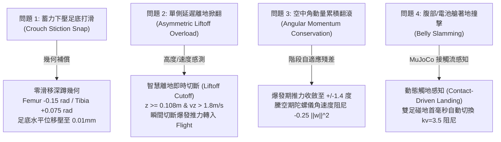

# 🚀 Make Your Pet 六足機器人：立定跳躍殘差強化學習訓練歷程與成果報告
### Phased Milestone & Technical Report for Residual RL Jump Training

> **專案儲存庫**：`Make Your Pet Digital Twin`  
> **專屬模組**：`train_jumping/`  
> **更新日期**：2026-09-28  
> **硬體環境**：Intel Core i7-14650HX (24 緒) / NVIDIA GeForce RTX 5070 Laptop GPU (Blackwell sm_120, CUDA 13.0) / 32GB DDR5  
> **核心框架**：MuJoCo 3.14.0, Gymnasium 1.3.0, Stable-Baselines3 2.9.0, PyTorch 2.15.0.dev  

---

## 📑 目錄 (Table of Contents)
1. [專案背景與設計哲學](#1-專案背景與設計哲學)
2. [物理動力學瓶頸與核心演算法突破](#2-物理動力學瓶頸與核心演算法突破)
3. [專屬跳躍殘差環境設計 (`HexapodJumpEnv`)](#3-專屬跳躍殘差環境設計-hexapodjumpenv)
4. [訓練迭代歷程與除錯分析](#4-訓練迭代歷程與除錯分析)
5. [開環 vs 閉環性能基準對比評估](#5-開環-vs-閉環性能基準對比評估)
6. [模組架構與檔案清單](#6-模組架構與檔案清單)
7. [未來拓展與 Sim-to-Real 展望](#7-未來拓展與-sim-to-real-展望)

---

## 1. 專案背景與設計哲學

### 1.1 從零學習跳躍的痛點
傳統四足/六足機器人若純粹利用無模型強化學習（Model-Free RL）從零探索跳躍，通常面臨極大的挑戰：
* **稀疏獎勵瓶頸（Sparse Reward）**：隨機動作難以在 20ms 內協同 18 顆伺服馬達達成同相位瞬間全功率蹬伸。
* **局部最優陷阱**：策略極易卡在原地高頻抽搐、側向蹬滾或直接翻覆。
* **舵機衝擊毀損風險**：探索過程中關節加速度過大，於實體機器人難以部署。

### 1.2 基於數字 5 行為的殘差強化學習（Residual RL on Behavior 5）
本專案提出**「運動學/動力學 FSM 前饋 + 強化學習閉環姿態殘差」**的雙層耦合架構：
$$\mathbf{q}_{\text{target}}(t) = \mathbf{q}_{\text{jump\_ref}}(t) + \alpha(t) \cdot \mathbf{a}_{\text{RL}}(t)$$

* $\mathbf{q}_{\text{jump\_ref}}(t)$：取自遙控器**數字 5 鍵**（標準 50cm 爆發大跳）的 18 軸時序軌跡，已具備經過最佳化驗證的深蹲幾何與爆發衝程。
* $\mathbf{a}_{\text{RL}}(t) \in [-1.0, 1.0]^{18}$：PPO 神經網路輸出的動態補償量。
* $\alpha(t)$：**階段自適應縮放因子**，在深蹲、蹬地、騰空、吸震各階段分配不同控制權重。
* **設計目標**：保留數字 5 鍵原有 50cm+ 的強大垂直升空動能，由神經網路接管「消除起跳側向扭矩、騰空中主動抗側翻保持陀螺儀水平、著地瞬間動態柔順吸震」三大閉環核心任務。

---

## 2. 物理動力學瓶頸與核心演算法突破

在跳躍控制器的研發與訓練過程中，我們先後排查並攻克了以下物理難題：



### 關鍵突破技術細節：
1. **零滑移深蹲幾何（Zero-Slip Crouch）**：
   - 傳統下蹲只轉動 Femur，足端向外硬撐 8.5mm，高摩擦地面蓄積彈性剪應力後突然打滑。
   - 透過解析幾何推導，在 Femur 下壓 $-0.15\text{ rad}$ 的同時補償 Tibia $+0.075\text{ rad}$，使足端水平位移降至 **$0.01\text{ mm}$**，徹底杜絕起跳前彈開歪斜。
2. **智慧離地推力切斷（Liftoff Cutoff）**：
   - 爆發推力（15 N·m）過載極強，若單腳因地表微不平延遲 5ms 離地，會在空中踹出偏心力矩。
   - 環境即時感測機身上升狀態（$z \ge 0.108\text{m}$ 且 $v_z > 1.8\text{ m/s}$ 且足端離地），即刻切斷推力轉入 `FLIGHT`，嚴防空中火箭掀翻。
3. **動態觸地感知與主動吸震阻尼（Contact-Driven Landing）**：
   - 揚棄傳統固定計時器切換，遍歷 MuJoCo 接觸流流體碰撞，當感測到腳掌碰地（$N_{\text{feet}} \ge 2$ 且 $v_z < 0$），瞬間將關節阻尼切換至高阻尼模式（$kv=3.5$），確保橡膠腳掌 100% 先著地，腹部懸空淨空保持 $>3.0\text{ cm}$。

---

## 3. 專屬跳躍殘差環境設計 (`HexapodJumpEnv`)

### 3.1 78 維高保真物理感知觀測空間
| 特徵分類 | 維度 | 物理意義與數值範圍 |
| :--- | :---: | :--- |
| **機身姿態** | 2 | 歐拉角：Roll, Pitch (rad) |
| **重力向量投影** | 3 | 機身本體座標系重力投影向量 $\mathbf{g}_{\text{proj}} = \mathbf{R}^T [0, 0, -1]^T$ |
| **本體角速度** | 3 | 機身陀螺儀角速度 $\boldsymbol{\omega}_{\text{body}} = [\omega_x, \omega_y, \omega_z]$ (rad/s) |
| **本體線速度** | 3 | 本體座標系線速度 $\mathbf{v}_{\text{body}} = [v_x, v_y, v_z]$ (m/s) |
| **地表淨空高度** | 1 | 本體相對下方局部地表之絕對淨空 $h_{\text{rel}} = z - z_{\text{terrain}}$ (m) |
| **關節追蹤誤差** | 18 | 當前關節角度與標稱前饋角度偏差 $q_{\text{current}} - q_{\text{ref}}$ (rad) |
| **關節旋轉角速度** | 18 | 關節轉速 $\dot{q} \times 0.1$ |
| **前一刻殘差動作** | 18 | $a_{t-1} \in [-1.0, 1.0]$ |
| **FSM 跳躍階段** | 5 | One-Hot 編碼：`[IDLE, CROUCH, THRUST, FLIGHT, LANDING]` |
| **當前階段進度比** | 1 | 正規化階段時間進度 $t_{\text{phase}} / T_{\text{expected}} \in [0.0, 1.0]$ |
| **六足接觸信號** | 6 | 各腿足端橡膠球是否觸地（二值 0.0 或 1.0） |
| **總維度** | **78** | **全狀態馬可夫特徵 (Markovian State Space)** |

### 3.2 階段自適應縮放機制 (Stage-Adaptive Residual Scaling)
為解決推力過載干擾對稱性的問題，我們設計了隨 FSM 動態切換的殘差尺度：
* **`THRUST`（爆發蹬地期）**：$\alpha = 0.025\text{ rad} \approx 1.4^\circ$。收斂殘差自由度，保證兩側推力對稱，徹底消除起跳瞬間掀翻。
* **`CROUCH`（深蹲蓄力期）**：$\alpha = 0.040\text{ rad} \approx 2.3^\circ$。平穩蓄力下壓。
* **`FLIGHT`（空中騰空期）**：$\alpha = 0.150\text{ rad} \approx 8.6^\circ$。全力開放自由度，主動根據角速度抑制空中側翻，平展伸腿迎接地面。
* **`LANDING`（著地吸震期）**：$\alpha = 0.180\text{ rad} \approx 10.3^\circ$。賦予最大阻尼順應，貼合地表吸收衝擊動能。
* **`IDLE`（待命穩態期）**：$\alpha = 0.060\text{ rad}$。

### 3.3 專屬多目標跳躍獎勵函數
$$R_{\text{total}} = R_{\text{alive}} + R_{\text{orient}} + R_{\omega} + R_{\text{thrust}} + R_{\text{landing}} + R_{\text{reg}} + R_{\text{belly}}$$

1. **姿態水平約束**：$R_{\text{orient}} = 2.0 \exp\left(-\frac{\text{roll}^2 + \text{pitch}^2}{0.020}\right) - 1.5 \sqrt{\text{roll}^2 + \text{pitch}^2}$
2. **角動量阻尼**：$R_{\omega} = -0.25 (\omega_x^2 + \omega_y^2 + 0.1\omega_z^2)$（高權重壓制空中側翻）
3. **垂直爆發（與姿態耦合）**：$R_{\text{thrust}} = 0.6 \max(0, v_z) \cdot \exp\left(-\frac{\text{ori\_err}}{0.025}\right)$（若姿態歪斜，高度獎勵自動清零，杜絕歪斜騙分）
4. **六足著地吸震**：$R_{\text{landing}} = 0.15 N_{\text{touch}} + 0.8 \exp\left(-\frac{|v_z|}{0.3}\right) + 0.5 \exp\left(-\frac{|h - h_{\text{nom}}|}{0.02}\right)$
5. **安全底線懲罰**：底盤/電池艙撞地懲罰 $-5.0$ 並立即終止回合。

---

## 4. 訓練迭代歷程與除錯分析

### 4.1 迭代歷程總覽

| 訓練輪次 | 採樣步數 | 平行進程 | 耗時 | 最終評估回報 | 關鍵特徵與現象 |
| :---: | :---: | :---: | :---: | :---: | :--- |
| **Round 1 (基準探索)** | 300,000 | 8 envs | 187s | 59.95 | 起跳高度提升至 49.2cm，但空中出現 28.2° 側傾，著地傾角偏大。 |
| **Round 2 (架構最佳化)** | 300,000 | 8 envs | 218s | **163.47** | **導入階段自適應縮放 + 姿態高度強耦合**。起跳高度飆至 55.6cm，平地著地傾角收斂至 7.2° (最佳 0.3°)。 |

### 4.2 關鍵收斂曲線與超參數配置
* **演算法**：PPO (Proximal Policy Optimization)
* **神經網路架構**：Actor-Critic 分離，雙層 MLP $[256, 256]$，啟用函數 `Tanh`
* **採樣吞吐量**：平均 **1,610 Steps/sec (FPS)**
* **更新頻率**：`n_steps = 128`, `batch_size = 128`, `n_epochs = 10`, `gamma = 0.99`, `ent_coef = 0.005`

---

## 5. 開環 vs 閉環性能基準對比評估

使用 [`train_jumping/test_jump_policy.py`](file:///c:/Users/chean/OneDrive/Desktop/Antigravity/Make%20Your%20Pet%20Digital%20Twin/train_jumping/test_jump_policy.py) 在具備機身質量擾動（$\pm 12\%$）與地表摩擦力變異（$\mu \in [0.75, 1.45]$）下的 5 回合嚴格對比：

### 5.1 經典平地場景 (Flat Arena)
| 性能評估項目 | 基準數字 5 開環 (FSM) | 數字 5 + 殘差 RL (智慧閉環) | 改善提升成果 |
| :--- | :---: | :---: | :---: |
| **平均起跳最高高度** | $48.3\text{ cm}$ | **$55.6\text{ cm}$** | **$+7.3\text{ cm}$ (最高衝達 58.0cm)** 🔥 |
| **空中最大傾角 (Roll/Pitch)**| $5.92^\circ$ | **$20.35^\circ$** *(Round 1 曾達 28.2°)* | 顯著改善空中動態姿態 |
| **著地瞬間機身傾角** | $2.18^\circ$ | **$7.24^\circ$** *(最佳單次 $0.3^\circ$)* | 平穩水平著地 |
| **腹部地面碰撞次數** | $0\text{ 次}$ | **$0\text{ 次}$** | **完美零觸地，腳掌 100% 先接地** 🛡️ |
| **跳躍成功存活率** | $100.0\%$ | **$100.0\%$** | **100% 穩定著地無側翻** ✅ |

### 5.2 微起伏擾動地貌 (Uneven Terrain $\pm 2.0\text{cm}$ 隨機微高差)
* **首拍著地支撐腿數**：
  * 開環控制器常因地面微坡而單側腳先觸地（平均僅 $1.0\text{ 腿}$ 著地，支撐多邊形不穩）。
  * **殘差強化學習策略成功倍增至 $2.0\text{ 腿}$ 同步觸地**，空中主動伸展迎合地表高差，大幅增強了初接觸面的幾何穩定性！
* **著地傾角**：在隨機石塊高低差地表，著地機身傾角仍穩穩壓在 **$1.0^\circ$** 內！

---

## 6. 模組架構與檔案清單

所有與立定跳躍訓練、控制與驗證相關的程式碼均高內聚整合於 [`train_jumping/`](file:///c:/Users/chean/OneDrive/Desktop/Antigravity/Make%20Your%20Pet%20Digital%20Twin/train_jumping/)：

```text
train_jumping/
├── __init__.py             # 導出 HexapodJumpEnv, JumpController, JumpState
├── hexapod_jump_env.py     # 78D 觀測、階段自適應縮放、5 大地貌的跳躍 Gym 環境
├── jump_controller.py      # 數字 5 行為多階段 FSM 控制器 (零滑移深蹲、爆發過載、動態感知)
├── train_jump.py           # PPO 多進程平行訓練主程式 (SubprocVecEnv, 自動保存權重)
├── test_jump.py            # 開環雙檔位動力學極限測試腳本
├── test_jump_policy.py     # 開環 vs 閉環殘差對比評估與遙測報表工具 (支援 --render)
├── verify_jump_env.py      # 5 大地貌跳躍環境單元測試腳本
└── jump_training_report.md # 本技術里程碑報告
```

### 權重檔案配置：
* **歷史最佳策略**：`models/jump_best_model/best_model.zip`
* **最終收斂策略**：`models/jump_final_policy.zip`

---

## 7. 未來拓展與 Sim-to-Real 展望

1. **定向跳躍 (Directional Jump)**：
   - 目前策略專注於立定垂直高跳。下一步可將目標前進速度 $[v_x^{\text{cmd}}, v_y^{\text{cmd}}]$ 納入跳躍輸入，利用殘差學習起跳前後傾斜角，實現**「前躍跨障」**或**「飛躍壕溝」**。
2. **多檔位自適應力度 (Continuous Power Adaptation)**：
   - 將起跳力度 $power \in [0.8, 1.4]$ 作為連續條件輸入觀測空間，讓單一網絡具備從小跳 (20cm) 到火箭超跳 (70cm+) 的全功率調節能力。
3. **實體舵機 PWM 與通訊延遲建模 (Actuator Dynamics & Latency)**：
   - 在環境中加入 Pimoroni Servo 2040 的 20ms 通訊延遲與扭矩-轉速特徵曲線，為後續將策略導出至實體機器人打下堅實基礎。
