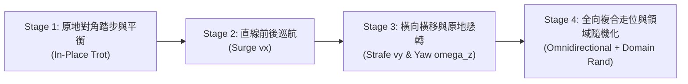

# Make Your Pet 18-DOF 六足機器人：四足全向步態訓練工程計畫書
## 包含：前後線性移動 ($v_x$)、左右側向橫移 ($v_y$)、原地與差速懸轉 ($\omega_z$) 之動態對角小跑 (Dynamic Trot) 強化學習落地藍圖

---

## 📌 一、計畫背景與系統定位 (Executive Summary & System Architecture)

### 1.1 研發背景
**Make Your Pet** 現有系統已在 `train_walking` 模組中成功實現了 18 自由度六足機器人的經典靜態三角步態（Tripod Gait）。在六足三角步態下，機器人任何瞬間皆由 3 隻腿構成支撐三角形，質心投影始終位於支撐多邊形內，具備天然的靜態穩定性（Static Stability）。

然而，足式機器人在多地形環境與多工任務中，常需具備**構型自適應切換（Morphological Adaptation）**能力：
1. **釋放前肢/中肢作動空間**：當六足機器人將中間雙腿（L2, R2）收納折疊，轉化為「四足模式（Quadruped Mode）」時，不僅大幅縮減側向機構干涉，還能為未來的機載機械臂、感測雲台或夾爪工具騰出充裕的作業空間。
2. **挑戰更高能效之動態步態**：四足對角小跑（Diagonal Trot Gait）具有顯著的動態步態特徵，接地摩擦衝量集中於四角腿，擺動相能耗更低，運動節奏更迅捷生動。
3. **全向機動性（Omnidirectional Locomotion）**：四足模式下的四條角腿（L1, L3, R1, R3）在幾何安裝上對稱分佈於機體四個象限（$\pm 45^\circ, \pm 135^\circ$），具備絕佳的力學投影對稱性，能天然支援前後走位、側向平移與原地旋轉。

```mermaid
flowchart TD
    subgraph QuadrupedArchitecture["Make Your Pet 四足全向運動控制架構"]
        subgraph Input["運動指令 (User Commander)"]
            CMD["目標向量 [v_x, v_y, omega_z]<br>前後衝程 / 側向橫移 / 偏航自轉"]
        end

        subgraph Kinematics["四足運動學前饋層 (Nominal Prior)"]
            TrotGen["QuadrupedTrotKinematics<br>對角步態時鐘 phi (1.6 Hz)"]
            TuckCtrl["中腿收納約束器 (Middle-Leg Tuck Controller)<br>L2/R2 保持超高空懸空避障態"]
            TrotGen -->|動態角 q_ref (4腿)| Splitter["18-DOF 關節目標合成器"]
            TuckCtrl -->|固定收納角 q_tuck (2腿)| Splitter
        end

        subgraph RLPolicy["殘差動態平衡神經網路 (PPO Policy)"]
            Obs["67 維觀測狀態 (姿態/速度/時鐘/關節誤差)"] --> ActorNet["Actor-Critic 網路 (MLP 256x256)"]
            ActorNet --> ResAction["18 維關節殘差 Delta q (主動維持側傾平衡與踏地推蹬)"]
        end

        subgraph Execution["底層執行與物理引擎"]
            Splitter & ResAction --> Adder["q_target = q_ref + Delta q"]
            Adder --> PD["關節 PD 控制器 (kp=20, kd=1.5)"]
            PD --> MuJoCo["MuJoCo 物理數位孿生 / 實體 Servo 2040"]
        end

        CMD --> TrotGen
        CMD --> Obs
    end
```

### 1.2 核心技術挑戰 (Key Technical Challenges)
相較於六足三角步態，四足模式的訓練難度有階躍式提升：
1. **從靜態穩定到動態穩定（Loss of Static Polygon）**：
   在 Trot 步態下，同時著地的僅有對角兩條腿（如 LF + RR 或 RF + LR）。兩足支撐點在地面僅能連成一條「支撐線（Support Line）」，無法構成多邊形支撐面。機身重心時刻處於倒立擺失穩邊界，策略網路必須學會利用左右足端推力差、身體角動量以及擺動相落腳點補償，維持動態平衡。
2. **中腿絕對收折防擦地（Strict Tucking Invariance）**：
   中間雙腿（L2, R2）雖然仍掛載於機器人身上並由舵機供電，但必須嚴格維持在機側上方折疊姿態，**觸地率必須為 0.0%**，且不能因動作殘差抖動刮擦地面阻礙四足邁步。
3. **全向向量協同解耦（Omnidirectional Stride Decomposition）**：
   實現任意複合方向的行進（前後移動 $v_x$、左右橫移 $v_y$、原地懸轉 $\omega_z$），需將期望速度精確投影至四條傾斜安裝的角腿局部坐標系中，由 Coxa（水平偏航）與 Femur/Tibia（垂直與徑向伸縮）聯動輸出。

---

## 📐 二、機構幾何與中腿收納形態學 (Mechanism Geometry & Tucking Kinematics)

### 2.1 腿部編號與角色重新劃分
Make Your Pet 實體機構共 6 條腿，每腿 3 個自由度（Coxa, Femur, Tibia）。在四足模式下，各腿的功能配置如下表：

| 腿編號 | 代號 | 邏輯名稱 | 機構安裝角 $\psi_i$ | 實體引腳 (Servo 2040) | 四足角色劃分 | 所屬 Trot 步態組 |
| :--- | :--- | :--- | :--- | :--- | :--- | :--- |
| **Leg 0** | **L1** | 左前 (Left-Front) | $+45^\circ$ ($+\pi/4$) | P10, P11, P12 | **四足主動運動腿** | **Trot Group A** |
| **Leg 1** | **L2** | 左中 (Left-Middle) | $+90^\circ$ ($+\pi/2$) | P13, P14, P15 | **休眠折疊收納腿** | *(不參與步態，恆定收起)* |
| **Leg 2** | **L3** | 左後 (Left-Rear) | $+135^\circ$ ($+3\pi/4$) | P16, P17, P18 | **四足主動運動腿** | **Trot Group B** |
| **Leg 3** | **R1** | 右前 (Right-Front) | $-45^\circ$ ($-\pi/4$) | P1, P2, P3 | **四足主動運動腿** | **Trot Group B** |
| **Leg 4** | **R2** | 右中 (Right-Middle) | $-90^\circ$ ($-\pi/2$) | P4, P5, P6 | **休眠折疊收納腿** | *(不參與步態，恆定收起)* |
| **Leg 5** | **R3** | 右後 (Right-Rear) | $-135^\circ$ ($-3\pi/4$) | P7, P8, P9 | **四足主動運動腿** | **Trot Group A** |

### 2.2 中腿收納位姿參數 (Middle-Leg Tucking Pose)
為了確保中腿在四足運動過程中既不干涉地面、也不阻擋前後腿大擺幅運動，定義中腿標準收納角向量：
- **Coxa (偏航關節)**：$q_{\text{tuck, coxa}} = 0.0\text{ rad} \ (0.0^\circ)$。保持正側向 neutral 中位，遠離前後腿的水平運動包絡面。
- **Femur (俯仰關節)**：$q_{\text{tuck, femur}} = -0.65\text{ rad} \ (-37.2^\circ)$。大腿向上緊縮抬起，將整條腿提起高過機身底板。
- **Tibia (小腿關節)**：$q_{\text{tuck, tibia}} = -0.95\text{ rad} \ (-54.4^\circ)$。小腿大幅向內折疊收緊，使足端緊貼機身外殼。
- **安全離地淨空高度 (Ground Clearance)**：
  在標準站立高度 $z_{\text{trunk}} = 0.082\text{ m}$ 時，中腿足端最低點離地高度為：
  $$h_{\text{clearance, mid}} \ge 55\text{ mm}$$
  即使在 Trot 步態劇烈顛簸或著地避震瞬間，機身下沉極限達到 $15\text{ mm}$，中腿足端依然保有 $> 40\text{ mm}$ 的安全緩衝距離，杜絕誤碰地面。

```
[中腿收納側視剖面示意圖]
        +------------- 機身頂板 -------------+
        |                                   |
        | [Coxa: 0°]                        |
        +---\                               |
             \  Femur 向上挑起 (-37.2°)     |
              \                             |
               +---/                        |
                  /  Tibia 極限向內折疊 (-54.4°)
                 * (足端 Tip 收攏於機腹側上方，淨空高度 > 55mm)
====================== 地面 (Ground) ======================
```

---

## 🏃 三、數學物理模型：四足全向對角步態運動學 (Quadruped Omnidirectional Kinematics)

四足模式採用**對角小跑步態（Diagonal Trot Gait）**。四條角腿劃分為兩組對角配對：
- **Group A**：左前足 (L1) + 右後足 (R3)
- **Group B**：右前足 (R1) + 左後足 (L3)

### 3.1 步態時序與相位推進 (Phase Oscillator)
設定步態基準頻率 $f_{\text{trot}} = 1.6\text{ Hz}$（週期 $T = 0.625\text{ s}$），佔空比（Duty Factor） $\beta = 0.55$：
$$\phi \in [0, 2\pi), \quad \dot{\phi} = 2\pi f_{\text{trot}}$$
兩組腿的相位關係為：
$$\phi_A = \phi \pmod{2\pi}, \quad \phi_B = (\phi + \pi) \pmod{2\pi}$$
- 當 $\phi_i \in [0, \pi)$：該組處於**擺動相（Swing Phase）**，足端騰空抬高並跨步向前/側向延伸。
- 當 $\phi_i \in [\pi, 2\pi)$：該組處於**支撐相（Stance Phase）**，足端貼地蹬踏，對地面施加剪切與法向反作用力，推動機體前進。

### 3.2 平面全向向量分解模型 (Omnidirectional Stride Decomposition)
設機身在水平本體坐標系下的期望運動向量為：
$$\mathbf{v}_{\text{cmd}} = \begin{bmatrix} v_x \\ v_y \\ \omega_z \end{bmatrix} \in \mathbb{R}^3$$
其中：
- $v_x$：前後縱向線速度（前進為正，後退為負）
- $v_y$：左右橫向線速度（左移為正，右移為負）
- $\omega_z$：偏航角速度（逆時針/左轉為正，順時針/右轉為負）

對於安裝角為 $\psi_i$ 的四角腿（$i \in \{0, 2, 3, 5\}$），將期望速度投影為**切向行程（Tangential Stride $S_{t, i}$）**與**徑向行程（Radial Stride $S_{r, i}$）**：

#### 1. 切向行程 $S_{t, i}$（由 Coxa 水平航向舵機驅動）
切向運動垂直於腿部的幾何安裝半徑軸線，負責產生橫向剪切與轉向力矩：
$$S_{t, i} = v_x \sin\psi_i - v_y \cos\psi_i + \omega_z \cdot R_{\text{yaw}} \cdot \text{yaw\_sign}_i$$
其中：
- $R_{\text{yaw}} \approx 0.12\text{ m}$ 為足端至旋轉質心的有效力臂半徑。
- 對稱轉換係數 $\text{yaw\_sign}_i$：左腿取 $-1.0$，右腿取 $+1.0$。
- **角度投影分析**：
  - L1 ($+45^\circ$): $S_{t, 0} = \frac{\sqrt{2}}{2} v_x - \frac{\sqrt{2}}{2} v_y - \omega_z R_{\text{yaw}}$
  - R1 ($-45^\circ$): $S_{t, 3} = -\frac{\sqrt{2}}{2} v_x - \frac{\sqrt{2}}{2} v_y + \omega_z R_{\text{yaw}}$
  - L3 ($+135^\circ$): $S_{t, 2} = \frac{\sqrt{2}}{2} v_x + \frac{\sqrt{2}}{2} v_y - \omega_z R_{\text{yaw}}$
  - R3 ($-135^\circ$): $S_{t, 5} = -\frac{\sqrt{2}}{2} v_x + \frac{\sqrt{2}}{2} v_y + \omega_z R_{\text{yaw}}$

> **幾何優勢**：在四足模式下，四角腿的安裝角度對稱分佈在 4 個象限（$\sin$ 與 $\cos$ 絕對值皆為 $\frac{\sqrt{2}}{2}$），前後運動與左右橫移的切向增益完全對等！這使四足機器人具備天然純粹的全向蟹行橫移能力，完全沒有六足模式中軸中腿的奇異性問題。

#### 2. 徑向行程 $S_{r, i}$（由 Femur / Tibia 徑向伸縮驅動）
徑向運動沿著腿部幾何軸向伸縮，在支撐相提供側向輔助推力，在擺動相提供步幅伸展：
$$S_{r, i} = -(v_x \cos\psi_i + v_y \sin\psi_i)$$

### 3.3 關節名義參考軌跡合成 (`get_reference_angles`)
針對當前相位 $p = \phi_A$ 或 $\phi_B$：
1. **Coxa (偏航角)**：
   $$q_{\text{coxa}, i} = S_{t, i} \cdot \cos(p) \cdot K_{\text{stride}}$$
2. **Femur (大腿角) & Tibia (小腿角)**：
   - **擺動期 ($p < \pi$)**：拋物線高抬腿與跨步延伸
     $$h(p) = \sin^{0.8}(p)$$
     $$q_{\text{femur}, i} = -H_{\text{femur}} \cdot h(p) + 0.3 \cdot S_{r, i} \cdot \cos(p)$$
     $$q_{\text{tibia}, i} = -H_{\text{tibia}} \cdot h(p) + 0.3 \cdot S_{r, i} \cdot \cos(p)$$
     （標準配置：$H_{\text{femur}} = 0.38\text{ rad}, H_{\text{tibia}} = 0.24\text{ rad}$，確保足端離地高度達 $3.2\text{ cm}$ 避免磕碰地形）
   - **支撐期 ($p \ge \pi$)**：貼地蹬踏推進
     $$q_{\text{femur}, i} = q_{\text{nominal, femur}} + K_{\text{radial}} \cdot S_{r, i} \cdot \cos(p)$$
     $$q_{\text{tibia}, i} = q_{\text{nominal, tibia}} + K_{\text{radial}} \cdot S_{r, i} \cdot \cos(p)$$
3. **中腿 L2, R2**：
   $$q_{\text{ref, L2}} = [0.0, -0.65, -0.95]^T, \quad q_{\text{ref, R2}} = [0.0, -0.65, -0.95]^T$$

---

## 🧠 四、強化學習環境與獎勵函數工程 (`quadruped_env.py`)

為了保證與現有 ONNX 導出器、Chica Server 網路封包協定（TCP 18711）以及 Android App 的 $100\%$ 無縫對接，環境**觀測空間（Observation Space）維持為經典的 67 維**，**動作空間（Action Space）維持為 18 維**。

### 4.1 觀測空間設計 ($\mathcal{S}_t \in \mathbb{R}^{67}$)
| 子向量維度 | 物理涵義 | 坐標系 / 單位 | 備註 |
| :--- | :--- | :--- | :--- |
| **$[0:2]$ (2D)** | 機身姿態傾角 $[roll, pitch]$ | 弧度 (rad) | 監控倒立擺側傾與俯仰平衡 |
| **$[2:5]$ (3D)** | 機身本體角速度 $[\omega_x, \omega_y, \omega_z]$ | rad/s | 抑制 Trot 動態晃動與震盪 |
| **$[5:8]$ (3D)** | 機身本體線速度 $[v_x, v_y, v_z]$ | m/s | 實時速度反饋與跟隨基準 |
| **$[8:26]$ (18D)** | 關節追蹤誤差 $(q_{\text{meas}} - q_{\text{ref}})$ | rad | 包含 4 主動腿誤差與 2 中腿收納誤差 |
| **$[26:44]$ (18D)** | 關節轉速 $\dot{q} \times 0.1$ | rad/s (縮放 0.1) | 舵機動態速度特徵 |
| **$[44:62]$ (18D)** | 前一步殘差動作 $a_{t-1}$ | 正規化 $[-1, 1]$ | 保證動作連續性與平滑度 |
| **$[62:65]$ (3D)** | 目標運動指令 $[v_x^{\text{cmd}}, v_y^{\text{cmd}}, \omega_z^{\text{cmd}}]$ | [m/s, m/s, rad/s] | 控制器引導意圖 |
| **$[65:67]$ (2D)** | 步態相位時鐘 $[\sin\phi, \cos\phi]$ | 無量綱 | 指引 Trot 週期與著地節奏 |

### 4.2 動作空間設計 ($\mathcal{A}_t \in \mathbb{R}^{18}$)
策略網路輸出連續動作 $\mathbf{a}_t \in [-1.0, 1.0]^{18}$：
$$\mathbf{q}_{\text{target}} = \mathbf{q}_{\text{ref}} + \mathbf{S}_{\text{scale}} \odot \mathbf{a}_t$$
其中動作縮放對角陣 $\mathbf{S}_{\text{scale}}$ 採取**主動/休眠非對稱架構**：
- **四條主動腿（L1, L3, R1, R3 共 12 個關節）**：
  - Coxa 殘差縮放：$0.15\text{ rad}$（防止劇烈扭頭摔倒）
  - Femur 殘差縮放：$0.25\text{ rad}$（充裕的支撐相高度調整與動態配重能力）
  - Tibia 殘差縮放：$0.25\text{ rad}$（蹬地推力與地面接觸緩衝補償）
- **兩條收納中腿（L2, R2 共 6 個關節）**：
  - 縮放係數強制設為 $0.0\text{ rad}$（硬鎖定）或極微小值 $0.02\text{ rad}$，使神經網路輸出主要集中在四足動態平衡，完全消除中腿誤動干擾。

### 4.3 獎勵函數工程架構 (Comprehensive Multi-Objective Reward)
獎勵函數 $R_{\text{total}}$ 由以下五大子項合成：
$$R_{\text{total}} = R_{\text{tracking}} + R_{\text{gait}} + R_{\text{tuck}} + R_{\text{stability}} + R_{\text{regularization}}$$

#### 1. 任務指令追蹤獎勵 ($R_{\text{tracking}}$)
採用高斯核函數，提供平滑且具備高梯度指引的速度跟隨激勵：
$$r_{vx} = 3.5 \cdot \exp\left(-\frac{(v_x - v_x^{\text{cmd}})^2}{0.015}\right)$$
$$r_{vy} = 3.5 \cdot \exp\left(-\frac{(v_y - v_y^{\text{cmd}})^2}{0.015}\right)$$
$$r_{\omega z} = 2.5 \cdot \exp\left(-\frac{(\omega_z - \omega_z^{\text{cmd}})^2}{0.030}\right)$$
- **靜止待命鎖定**：當指令接近零時（$|\mathbf{v}_{\text{cmd}}| < 0.02$），額外獎勵靜止站立：
  $$r_{\text{stand}} = 1.5 \cdot \exp\left(-\frac{v_x^2 + v_y^2 + \omega_z^2}{0.005}\right)$$

#### 2. 中腿絕對收折約束 ($R_{\text{tuck}}$) —— 四足專屬生命線獎勵
- **中腿觸地懲罰 (Ground Contact Penalty)**：
  $$r_{\text{mid\_contact}} = -20.0 \cdot (\mathbb{I}_{\text{L2\_contact}} + \mathbb{I}_{\text{R2\_contact}})$$
  只要中腿足端或小腿碰觸地面，單步直接扣除 20 分重罰，強迫神經網路徹底打消使用中腿支撐的念頭。
- **中腿位姿收納偏離懲罰 (Pose Deviation Penalty)**：
  $$r_{\text{mid\_pose}} = -3.0 \cdot \sum_{j \in \{\text{L2}, \text{R2}\}} (q_j - q_{\text{tuck}, j})^2$$

#### 3. 四足對角步態塑形獎勵 ($R_{\text{gait}}$)
- **對角同步接地獎勵 (Diagonal Synchrony Reward)**：
  激勵同一 Trot 組內的兩條腿同起同落，懲罰單腿著地造成的傾覆力矩：
  $$r_{\text{diag\_sync}} = 1.5 \cdot (\mathbb{I}_{\text{L1\_contact}} \cdot \mathbb{I}_{\text{R3\_contact}} + \mathbb{I}_{\text{R1\_contact}} \cdot \mathbb{I}_{\text{L3\_contact}})$$
- **足端打滑懲罰 (Foot Slip Penalty)**：
  支撐相著地期間，懲罰足端水平相對滑動速度：
  $$r_{\text{slip}} = -0.8 \cdot \sum_{i \in \text{active}} \mathbb{I}_{i\text{\_contact}} \cdot (v_{\text{tip}, x, i}^2 + v_{\text{tip}, y, i}^2)$$
- **擺動相拔足離地高度引導 (Swing Clearance Reward)**：
  保證擺動相足端抬升超越地面一定間隙，杜絕踢地磕絆。

#### 4. 姿態平衡與機體抗摔 ($R_{\text{stability}}$)
- **標準機身高度維持**：$r_{\text{height}} = 2.0 \cdot \exp\left(-\frac{(z - 0.082)^2}{0.0004}\right)$
- **傾角約束（防側翻/前翻）**：$r_{\text{orient}} = -3.5 \cdot (roll^2 + pitch^2)$
- **垂直震盪約束**：$r_{\text{vz}} = -2.0 \cdot v_z^2$

#### 5. 硬體能耗與安全約束 ($R_{\text{regularization}}$)
- 動作變化率懲罰：$r_{\text{rate}} = -0.08 \cdot \|\mathbf{a}_t - \mathbf{a}_{t-1}\|^2$（防止高頻抖舵機）
- 關節力矩懲罰：$r_{\text{torque}} = -0.002 \cdot \|\boldsymbol{\tau}\|^2$（降低舵機發熱與耗電）
- 關節極限安全邊界：超出舵機極限角度時施加強烈線性懲罰。

---

## 🗺️ 五、分階段課程學習訓練藍圖 (Curriculum Learning Roadmap)

四足小跑需要從「學會平衡」逐步遞進到「靈巧全向走位」。我們設計四階段漸進式課程學習（Curriculum Learning）：



### 5.1 階段目標與採樣空間配置表

| 階段名稱 | 訓練步數 (Steps) | 指令採樣空間配置 | 專項訓練重點與考核指標 |
| :--- | :--- | :--- | :--- |
| **Stage 1: 原地對角踏步與平衡** | 100,000 步 (約 10 分鐘) | $v_x = 0.0$<br>$v_y = 0.0$<br>$\omega_z = 0.0$ | **建立對角平衡本能**：<br>學會對角兩點支撐時的微幅動態側傾調諧，中腿 $100\%$ 收攏，機身 Roll/Pitch $< 2.5^\circ$。 |
| **Stage 2: 直線前後巡航** | 250,000 步 (約 25 分鐘) | $v_x \in [-0.20, +0.35]\text{ m/s}$<br>$v_y = 0.0$<br>$\omega_z = 0.0$ | **縱向速度掌控與抗前傾/後仰**：<br>掌握對角前向推蹬做功，急停急起時不摔倒，速度追蹤誤差 $< 0.04\text{ m/s}$。 |
| **Stage 3: 純側向橫移與懸轉** | 300,000 步 (約 30 分鐘) | $v_y \in [\pm 0.15, \pm 0.28]\text{ m/s}$<br>$\omega_z \in [\pm 0.40, \pm 0.85]\text{ rad/s}$<br>$v_x = 0.0$ | **四角腿切向/徑向全向側推**：<br>完全不依賴轉頭即可純側向平移，原地高轉速自轉，無多餘縱向漂移（Drift $< 0.03\text{ m/s}$）。 |
| **Stage 4: 全向複合走位與強健化** | 350,000 步 (約 35 分鐘) | $v_x, v_y, \omega_z$ 任意複合連續隨機採樣<br>+ 領域隨機化 (DR) | **任意方向全向飄移與抗擾越野**：<br>疊加質量變動 ($\pm 15\%$)、摩擦力變動 ($0.7 \sim 1.4$) 與輕度凹凸波浪地形 (Bumps)。 |

> **總訓練預算**：約 $1,000,000$ 步（單卡 RTX 3060/4060 約需 1.5 ~ 2 小時即可收斂至極致水準）。

---

## 💻 六、`train_quadruped/` 目錄工程架構與實作計畫 (Implementation Plan)

在 `MakeYourPet-DigitalTwin/train_quadruped/` 目錄下，我們將清理現有的無關跳躍檔案，構建專屬的四足訓練模組庫：

### 6.1 核心檔案與職責清單
```text
MakeYourPet-DigitalTwin/train_quadruped/
├── quadruped_locomotion_plan.md      # [本檔案] 四足全向移動訓練完整工程規格計畫書
├── quadruped_trot_kinematics.py      # [模組 1] 四足對角全向 Trot 幾何運動學前饋產生器
├── quadruped_env.py                  # [模組 2] 67 維觀測 / 18 維動作之四足 Gymnasium 強化學習環境
├── train_quadruped.py                # [模組 3] PPO 強化學習四階段課程訓練入口腳本
├── verify_quadruped_kinematics.py    # [模組 4] 運動學軌跡靜態/動態數值驗證與可視化工具
├── test_quadruped_policy.py          # [模組 5] 訓練完畢策略互動測試器 (鍵盤/手把即時操作)
├── export_quadruped_onnx.py          # [模組 6] ONNX 神經網路導出器 (匯出為 quadruped_policy.onnx)
└── __init__.py                       # 套件模組聲明
```

### 6.2 各模組詳細實作細節

#### 1. 運動學生成器 (`quadruped_trot_kinematics.py`)
- 定義 `QuadrupedTrotKinematics` 類別。
- 內建四角腿安裝角與對角步態相位分組（Group A / Group B）。
- 中腿 L2/R2 輸出固定高空收折姿態。
- 實現 `get_reference_angles(phase, command)`，支援 $(v_x, v_y, \omega_z)$ 任意全向速度向量分解。

#### 2. 四足環境 (`quadruped_env.py`)
- 繼承自 Gymnasium `gym.Env`。
- 載入相同的 `hexapod.xml` 物理模型，確保與六足共享同一具數位孿生硬體。
- 實作 67 維觀測空間與 18 維動作空間。
- 植入中腿接觸檢測器 (`mj_contact`) 與強烈懲罰邏輯。
- 整合課程學習階段開關（`set_curriculum_stage(stage: int)`）。

#### 3. 訓練腳本 (`train_quadruped.py`)
- 基於 Stable-Baselines3 PPO 演算法。
- 網路超參數最佳化配置：
  - `n_steps = 2048`
  - `batch_size = 64`
  - `learning_rate = 3e-4` (線性衰減至 `5e-5`)
  - `gamma = 0.99`
  - `gae_lambda = 0.95`
  - `ent_coef = 0.005` (維持動作探索多樣性)
- 支援 `--stage 1` 至 `--stage 4` 連續接續訓練（`--resume`）。

#### 4. ONNX 模型導出與部署整合 (`export_quadruped_onnx.py`)
- 將訓練好的最佳 PPO Policy 提取 Actor MLP，導出為 `models/quadruped_policy.onnx`。
- 輸入形狀：`[1, 67]`，輸出形狀：`[1, 18]`。
- 與手機端 `chica-server` 原生 TCP 18711 埠通訊無縫相容。

---

## 🎮 七、展示與人機互動控制規格 (Control & Telemetry Interface)

訓練完畢後，在 `test_quadruped_policy.py` 與根目錄 `demo.py` 中支援雙搖桿與鍵盤全自由度操作：

### 7.1 鍵盤全向按鍵映射表 (Keyboard Layout)
| 按鍵組合 | 動作名稱 | 指令向量 $[v_x, v_y, \omega_z]$ | 說明 |
| :--- | :--- | :--- | :--- |
| **`W` / `↑`** | 前進 (Forward) | `[+0.30, 0.0, 0.0]` | 四足對角大步小跑向前 |
| **`S` / `↓`** | 後退 (Backward) | `[-0.25, 0.0, 0.0]` | 四足對角平穩倒車 |
| **`A`** | **純向左橫移 (Strafe Left)** | `[0.0, +0.25, 0.0]` | **身體朝前，純側向向左橫移** |
| **`D`** | **純向右橫移 (Strafe Right)** | `[0.0, -0.25, 0.0]` | **身體朝前，純側向向右橫移** |
| **`Q` / `←`** | **左轉自轉 (Yaw Left)** | `[0.0, 0.0, +0.80]` | 原地逆時針旋轉 |
| **`E` / `→`** | **右轉自轉 (Yaw Right)** | `[0.0, 0.0, -0.80]` | 原地順時針旋轉 |
| **`W` + `D`** | 斜向右前平移 | `[+0.25, -0.20, 0.0]` | 45 度角斜向前走位 |
| **`Space`** | 待命煞車 (Stop) | `[0.0, 0.0, 0.0]` | 四足站立待命，中腿持續高懸收折 |

### 7.2 遊戲手把映射表 (Xbox / PlayStation Controller)
- **左搖桿 (Left Stick)**：$360^\circ$ 無級全向平移走位（推桿方向即為機身水平運動方向，支援前後 $v_x$ 與左右橫移 $v_y$ 混合）。
- **右搖桿水平軸 (Right Stick X)**：控制原地旋轉與前進中轉彎 ($\omega_z$)。
- **LB / RB 肩鍵**：微調左/右純側向蟹行平移。

---

## 📊 八、驗收指標與量化評估標準 (Acceptance Benchmarks)

專案開發與訓練完成後，將透過以下嚴格量化指標進行驗收：

| 評估維度 | 指標項目 | 基準合格線 (Pass) | 頂尖卓越線 (Excellent) | 驗收方法 |
| :--- | :--- | :--- | :--- | :--- |
| **指令跟隨精度** | $v_x$ 前後速度追蹤 RMSE | $\le 0.04\text{ m/s}$ | $\le 0.02\text{ m/s}$ | 於 MuJoCo 執行 60 秒隨機指令階躍測試 |
| **指令跟隨精度** | $v_y$ 橫向平移追蹤 RMSE | $\le 0.035\text{ m/s}$ | $\le 0.018\text{ m/s}$ | 執行 $\pm 0.25\text{ m/s}$ 純橫移測試 |
| **指令跟隨精度** | $\omega_z$ 偏航轉向追蹤 RMSE | $\le 0.06\text{ rad/s}$ | $\le 0.03\text{ rad/s}$ | 執行 $\pm 0.80\text{ rad/s}$ 自轉測試 |
| **步態規範性** | **中腿地面接觸率** | **$0.00\%$** | **$0.00\%$** | 監控 100,000 步模擬中 `col_tip_L2`, `col_tip_R2` 接觸次數為 0 |
| **步態穩定性** | 機身 Roll 橫滾最大抖動 | $< 4.0^\circ$ | $< 2.0^\circ$ | 橫移與旋轉狀態下的橫滾角峰值 |
| **步態穩定性** | 機身 Pitch 俯仰最大抖動 | $< 4.0^\circ$ | $< 2.2^\circ$ | 前進與倒車加速/煞車時的俯仰角峰值 |
| **抗摔能力** | 連續運動摔倒傾覆率 | $< 0.5\%$ | $0.0\%$ | 於連續 20 分鐘隨機走位中未觸發 Terminate |
| **邊緣端推論效能** | ONNX 推論延遲 (手機/PC) | $< 8\text{ ms}$ | $< 3\text{ ms}$ | ONNX Runtime 單次推理耗時統計 |

---

## 🚀 九、後續實作推動計畫 (Action Items)

本計畫書批准後，將依序展開以下工程實施：
1. **建立四足運動學前饋**：撰寫 `train_quadruped/quadruped_trot_kinematics.py` 並完成幾何向量驗證。
2. **建置四足專用 RL 環境**：撰寫 `train_quadruped/quadruped_env.py`，配置 67 維觀測與中腿防觸地懲罰。
3. **編寫課程訓練與驗證工具**：完成 `train_quadruped.py`、`verify_quadruped_kinematics.py` 與 `test_quadruped_policy.py`。
4. **啟動 PPO 強化學習訓練**：依序執行 Stage 1 至 Stage 4 課程，監控 TensorBoard 獎勵收斂。
5. **導出 ONNX 並整合至展示系統**：匯出模型權重並整合至 `demo.py`，完成全向四足步態驗收。
