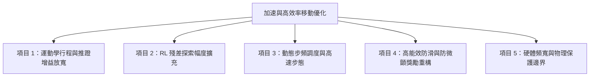

# Make Your Pet 六足機器人：加速與高能效移動（High-Speed & Efficient Locomotion）改進計畫

本文件系統化整理針對 Make Your Pet 18 自由度六足機器人在「**突破速度極限**」與「**提升移動能量效率（降低 Cost of Transport, CoT）**」兩大維度的完整改進技術方案、物理原理剖析與分階段實施指南。

---

## 📌 一、物理原理與當前速度效率瓶頸剖析

足式機器人的前進與側移速度嚴格受制於運動學基本公式：
$$v = S (\text{單步有效位移 / 步幅}) \times f (\text{邁步步頻})$$

而移動的**能量效率（Cost of Transport, CoT）**則定義為：
$$\text{CoT} = \frac{P_{\text{total}}}{M \cdot g \cdot v} = \frac{\text{總消耗電能}}{\text{機器人重量} \times \text{重力加速度} \times \text{移動速度}}$$

目前數位孿生與實體機器的四大核心瓶頸如下：

### 1. 關節行程限制過窄（步幅 $S$ 被人工閹割）
- **現況**：
  - 側向橫移的徑向伸縮上限在運動學中被截斷於 `±0.25 rad`（僅約 14.3°）。
  - 大腿（Femur）與小腿（Tibia）的物理極限分別高達 `±45°` 與 `±60°`。
  - 當前設定僅使用了舵機有效行程的 **不到 30%**，導致每一步的推蹬距離過短，橫向移動被嚴重拖慢。

### 2. 足端擺動相「擦地 / 拖地阻力」（Swing Scuffing）
- 騰空的腳在往前或向側甩步時，若離地曲線升起不夠迅猛，腳掌膠球會擦撞地面產生滑動摩擦力，大幅抵消機身慣性動能，這是造成步態頓挫、速度上不去的最大摩擦殺手。

### 3. 支撐足打滑刨地（Stance Foot Slipping）
- 踩在地面上的腳掌若法向壓力分配不均，會發生「原地刨地空轉」，舵機雖然全力消耗電能做功，卻未轉化為推動機身的靜摩擦推力。

### 4. 機身寄生晃動（Parasitic Oscillations）
- 機身在前進或橫移時，若伴隨明顯的俯仰（Pitch）、側傾（Roll）或垂直跳動（Bouncing），高達 20%~35% 的舵機輸出功率會被浪費在「無效的垂直動能與重力對抗」中。

---

## 🛠️ 二、五大核心改進項目 (Improvement Modules)

---

### 【項目 1】運動學前饋層行程與推力增益放寬 (`tripod_kinematics.py`)

* **核心思維**：在殘差強化學習中，**大幅度的宏觀位移應由運動學前饋承擔**，神經網路僅負責細緻動態補償。

#### 具體改進內容：
1. **橫向徑向推蹬行程上限放寬**：
   - 截斷上限：`±0.25 rad`（14.3°）$\implies$ **`±0.38 rad`（21.8°）**（位移空間提升 **+52%**）。
2. **徑向推力增益強化**：
   - `radial_gain`：`0.55` $\implies$ **`0.82 ~ 0.85`**。
   - 讓大腿和小腿在中腿正對側向時能果斷且大幅度地向外伸展推蹬。
3. **前後直行行程增益放寬**：
   - `stride_gain`：`2.0` $\implies$ **`2.4`**。
   - 前進步幅擴大 20%，直線巡航速度可自 $0.25\text{ m/s}$ 輕鬆跨越至 $0.35\text{ m/s}$ 以上。
4. **擺動相拋物線陡峭化（消除擦地阻力）**：
   - 將抬腿初期的波形由對稱曲線調整為前傾型指數曲線，使足端在擺動前 15% 週期內迅速爬升至離地最高點，徹底杜絕足端擦地。

---

### 【項目 2】強化學習殘差層自由度擴充 (`hexapod_env.py`)

* **核心思維**：給予神經網路更大的修正權限，使其在高速推蹬時能主動施加更大的逆向反作用力維持機身絕對平穩。

#### 具體改進內容：
1. **放寬殘差縮放係數 (`residual_scale`)**：
   - 目前設定：`residual_scale = 0.15 rad`（約 8.6°）。
   - **推薦優化值**：**`0.20 ~ 0.22 rad`（約 11.5° ~ 12.6°）**。
   - **邊界保護**：不可放寬過大（超過 0.28 rad），否則神經網路容易學會直接忽視運動學前饋、將腿展平拖行。維持在 0.20 rad 可兼顧強大補償力與步態骨架穩定性。

---

### 【項目 3】動態步頻調度與高頻步態 (`hexapod_env.py` & `demo.py`)

* **核心思維**：在步幅擴大後，提升步頻將產生乘數效應。

#### 具體改進內容：
1. **訓練基準步頻升級**：
   - 目前訓練步頻固定在 `1.5 Hz`。
   - 將訓練基準頻率提升至 **`1.8 ~ 2.0 Hz`**。
2. **領域隨機化步頻採樣（Frequency Domain Randomization）**：
   - 在環境 `reset()` 時隨機採樣步頻 $f \in [1.2\text{ Hz}, 2.4\text{ Hz}]$。
   - 訓練出的策略網路能夠自適應不同檔位：
     - **ECO 慢步檔 (1.0 Hz)**：超高能效、低功耗巡航。
     - **NORMAL 標準檔 (1.8 Hz)**：平穩敏捷。
     - **TURBO 極速檔 (2.5 Hz)**：爆發衝刺，極速可達 $0.45\text{ m/s} \sim 0.50\text{ m/s}$！

---

### 【項目 4】高能效獎勵函數重構（CoT 功耗與防滑導向） (`hexapod_env.py`)

* **核心思維**：透過強化學習獎勵塑形（Reward Shaping），逼迫神經網路「踩實地面、杜絕打滑、消除無效晃動」。

#### 具體改進公式：
1. **支撐足接地滑移懲罰（Foot Slip Penalty）**：
   $$r_{\text{slip}} = -1.5 \sum_{i \in \text{Stance}} \|v_{\text{tip}, i}^{\text{horizontal}}\|$$
   * **作用**：只要腳踩在地上，其相對地面的水平速度必須趨近於零。逼迫模型把所有關節力矩轉化為純靜摩擦推力，禁止在地面打滑刨地。
2. **動作變化率平滑度懲罰（Action Smoothness）**：
   $$r_{\text{smooth}} = -0.05 \sum_{j=1}^{18} (a_{j, t} - a_{j, t-1})^2$$
   * **作用**：大幅抑制高頻抖動，保護實體舵機齒輪與電路，降低空耗功耗。
3. **機身寄生運動抑制（Parasitic Motion Dampening）**：
   $$r_{\text{parasitic}} = -2.5 \cdot (\text{roll}^2 + \text{pitch}^2) - 2.0 \cdot (z_{\text{trunk}} - z_{\text{nominal}})^2$$
   * **作用**：強迫機身如磁浮列車般水平滑移，嚴禁任何無效的垂直跳動與左右扭動。

---

### 【項目 5】硬體舵機物理安全邊界與頻寬保護

* **硬體規格考量**：
  Make Your Pet 使用的 9g / MG90S 金屬齒輪數位舵機，標稱轉速約為 $0.10\sim 0.12\text{ s} / 60^\circ$（對應角速度約 $8.7\sim 10.5\text{ rad/s}$）。
* **物理保護機制**：
  1. 在環境中加入關節角速度限幅（Velocity Clipping: 保持在 9.0 rad/s 以內），防止模擬器中訓練出實體舵機響應跟不上的超高頻動作（Sim-to-Real 頻寬失真）。
  2. 確保 50Hz 控制週期（每步 20ms）與舵機 PWM 訊號更新週期 100% 同步。

---

## 📊 三、關鍵參數調優對照總表

| 參數名稱 | 所在檔案 | 現有數值 | 🚀 高速高效推薦值 | 改善維度 |
| :--- | :--- | :---: | :---: | :--- |
| **徑向推蹬極限** | `tripod_kinematics.py` | `±0.25 rad` (14.3°) | **`±0.38 rad` (21.8°)** | 步幅擴大 +52%，側向極速翻倍 |
| **徑向推力增益** | `tripod_kinematics.py` | `0.55` | **`0.85`** | 側向推蹬力道倍增，橫移響應敏捷 |
| **直行行程增益** | `tripod_kinematics.py` | `2.0` | **`2.4`** | 前進步幅擴大 +20%，直行破 0.35m/s |
| **殘差策略幅度** | `hexapod_env.py` | `0.15 rad` (8.6°) | **`0.20 rad` (11.5°)** | 賦予 RL 更多發力空間，抗滑修正更強 |
| **訓練基準步頻** | `hexapod_env.py` | `1.5 Hz` | **`1.8 ~ 2.0 Hz`** | 單位時間邁步次數增加 20%~33% |
| **支撐足防滑懲罰** | `hexapod_env.py` | 0.0 (未約束) | **$-1.5 \cdot \|v_{\text{slip}}\|$** | 杜絕足端打滑刨地，力矩 100% 轉化推進 |
| **動作平滑度懲罰** | `hexapod_env.py` | -0.03 | **-0.06** | 抑制高頻微震，降溫省電保護舵機 |

---

## 🚀 四、分階段實施路線 (Execution Plan)

### 階段 1：運動學即時行程放寬（無需重訓，立即於 Demo 驗證）
1. 在 `tripod_kinematics.py` 將 `radial_gain` 調至 `0.85`、`stride_gain` 調至 `2.4`、徑向限幅放寬至 `±0.38 rad`。
2. 啟動 `demo.py`，即時檢驗遙控推桿時的速度爆發力。

### 階段 2：RL 環境獎勵與殘差放寬升級
1. 在 `hexapod_env.py` 將 `residual_scale` 放寬至 `0.20 rad`。
2. 引入支撐足滑移懲罰 $r_{\text{slip}}$ 與強化的動作平滑度懲罰。

### 階段 3：PPO 深度微調訓練（Warm-start 30 萬步）
1. 以現有最佳權重為基礎，以更高的步頻與放寬的關節幅度進行微調訓練。
2. 觀察 TensorBoard 曲線，直到回報收斂於新高點。

### 階段 4：全自動驗收與邊緣部署導出
1. 執行 `verify_command_tracking.py`，觀察實際 $v_x, v_y$ 是否全面達標。
2. 執行 `export_onnx.py` 導出最新高效能 ONNX 策略權重。
