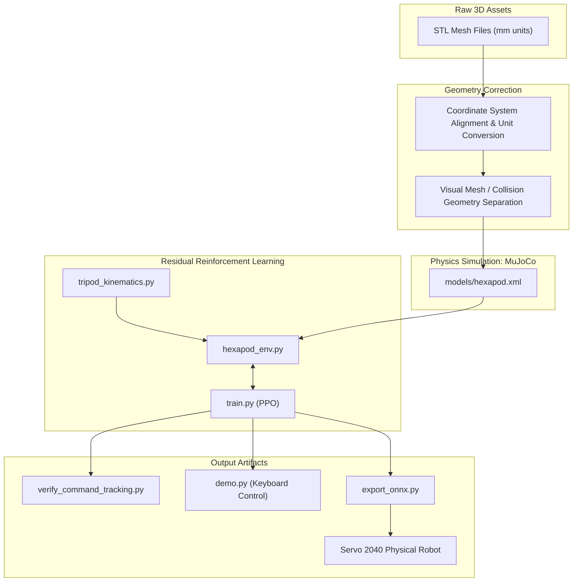

# Make Your Pet Hexapod Robot: Digital Twin & AI Gait Learning Implementation Guide (3rd Edition)

> **Open-Source Hardware Project**: [MakeYourPet/hexapod](https://github.com/MakeYourPet/hexapod)
> **Version**: Third Edition (3ed · September 2026)
> **Target Audience**: Users with basic Python knowledge who want to train a hexapod robot to walk in a simulator and deploy the trained model to a physical robot.

---

## Table of Contents

1. [System Overview](#1-system-overview)
2. [Environment Setup (Stage 0)](#2-environment-setup-stage-0)
3. [3D Model Assembly & Physics Modeling (Stage 1)](#3-3d-model-assembly--physics-modeling-stage-1)
4. [Tripod Gait Feedforward Kinematics (Stage 2)](#4-tripod-gait-feedforward-kinematics-stage-2)
5. [Reinforcement Learning Environment Wrapper (Stage 3)](#5-reinforcement-learning-environment-wrapper-stage-3)
6. [Training (Stage 4)](#6-training-stage-4)
7. [Verification, Control & Model Export (Stage 5)](#7-verification-control--model-export-stage-5)
8. [Blender Cinematic Rendering (Stage 6)](#8-blender-cinematic-rendering-stage-6)
9. [Physical Robot Deployment (Stage 7)](#9-physical-robot-deployment-stage-7)
10. [Frequently Asked Questions](#10-frequently-asked-questions)
11. [Milestone Checklist](#11-milestone-checklist)

---

## 1. System Overview

### 1.1 What This Project Does

This project imports the 3D-printed parts of the MakeYourPet open-source hexapod robot into the MuJoCo physics simulator to create a Digital Twin, then uses reinforcement learning to let the robot learn to walk on its own, and finally deploys the trained neural network to the physical robot.

### 1.2 Approach: Residual Reinforcement Learning

The core formula of the control architecture:

$$\mathbf{q}_{\text{ctrl}}(t) = \mathbf{q}_{\text{ref}}(t) + \alpha \cdot \Delta \mathbf{q}_{\text{RL}}(s)$$

- $\mathbf{q}_{\text{ref}}$ **(Feedforward Layer)**: Uses mathematical formulas to directly compute the standard motions of the "tripod gait," guaranteeing that the robot can walk from the very first training step.
- $\Delta \mathbf{q}_{\text{RL}}$ **(Residual Layer)**: The neural network outputs small joint corrections ($\pm 0.15 \text{ rad} \approx \pm 8.6°$), responsible for balancing posture, resisting external forces, and adapting to changes in ground friction.
- $\alpha$: Residual scaling coefficient, set to `0.15` in this project.

The advantage of this approach: the feedforward layer solves the "how to step" problem first, leaving RL to focus only on fine-tuning. This results in fast training and stable outcomes.

### 1.3 Data Flow



### 1.4 Project File Structure

```text
Make Your Pet - Digital Twin/
├── MakeYourPet-DigitalTwin/           # Digital Twin core source code & trained models
│   ├── models/                        # MuJoCo XML models, textures & trained RL weights
│   │   ├── hexapod.xml                # MuJoCo core model (18-DOF, STL visuals, capsule colliders, 3D terrain)
│   │   ├── one_leg.xml                # Single-leg prototype debug model
│   │   ├── best_model/                # Best weights saved during training (best_model.zip)
│   │   ├── hexapod_final_policy.zip   # Latest converged PPO policy weights
│   │   ├── hexapod_policy.onnx        # Exported lightweight neural network (1.9 KB)
│   │   ├── hexapod_policy.onnx.data   # ONNX external tensor weight data
│   │   ├── arena_10x10_preview.png    # Terrain arena preview
│   │   └── wood.png                   # Ground texture
│   │
│   ├── KnownIssue/                    # In-depth technical root-cause guides & diagnostic records
│   │   ├── coordinate_transformation_issues.md # CAD coordinate conflicts & reverse-engineering fixes
│   │   ├── training_issues.md                  # Top-10 RL training errors & solutions
│   │   └── DEBUG/                              # Debug records, scripts & calibration notes
│   │       └── test_kinematics_openloop.py     # Open-loop kinematics verification script
│   │
│   ├── tripod_kinematics.py           # Analytical tripod gait feedforward generator (Human Prior Engine)
│   ├── hexapod_env.py                 # Gymnasium reinforcement learning environment wrapper
│   ├── train.py                       # PPO multi-process vectorized parallel training main script
│   ├── verify_command_tracking.py     # 5-scenario closed-loop command tracking benchmark
│   ├── demo.py                        # Game-grade 3D real-time remote control workstation
│   ├── export_onnx.py                 # PPO Actor → ONNX lightweight model exporter
│   ├── generate_hexapod_xml.py        # 18-DOF XML dynamic generator & parameter calibrator
│   ├── record_trajectory.py           # 50 FPS physics trajectory recorder (for Blender)
│   ├── blender_cinematic.py           # Blender 5.2 automated cinematic render script
│   ├── make_video.py                  # Trajectory frame renderer & video synthesizer
│   │
│   ├── experiment_log.md              # Project experiment log & full milestone tracker
│   ├── KnownIssue.md                  # Global known-issues quick reference
│   ├── LICENSE                        # Apache 2.0 License
│   └── hexapod_rl_env/                # Python virtual environment (created inside this folder)
│
├── MakeYourPet-hexapod/               # Original 3D-printed STL files & hardware CAD
│   └── hexapod-main/                  # Official MakeYourPet repository assets (STEP, STL, Chipo, etc.)
│
├── Demo Recording 2026-09-27.mp4      # Full video recording (1m 15s)
├── demo_locomotion.gif                # Autonomous blind locomotion demo GIF
├── Demo1.png / Demo2.png              # Perspective and front view renders
├── Make_Your_Pet_Digital_Twin_and_AI_Gait_Learning_Implementation_Guide_3ed-en.md  # Implementation guide (EN)
├── Make_Your_Pet_數位孿生與AI步態學習實作計畫3ed-zh.md                                # Implementation guide (ZH)
└── README.md                          # Repository main documentation
```

---

## 2. Environment Setup (Stage 0)

### Requirements

- Python 3.10 or higher
- NVIDIA GPU with CUDA support (CPU is sufficient for training; GPU is optional for acceleration)
- Blender 4.x or 5.x (only needed for the rendering stage; can be installed later)
- Windows 10/11 or Linux

### Step 0-1: Configure PowerShell Execution Policy (Windows)

Windows does not allow virtual environment activation scripts to run by default. Allow it first:

```powershell
Set-ExecutionPolicy -ExecutionPolicy RemoteSigned -Scope CurrentUser
```

Enter `Y` to confirm when prompted.

### Step 0-2: Create a Python Virtual Environment

First navigate into the Digital Twin core project directory `MakeYourPet-DigitalTwin` (all subsequent simulation, training, control, and export commands are run from inside this directory):

```powershell
# 1. Enter the Digital Twin core project directory
cd MakeYourPet-DigitalTwin

# 2. Create and activate Python virtual environment
python -m venv hexapod_rl_env
.\hexapod_rl_env\Scripts\Activate.ps1
```

When `(hexapod_rl_env)` appears at the beginning of the terminal prompt, the environment is active.

### Step 0-3: Install Packages

```powershell
# PyTorch (with CUDA support)
pip install torch torchvision --index-url https://download.pytorch.org/whl/cu124

# Physics engine, reinforcement learning, and utilities
pip install mujoco gymnasium stable-baselines3[extra] tensorboard
pip install numpy matplotlib onnx onnxruntime trimesh pyyaml scipy
```

### Step 0-4: Verify Installation

```powershell
python -c "import torch, mujoco, gymnasium, stable_baselines3; print('PyTorch:', torch.__version__); print('CUDA:', torch.cuda.is_available()); print('MuJoCo:', mujoco.__version__)"
```

Confirm that the `PyTorch` and `MuJoCo` version numbers are displayed correctly in the output.

> [!NOTE]
> **Windows Encoding Note**: The default encoding of the Windows Traditional Chinese terminal is cp950, which will raise an error when printing UTF-8 special characters (such as emoji). Add the following two lines to the beginning of all Python scripts to avoid this:
> ```python
> import sys
> if hasattr(sys.stdout, "reconfigure"):
>     sys.stdout.reconfigure(encoding="utf-8")
> if hasattr(sys.stderr, "reconfigure"):
>     sys.stderr.reconfigure(encoding="utf-8")
> ```

---

## 3. 3D Model Assembly & Physics Modeling (Stage 1)

### 3.1 Robot Hardware Specifications

The MakeYourPet hexapod robot has 6 legs and 18 servo joints (3 per leg):

| Joint Name | Function | Link Length |
|:---|:---|:---|
| **Coxa (Base)** | Horizontal yaw; controls forward/backward leg swing | 43 mm |
| **Femur (Thigh)** | Vertical pitch; controls leg lift and depression | 80 mm (angled rise height 46 mm) |
| **Tibia (Shin)** | Vertical pitch; controls foot-to-ground push-off | 134 mm |

Leg numbering: L1 (front-left), L2 (mid-left), L3 (rear-left), R1 (front-right), R2 (mid-right), R3 (rear-right).

### 3.2 Coordinate Correction When Importing STL Meshes

The coordinate system defined in the original CAD files is inconsistent with MuJoCo and requires the following corrections in the XML:

| Part | Issue | Correction |
|:---|:---|:---|
| Body (Frame / Top Cover) | Long axis aligned to Y-axis, but travel direction is +X | Rotate 90° about Z-axis: `euler="0 0 90"` |
| Femur (Thigh) | Angled rise of 35.26°; left and right sides are mirrored | Left leg: `euler="90 0 35.26"`, Right leg: `euler="-90 0 -35.26"` |
| Tibia / Shield (Shin) | Folds inward toward the body at zero position | Rotate 180°: `euler="0 0 180"` |
| Knee Joint Connection | Femur tip and tibia origin are offset 24 mm along the X-axis | Add offset to tibia: Left `pos="0.0490 -0.0070 0.0065"`, Right `pos="0.0490 0.0070 0.0065"` |
| Left Side Armor | Manufacturer only provides right-side `shield.stl` | Mirror using negative scale: `scale="0.001 -0.001 0.001"` |
| Foot Ball Joint | Mesh collision causes penetration | Replace with a Sphere of radius 10 mm with friction `friction="1.2 0.05 0.001"` |

### 3.3 Separating the Visual Layer and Collision Layer

The model uses a dual-layer structure:

- **Visual Layer** (`group="1"`): Mounts the original STL meshes and material textures; set to `contype="0" conaffinity="0"` so it does not participate in physics collisions.
- **Collision Layer** (`group="3"`): Wraps the body and limbs with simplified geometry (Box, Capsule, Sphere); set to transparent `rgba="0 0 0 0"`.

This approach yields good visuals while keeping physics computation fast.

### 3.4 Physics Model Description File: `models/hexapod.xml`

Key configuration sections are shown below (the full file is located at `MakeYourPet-DigitalTwin/models/hexapod.xml`):

```xml
<mujoco model="makeyourpet_hexapod">
  <compiler angle="degree" coordinate="local"/>
  <option gravity="0 0 -9.81" timestep="0.002" integrator="implicitfast"/>

  <asset>
    <!-- STL meshes (mm to m, scale 0.001) -->
    <mesh name="mesh_frame" file="../MakeYourPet-hexapod/hexapod-main/STL/frame.stl"
          scale="0.001 0.001 0.001"/>
    <!-- Other parts follow the same pattern -->

    <material name="mat_frame" rgba="0.18 0.20 0.24 1.0" specular="0.5"/>
    <material name="mat_armor" rgba="0.95 0.70 0.12 1.0" specular="0.8"/>
    <material name="mat_leg_dark" rgba="0.15 0.15 0.16 1.0"/>
    <material name="mat_rubber" rgba="0.85 0.15 0.15 1.0"/>
  </asset>

  <worldbody>
    <light diffuse="0.9 0.9 0.9" pos="0 0 2.5" dir="0 0 -1"/>
    <geom name="ground" type="plane" size="2 2 0.01"
          rgba="0.92 0.92 0.94 1" friction="1.2 0.05 0.001"/>

    <body name="trunk" pos="0 0 0.065">
      <freejoint name="root"/>
      <!-- Body visual and collision geometry -->
      <geom name="vis_frame" type="mesh" mesh="mesh_frame"
            pos="0 0 -0.008" euler="0 0 90" material="mat_frame"
            contype="0" conaffinity="0" group="1"/>
      <geom name="col_frame" type="box" size="0.095 0.065 0.012"
            mass="0.50" group="3"/>

      <!-- 6 legs defined in sequence (full content in hexapod.xml) -->
    </body>
  </worldbody>

  <!-- 18-axis servos (position control) -->
  <actuator>
    <position name="mot_L1_c" joint="joint_L1_coxa"
              kp="12.0" kv="1.2" ctrlrange="-45 45" forcerange="-3.0 3.0"/>
    <position name="mot_L1_f" joint="joint_L1_femur"
              kp="12.0" kv="1.2" ctrlrange="-45 45" forcerange="-3.0 3.0"/>
    <position name="mot_L1_t" joint="joint_L1_tibia"
              kp="12.0" kv="1.2" ctrlrange="-60 60" forcerange="-3.0 3.0"/>
    <!-- L2, L3, R1, R2, R3 — 18 groups total -->
  </actuator>
</mujoco>
```

> [!NOTE]
> Since simulation and training scripts run with `MakeYourPet-DigitalTwin/` as the working directory, relative asset paths like `file="../MakeYourPet-hexapod/hexapod-main/STL/frame.stl"` correctly resolve to the adjacent `MakeYourPet-hexapod/` hardware assets directory.

After building the model, verify the assembly using the MuJoCo built-in viewer (run from inside the `MakeYourPet-DigitalTwin` directory):

```powershell
python -m mujoco.viewer --mjcf=models/hexapod.xml
```

Use the mouse to rotate the view and drag the robot to confirm that no parts are dislocated or intersecting.

---

## 4. Tripod Gait Feedforward Kinematics (Stage 2)

The tripod gait is the most common walking pattern for insects: the 6 legs are divided into two groups (Group A: L1, L3, R2; Group B: L2, R1, R3), alternating between stance and swing.

### 4.1 `tripod_kinematics.py`

Located at `MakeYourPet-DigitalTwin/tripod_kinematics.py` (create or edit this file in the `MakeYourPet-DigitalTwin/` directory):

```python
"""
tripod_kinematics.py
Tripod gait inverse kinematics feedforward generator.
Provides the baseline trajectory q_ref for residual RL.
"""
import numpy as np

class TripodKinematics:
    def __init__(self, step_frequency=1.5):
        self.step_frequency = step_frequency

        # Swing phase leg lift amplitude (rad)
        self.lift_femur = 0.32   # Femur lifts upward ~18.3°
        self.lift_tibia = 0.20   # Tibia flexes inward ~11.5°

        # Stride gain
        self.stride_gain = 2.0   # Forward speed → stride length conversion
        self.yaw_gain = 0.40     # Yaw rate → left/right differential

        # Six-leg configuration: (leg index, is group A, is right leg, yaw multiplier)
        self.legs_cfg = [
            (0, True,  False, -1.0),  # L1
            (1, False, False, -1.0),  # L2
            (2, True,  False, -1.0),  # L3
            (3, False, True,   1.0),  # R1
            (4, True,  True,   1.0),  # R2
            (5, False, True,   1.0),  # R3
        ]

    def get_reference_angles(self, phase: float, command: np.ndarray) -> np.ndarray:
        """
        Compute the reference angles q_ref (rad) for all 18 joints.
        phase: gait phase [0, 2π)
        command: [vx, vy, yaw_rate]
        Returns: (18,) ndarray
        """
        vx = float(command[0])
        vy = float(command[1])
        yaw = float(command[2])

        q_ref = np.zeros(18, dtype=np.float32)
        speed = abs(vx) + abs(vy) + abs(yaw)

        # Return natural standing pose when speed is near zero
        if speed < 0.02:
            return q_ref

        phase_A = phase % (2.0 * np.pi)
        phase_B = (phase + np.pi) % (2.0 * np.pi)
        stride_base = vx * self.stride_gain

        for leg_idx, is_tripod_A, is_right, yaw_mult in self.legs_cfg:
            p = phase_A if is_tripod_A else phase_B
            leg_stride = np.clip(
                stride_base + yaw * self.yaw_gain * yaw_mult,
                -0.65, 0.65
            )

            # Coxa forward/backward swing
            q_coxa = np.cos(p) * leg_stride
            if is_right:
                q_coxa = -q_coxa

            # Femur / Tibia lift and lower
            if p < np.pi:
                # Swing phase: lift leg off ground
                h = np.sin(p)
                q_femur = -self.lift_femur * h
                q_tibia = -self.lift_tibia * h
            else:
                # Stance phase: press against ground and push
                q_femur = 0.02
                q_tibia = 0.01

            base_j = leg_idx * 3
            q_ref[base_j + 0] = q_coxa
            q_ref[base_j + 1] = q_femur
            q_ref[base_j + 2] = q_tibia

        return q_ref
```

### 4.2 Verifying the Feedforward Kinematics

Run `KnownIssue/DEBUG/test_kinematics_openloop.py` from the `MakeYourPet-DigitalTwin/` directory to confirm that the robot can travel steadily forward at approximately 0.26 m/s using only mathematical formulas, with no RL involved:

```powershell
python KnownIssue/DEBUG/test_kinematics_openloop.py
```

---

## 5. Reinforcement Learning Environment Wrapper (Stage 3)

### 5.1 Observation Space (67 dimensions)

| Index | Dims | Content | Purpose |
|:---|:---:|:---|:---|
| `[0:2]` | 2 | Body roll, pitch | Detect levelness |
| `[2:5]` | 3 | Body angular velocity | Damp oscillations |
| `[5:8]` | 3 | Body-frame linear velocity | Sense actual travel direction |
| `[8:26]` | 18 | Joint angle deviation from feedforward | Sense load and terrain |
| `[26:44]` | 18 | Joint angular velocity ×0.1 | Prevent jitter |
| `[44:62]` | 18 | Previous step residual action | Smooth control |
| `[62:65]` | 3 | Target command [vx, vy, yaw_rate] | Remote control input |
| `[65:67]` | 2 | Gait phase clock [sin φ, cos φ] | Gait rhythm timing |

### 5.2 Action Space (18 dimensions)

The neural network outputs 18 values (range [-1, 1]), which are multiplied by `residual_scale = 0.15` and added to the feedforward angles.

### 5.3 Environment Source Code: `hexapod_env.py`

Located at `MakeYourPet-DigitalTwin/hexapod_env.py` (create or edit this file in the `MakeYourPet-DigitalTwin/` directory):

```python
"""
hexapod_env.py
MakeYourPet 18-DOF Hexapod Robot Gymnasium Environment
Architecture: Residual RL + Tripod Gait Feedforward
"""
import os
import math
import numpy as np
import gymnasium as gym
from gymnasium import spaces
import mujoco
from tripod_kinematics import TripodKinematics

class HexapodEnv(gym.Env):
    metadata = {"render_modes": ["human", "rgb_array"], "render_fps": 50}

    def __init__(self, render_mode=None, domain_randomization=True,
                 auto_resample_commands=True):
        super().__init__()
        self.render_mode = render_mode
        self.domain_randomization = domain_randomization
        self.auto_resample_commands = auto_resample_commands

        model_path = os.path.join(os.path.dirname(__file__), "models", "hexapod.xml")
        if not os.path.exists(model_path):
            raise FileNotFoundError(f"Model file not found: {model_path}")

        self.model = mujoco.MjModel.from_xml_path(model_path)
        self.data = mujoco.MjData(self.model)
        self.trunk_id = mujoco.mj_name2id(
            self.model, mujoco.mjtObj.mjOBJ_BODY, "trunk"
        )
        self.ground_id = mujoco.mj_name2id(
            self.model, mujoco.mjtObj.mjOBJ_GEOM, "ground"
        )

        self.default_trunk_mass = float(self.model.body_mass[self.trunk_id])
        if self.ground_id >= 0:
            self.default_ground_friction = float(
                self.model.geom_friction[self.ground_id, 0]
            )
        else:
            self.default_ground_friction = 1.2

        # Control cycle: 50 Hz (each step runs 10 physics sub-steps × 2 ms = 20 ms)
        self.substeps = 10
        self.dt = self.model.opt.timestep * self.substeps

        self.step_frequency = 1.5
        self.phase = 0.0
        self.kinematics = TripodKinematics(step_frequency=self.step_frequency)
        self.residual_scale = 0.15

        self.action_space = spaces.Box(
            low=-1.0, high=1.0, shape=(18,), dtype=np.float32
        )
        self.observation_space = spaces.Box(
            low=-np.inf, high=np.inf, shape=(67,), dtype=np.float32
        )

        self.default_joint_angles = np.zeros(18, dtype=np.float32)
        self.nominal_height = 0.065
        self.command = np.array([0.0, 0.0, 0.0], dtype=np.float32)
        self.command_timer = 350
        self.command_step = 0
        self.prev_action = np.zeros(18, dtype=np.float32)
        self.step_count = 0
        self.max_steps = 1000

    def _sample_command(self):
        """Randomly sample a motion command [vx, vy, yaw_rate]"""
        r = np.random.rand()
        if r < 0.20:
            vx, vy, yaw = 0.0, 0.0, 0.0
        elif r < 0.70:
            vx = float(np.random.uniform(0.15, 0.35))
            vy = 0.0
            yaw = float(np.random.uniform(-0.20, 0.20))
        elif r < 0.90:
            vx = float(np.random.uniform(0.0, 0.10))
            vy = 0.0
            yaw_sign = 1.0 if np.random.rand() > 0.5 else -1.0
            yaw = float(yaw_sign * np.random.uniform(0.35, 0.75))
        else:
            vx = float(np.random.uniform(-0.25, -0.10))
            vy = 0.0
            yaw = float(np.random.uniform(-0.20, 0.20))

        self.command = np.array([vx, vy, yaw], dtype=np.float32)

    def reset(self, seed=None, options=None):
        super().reset(seed=seed)
        mujoco.mj_resetData(self.model, self.data)

        if self.domain_randomization:
            mass_scale = np.random.uniform(0.90, 1.10)
            self.model.body_mass[self.trunk_id] = (
                self.default_trunk_mass * mass_scale
            )
            if self.ground_id >= 0:
                self.model.geom_friction[self.ground_id, 0] = (
                    np.random.uniform(0.85, 1.45)
                )
        else:
            self.model.body_mass[self.trunk_id] = self.default_trunk_mass
            if self.ground_id >= 0:
                self.model.geom_friction[self.ground_id, 0] = (
                    self.default_ground_friction
                )

        self.data.qpos[0] = 0.0
        self.data.qpos[1] = 0.0
        self.data.qpos[2] = self.nominal_height + np.random.uniform(-0.003, 0.003)
        self.data.qpos[3:7] = np.array([1.0, 0.0, 0.0, 0.0])

        for i in range(18):
            noise = np.random.uniform(-0.02, 0.02)
            self.data.qpos[7 + i] = self.default_joint_angles[i] + noise
            self.data.ctrl[i] = self.data.qpos[7 + i]

        self.data.qvel[:] = 0.0
        mujoco.mj_forward(self.model, self.data)

        self.prev_action = np.zeros(18, dtype=np.float32)
        self.step_count = 0
        self.command_step = 0
        self.command_timer = int(np.random.randint(300, 500))
        self.phase = 0.0

        if self.auto_resample_commands:
            self._sample_command()

        return self._get_obs(), {}

    def step(self, action):
        self.step_count += 1
        action = np.clip(action, -1.0, 1.0).astype(np.float32)

        q_ref = self.kinematics.get_reference_angles(self.phase, self.command)
        target_angles = q_ref + action * self.residual_scale

        # Servo physical limit protection
        for leg_idx in range(6):
            base_j = leg_idx * 3
            target_angles[base_j + 0] = np.clip(
                target_angles[base_j + 0], -0.785, 0.785
            )
            target_angles[base_j + 1] = np.clip(
                target_angles[base_j + 1], -0.785, 0.785
            )
            target_angles[base_j + 2] = np.clip(
                target_angles[base_j + 2], -1.047, 1.047
            )

        for i in range(18):
            self.data.ctrl[i] = target_angles[i]

        for _ in range(self.substeps):
            if self.domain_randomization and np.random.rand() < 0.005:
                push = np.random.uniform(-0.03, 0.03, size=2)
                self.data.qvel[0:2] += push
            mujoco.mj_step(self.model, self.data)

        is_moving = (
            abs(self.command[0]) > 0.02 or abs(self.command[2]) > 0.05
        )
        if is_moving:
            self.phase = (
                self.phase + 2.0 * np.pi * self.step_frequency * self.dt
            ) % (2.0 * np.pi)
        else:
            self.phase = 0.0

        if self.auto_resample_commands:
            self.command_step += 1
            if self.command_step >= self.command_timer:
                self._sample_command()
                self.command_step = 0
                self.command_timer = int(np.random.randint(300, 500))

        obs = self._get_obs()
        reward = self._compute_reward(action)
        terminated = self._is_terminated()
        truncated = self.step_count >= self.max_steps

        self.prev_action = action.copy()
        R = self.data.xmat[self.trunk_id].reshape(3, 3)
        v_body = R.T @ self.data.qvel[0:3]
        info = {
            "vx": float(v_body[0]),
            "vy": float(v_body[1]),
            "yaw_rate": float(self.data.qvel[5]),
            "cmd_vx": float(self.command[0]),
            "cmd_yaw": float(self.command[2]),
            "height": float(self.data.qpos[2]),
        }

        return obs, reward, terminated, truncated, info

    def _get_obs(self):
        quat = self.data.qpos[3:7]
        w, x, y, z = quat
        roll = math.atan2(2 * (w * x + y * z), 1 - 2 * (x * x + y * y))
        pitch = math.asin(np.clip(2 * (w * y - z * x), -1.0, 1.0))

        omega = self.data.qvel[3:6]
        R = self.data.xmat[self.trunk_id].reshape(3, 3)
        v_body = R.T @ self.data.qvel[0:3]

        q_ref = self.kinematics.get_reference_angles(self.phase, self.command)
        joint_error = self.data.qpos[7:25] - q_ref
        joint_vel = self.data.qvel[6:24]

        is_moving = (
            abs(self.command[0]) > 0.02 or abs(self.command[2]) > 0.05
        )
        sin_phase = np.sin(self.phase) if is_moving else 0.0
        cos_phase = np.cos(self.phase) if is_moving else 0.0

        return np.concatenate([
            np.array([roll, pitch], dtype=np.float32),
            omega.astype(np.float32),
            v_body.astype(np.float32),
            joint_error.astype(np.float32),
            joint_vel.astype(np.float32) * 0.1,
            self.prev_action.astype(np.float32),
            self.command.astype(np.float32),
            np.array([sin_phase, cos_phase], dtype=np.float32),
        ]).astype(np.float32)

    def _compute_reward(self, action):
        R = self.data.xmat[self.trunk_id].reshape(3, 3)
        v_body = R.T @ self.data.qvel[0:3]
        vx = float(v_body[0])
        vy = float(v_body[1])
        omega_z = float(self.data.qvel[5])

        cmd_vx = float(self.command[0])
        cmd_yaw = float(self.command[2])

        quat = self.data.qpos[3:7]
        w, x, y, z = quat
        roll = math.atan2(2 * (w * x + y * z), 1 - 2 * (x * x + y * y))
        pitch = math.asin(np.clip(2 * (w * y - z * x), -1.0, 1.0))
        height = float(self.data.qpos[2])

        action_diff = action - self.prev_action
        is_stop = abs(cmd_vx) < 0.02 and abs(cmd_yaw) < 0.05

        if is_stop:
            r_stop_v = 3.0 * np.exp(-(vx**2 + vy**2) / 0.005)
            r_stop_yaw = 2.0 * np.exp(-(omega_z**2) / 0.01)
            r_stop_action = -0.5 * float(np.sum(np.square(action)))
            r_motion = r_stop_v + r_stop_yaw + r_stop_action
        else:
            r_track_vx = 3.5 * np.exp(-((vx - cmd_vx) ** 2) / 0.02)
            r_lateral = -2.0 * (vy**2)
            r_track_yaw = 2.5 * np.exp(-((omega_z - cmd_yaw) ** 2) / 0.03)
            r_motion = r_track_vx + r_lateral + r_track_yaw

        r_posture = 2.0 * np.exp(-(roll**2 + pitch**2) / 0.015)
        r_height = 1.5 * np.exp(-((height - self.nominal_height) ** 2) / 0.002)
        r_res_mag = -0.05 * float(np.sum(np.square(action)))
        r_res_smooth = -0.03 * float(np.sum(np.square(action_diff)))
        r_alive = 1.0

        return float(
            r_motion + r_posture + r_height + r_res_mag + r_res_smooth + r_alive
        )

    def _is_terminated(self):
        height = self.data.qpos[2]
        if height < 0.035 or height > 0.12:
            return True
        quat = self.data.qpos[3:7]
        w, x, y, z = quat
        roll = abs(math.atan2(2 * (w * x + y * z), 1 - 2 * (x * x + y * y)))
        pitch = abs(math.asin(np.clip(2 * (w * y - z * x), -1.0, 1.0)))
        if roll > math.radians(35.0) or pitch > math.radians(35.0):
            return True
        return False
```

### 5.4 Reward Function Explained

| Reward Term | Role |
|:---|:---|
| `r_track_vx` | Encourages forward velocity to track the command |
| `r_track_yaw` | Encourages yaw rate to track the command |
| `r_lateral` | Penalizes lateral sliding |
| `r_stop_*` | Encourages complete standstill when braking |
| `r_posture` | Encourages the body to remain level |
| `r_height` | Encourages maintaining the nominal standing height |
| `r_res_mag` | Penalizes excessively large residual outputs |
| `r_res_smooth` | Penalizes abrupt action changes to reduce jitter |
| `r_alive` | Fixed +1 reward for surviving each step |

---

## 6. Training (Stage 4)

### 6.1 Training Main Script: `train.py`

Located at `MakeYourPet-DigitalTwin/train.py`.

```python
"""
train.py
PPO Residual Reinforcement Learning Training Main Script
"""
import os
import sys

if hasattr(sys.stdout, "reconfigure"):
    sys.stdout.reconfigure(encoding="utf-8")
if hasattr(sys.stderr, "reconfigure"):
    sys.stderr.reconfigure(encoding="utf-8")

import time
import argparse
import numpy as np
import torch
import gymnasium as gym

from stable_baselines3 import PPO
from stable_baselines3.common.vec_env import SubprocVecEnv, VecMonitor
from stable_baselines3.common.callbacks import (
    CheckpointCallback, EvalCallback, CallbackList,
)
from hexapod_env import HexapodEnv

def make_env(rank, seed=0, domain_rand=True, resample_cmd=True):
    def _init():
        env = HexapodEnv(
            domain_randomization=domain_rand,
            auto_resample_commands=resample_cmd,
        )
        env.reset(seed=seed + rank)
        return env
    return _init

def parse_args():
    parser = argparse.ArgumentParser()
    parser.add_argument("--timesteps", type=int, default=100_000)
    parser.add_argument("--num-envs", type=int, default=12)
    parser.add_argument("--device", type=str, default="cpu",
                        choices=["cpu", "cuda", "auto"])
    parser.add_argument("--lr", type=float, default=3e-4)
    parser.add_argument("--n-steps", type=int, default=1024)
    parser.add_argument("--batch-size", type=int, default=256)
    parser.add_argument("--n-epochs", type=int, default=10)
    parser.add_argument("--ent-coef", type=float, default=0.008)
    parser.add_argument("--eval-freq", type=int, default=25_000)
    parser.add_argument("--save-freq", type=int, default=100_000)
    return parser.parse_args()

def main():
    args = parse_args()

    print("=" * 60)
    print("  Make Your Pet — Residual Reinforcement Learning Training")
    print("=" * 60)
    print(f"  Total timesteps: {args.timesteps:,}")
    print(f"  Parallel envs: {args.num_envs}")
    print(f"  Device: {args.device}")

    log_dir = "tensorboard_logs"
    chkpt_dir = "checkpoints"
    best_model_dir = os.path.join("models", "best_model")
    os.makedirs(log_dir, exist_ok=True)
    os.makedirs(chkpt_dir, exist_ok=True)
    os.makedirs(best_model_dir, exist_ok=True)

    env = SubprocVecEnv(
        [make_env(i, seed=42) for i in range(args.num_envs)]
    )
    env = VecMonitor(env)

    eval_env = SubprocVecEnv(
        [make_env(999, seed=1234, domain_rand=False) for _ in range(1)]
    )
    eval_env = VecMonitor(eval_env)

    eval_callback = EvalCallback(
        eval_env,
        best_model_save_path=best_model_dir,
        log_path=log_dir,
        eval_freq=max(args.eval_freq // args.num_envs, 1),
        n_eval_episodes=5,
        deterministic=True,
        verbose=1,
    )
    checkpoint_callback = CheckpointCallback(
        save_freq=max(args.save_freq // args.num_envs, 1),
        save_path=chkpt_dir,
        name_prefix="hexapod_ppo",
    )

    policy_kwargs = dict(
        net_arch=dict(pi=[256, 256], vf=[256, 256]),
        activation_fn=torch.nn.Tanh,
    )
    model = PPO(
        policy="MlpPolicy",
        env=env,
        learning_rate=args.lr,
        n_steps=args.n_steps,
        batch_size=args.batch_size,
        n_epochs=args.n_epochs,
        gamma=0.99,
        gae_lambda=0.95,
        clip_range=0.2,
        ent_coef=args.ent_coef,
        policy_kwargs=policy_kwargs,
        verbose=1,
        device=args.device,
        tensorboard_log=log_dir,
    )

    start_time = time.time()
    try:
        model.learn(
            total_timesteps=args.timesteps,
            callback=CallbackList([eval_callback, checkpoint_callback]),
            progress_bar=True,
        )
    except KeyboardInterrupt:
        print("\nUser interrupted — saving model...")
    finally:
        elapsed = time.time() - start_time
        final_path = os.path.join("models", "hexapod_final_policy")
        model.save(final_path)
        print("=" * 60)
        print(f"  Training complete. Elapsed: {elapsed:.1f} s ({elapsed / 60:.1f} min)")
        print(f"  Final model: {final_path}.zip")
        print(f"  Best model:  {os.path.join(best_model_dir, 'best_model.zip')}")
        print("=" * 60)
        env.close()
        eval_env.close()

if __name__ == "__main__":
    main()
```

### 6.2 Starting Training

Run from inside the `MakeYourPet-DigitalTwin/` directory:

```powershell
python train.py --timesteps 100000 --num-envs 12
```

**Parameter Reference**:

| Parameter | Default | Description |
|:---|:---|:---|
| `--timesteps` | 100,000 | Total training steps; 100k is usually sufficient for residual RL |
| `--num-envs` | 12 | Number of parallel simulation environments; adjust based on CPU core count |
| `--device` | cpu | CPU training is adequate for an MLP of this scale |

**Expected Results**:
- Training completes within 1–2 minutes
- Evaluation return reaches 8,000 or above
- Full episode of 1,000 steps without falling

> [!TIP]
> This MLP network is small (two layers of 256 neurons). Training on CPU is actually faster than on GPU because it avoids the overhead of repeatedly shuttling small mini-batches between CPU and GPU memory.

---

## 7. Verification, Control & Model Export (Stage 5)

### 7.1 Command Tracking Verification: `verify_command_tracking.py`

Located at `MakeYourPet-DigitalTwin/verify_command_tracking.py`. Run from the `MakeYourPet-DigitalTwin/` directory to verify AI performance under different commands:

```powershell
python verify_command_tracking.py
```

The test covers 5 scenarios: braking/standby, forward cruise, in-place left turn, in-place right turn, and resume braking.

**Expected Performance**:
- Forward cruise target 0.25 m/s → actual ~0.255 m/s
- In-place rotation target ±0.50 rad/s → actual ~±0.68 rad/s
- Braking → velocity converges to 0.000 m/s

### 7.2 Keyboard Real-Time Control: `demo.py`

Located at `MakeYourPet-DigitalTwin/demo.py`. Run from the `MakeYourPet-DigitalTwin/` directory:

```powershell
python demo.py
```

Opens a MuJoCo 3D window where the robot can be controlled with the keyboard:

| Key | Function |
|:---|:---|
| `↑` | Hold to move forward (0.25 m/s); release to stop |
| `Shift + ↑` | Accelerate forward (0.35 m/s) |
| `↓` | Move backward |
| `← / →` | Turn in place |
| `↑ + ← / →` | Arc turn |
| `R` | Reset position |
| `T` | Toggle camera tracking |
| `Ctrl + Mouse Drag` | Apply external force to the robot to test balance |

### 7.3 Export ONNX Model: `export_onnx.py`

Located at `MakeYourPet-DigitalTwin/export_onnx.py`.

```python
"""
export_onnx.py
Export the PPO policy network to ONNX format
"""
import os
import sys
if hasattr(sys.stdout, "reconfigure"):
    sys.stdout.reconfigure(encoding="utf-8")

import numpy as np
import torch
import onnx
import onnxruntime as ort
from stable_baselines3 import PPO

class HexapodActor(torch.nn.Module):
    def __init__(self, policy):
        super().__init__()
        self.mlp_extractor = policy.mlp_extractor.policy_net
        self.action_net = policy.action_net

    def forward(self, obs):
        latent = self.mlp_extractor(obs)
        action = self.action_net(latent)
        return torch.clamp(action, -1.0, 1.0)

def main():
    model_path = os.path.join("models", "best_model", "best_model.zip")
    output_path = "models/hexapod_policy.onnx"

    print(f"Loading model: {model_path}")
    model = PPO.load(model_path, device="cpu")
    actor = HexapodActor(model.policy)
    actor.eval()

    dummy_input = torch.zeros((1, 67), dtype=torch.float32)
    os.makedirs(os.path.dirname(output_path), exist_ok=True)

    torch.onnx.export(
        actor,
        dummy_input,
        output_path,
        input_names=["observation"],
        output_names=["action"],
        dynamic_axes={
            "observation": {0: "batch_size"},
            "action": {0: "batch_size"},
        },
        opset_version=18,
    )

    onnx_model = onnx.load(output_path)
    onnx.checker.check_model(onnx_model)
    file_size_kb = os.path.getsize(output_path) / 1024.0
    print(f"ONNX validation passed. File size: {file_size_kb:.1f} KB")

    session = ort.InferenceSession(output_path)
    ort_inputs = {
        session.get_inputs()[0].name: np.random.randn(1, 67).astype(np.float32)
    }
    ort_outs = session.run(None, ort_inputs)
    print(f"Inference test passed. Output shape: {ort_outs[0].shape}")

if __name__ == "__main__":
    main()
```

Run from the `MakeYourPet-DigitalTwin/` directory:

```powershell
python export_onnx.py
```

The exported ONNX file is saved at `models/hexapod_policy.onnx` (within `MakeYourPet-DigitalTwin/`, approximately 1.9 KB) and can run on embedded boards such as Raspberry Pi, ESP32-S3, or Servo 2040.

---

## 8. Blender Cinematic Rendering (Stage 6)

This stage is optional. If you need to produce a demo video or still shots, you can import the gait trajectory from the simulator into Blender for rendering.

### 8.1 Record Gait Trajectory

Run `record_trajectory.py` from the `MakeYourPet-DigitalTwin/` directory:

```powershell
python record_trajectory.py --duration 5.0 --motion combo
```

`--motion` options: `combo` (multi-motion sequence), `forward` (straight walk), `sprint` (sprint), `turn` (rotation).

Output files (generated in `MakeYourPet-DigitalTwin/`):
- 11 `.obj` mesh files in the `blender_exports/` directory
- `gait_trajectory.json`: 250 frames (5 s × 50 FPS) of pose data

### 8.2 Auto-Build the Blender Scene

Run `blender_cinematic.py` from the `MakeYourPet-DigitalTwin/` directory:

```powershell
& "C:\Program Files\Blender Foundation\Blender 5.2\blender.exe" --background --python blender_cinematic.py
```

> [!NOTE]
> Replace the path above with your own Blender installation path.

What is set up automatically:
- Positioning and 250-frame keyframes for all 32 parts
- PBR materials (gold armor, matte titanium black, red silicone foot pads, LED strips)
- Three-point lighting (key light, fill light, rim light)
- 50 mm tracking camera with depth of field
- Outputs `hexapod_cinematic.blend`

### 8.3 Preview and Output

After opening `hexapod_cinematic.blend`:

| Action | Shortcut |
|:---|:---|
| Play animation | `Space` |
| Switch to camera view | `Numpad 0` |
| Enable real-time rendered preview | `Z` → `Rendered` |
| Hide overlay guides | `Shift + Alt + Z` |
| Render a single still frame | `F12` |

Batch output to MP4:

```powershell
& "C:\Program Files\Blender Foundation\Blender 5.2\blender.exe" -b hexapod_cinematic.blend -a
python make_video.py --fps 50 --output hexapod_cinematic.mp4
```

---

## 9. Physical Robot Deployment (Stage 7)

### 9.1 Hardware Connection

```
[PC (running ONNX inference)]
       │
       │  USB Serial Communication (115200 baud)
       ▼
[Servo 2040 Controller Board (RP2040)]
       │
       ├── 18-channel PWM signals (50 Hz)
       ▼
[18× Metal Gear Servos]
```

### 9.2 Converting Angles to PWM Pulse Width

The simulator outputs values in radians, while physical servos require PWM pulse widths in microseconds. Conversion formula:

$$\text{PWM}(\mu s) = 1500 + \left(\frac{\theta_{\text{rad}}}{\pi} \times 180\right) \times 11.11$$

| Angle | Radians | PWM |
|:---|:---|:---|
| 0° | 0.000 rad | 1500 μs (center) |
| +45° | +0.785 rad | 2000 μs |
| -45° | -0.785 rad | 1000 μs |

---

## 10. Frequently Asked Questions

### Q1: `UnicodeEncodeError: 'cp950' codec can't encode character...`

The default encoding of the Windows Traditional Chinese terminal cannot print emoji. Add the following to the top of the script:

```python
import sys
if hasattr(sys.stdout, "reconfigure"):
    sys.stdout.reconfigure(encoding="utf-8")
```

### Q2: `train.py` raises `RuntimeError: An attempt has been made to start a new process...`

Windows's multiprocessing mechanism requires that the main program code be placed inside `if __name__ == '__main__':`. Ensure that the `main()` call in `train.py` is guarded by this block.

### Q3: Incorrect observation slicing causes abnormal behavior

In the 67-dimensional observation, the command is at `obs[62:65]` (i.e., `obs[-5:-2]`), and the gait clock is at `obs[65:67]` (i.e., `obs[-2:]`). Using `obs[-3:]` to write the command will overwrite the clock, causing gait confusion.

### Q4: Femur and tibia separate at the knee joint

The original STL's pivot hole center is offset 24 mm from the mesh boundary. Add a position offset to the tibia anchor in the XML:
- Left leg: `pos="0.0490 -0.0070 0.0065"`
- Right leg: `pos="0.0490 0.0070 0.0065"`

### Q5: The tibia and armor fold inward toward the body

The original STL's zero-degree orientation is in the folded-in state. Adding a 180° rotation corrects this: `euler="0 0 180"`.

### Q6: There is no STL for the left side armor

Mirror it using negative scale: define `scale="0.001 -0.001 0.001"` in the `<asset>` section.

### Q7: Servos overheat or jitter during deployment

Two approaches:
1. The training reward function already includes an action smoothness penalty (`r_res_smooth`).
2. Add a low-pass filter or exponential moving average (EMA) smoothing on the deployment side.

### Q8: The robot drifts sideways while walking

Fine-tune `yaw_gain` in `tripod_kinematics.py`, or increase the lateral sliding penalty `r_lateral` in the reward function.

### Q9: Blender view shows black triangles and dashed lines

Those are editing overlay markers (camera frustum, constraint lines) and will not appear in the final render. Press `Numpad 0` to enter camera view, or press `Shift + Alt + Z` to hide all overlays.

> [!TIP]
> For more in-depth root-cause analysis and debugging records, refer to:
> - [CAD Geometry & Coordinate Conflicts](file:///c:/Users/chean/OneDrive/Desktop/Antigravity/Make%20Your%20Pet%20-%20Digital%20Twin/MakeYourPet-DigitalTwin/KnownIssue/coordinate_transformation_issues.md)
> - [AI RL Training Issues & Fixes](file:///c:/Users/chean/OneDrive/Desktop/Antigravity/Make%20Your%20Pet%20-%20Digital%20Twin/MakeYourPet-DigitalTwin/KnownIssue/training_issues.md)
> - [Master Known Issues Reference](file:///c:/Users/chean/OneDrive/Desktop/Antigravity/Make%20Your%20Pet%20-%20Digital%20Twin/MakeYourPet-DigitalTwin/KnownIssue.md)

---

## 11. Milestone Checklist

Complete each step in order and check it off when done:

- [ ] **M1 Environment Ready**: Virtual environment created inside `MakeYourPet-DigitalTwin/`; PyTorch and MuJoCo installation verified.
- [ ] **M2 Physics Model Assembled**: `models/hexapod.xml` complete; confirm correct part assembly and mouse drag interaction with `python -m mujoco.viewer --mjcf=models/hexapod.xml` (run from `MakeYourPet-DigitalTwin/`).
- [ ] **M3 Feedforward Verified**: `tripod_kinematics.py` complete; open-loop test (`KnownIssue/DEBUG/test_kinematics_openloop.py`) confirms the robot can travel forward at approximately 0.26 m/s.
- [ ] **M4 Environment Wrapped**: `hexapod_env.py` complete; 67-dimensional observation and 18-dimensional residual action space functioning correctly.
- [ ] **M5 Training Complete**: Run `python train.py --timesteps 100000 --num-envs 12` inside `MakeYourPet-DigitalTwin/`; evaluation return exceeds 8,000.
- [ ] **M6 Command Tracking Verified**: Run `verify_command_tracking.py` from `MakeYourPet-DigitalTwin/`; forward, turning, and braking commands all respond correctly.
- [ ] **M7 Control & Export**: `demo.py` controllable via keyboard; `export_onnx.py` successfully exports the ONNX model to `models/hexapod_policy.onnx`.
- [ ] **M8 Rendering (Optional)**: `record_trajectory.py` → `blender_cinematic.py`; gait imported into Blender and rendering complete.
