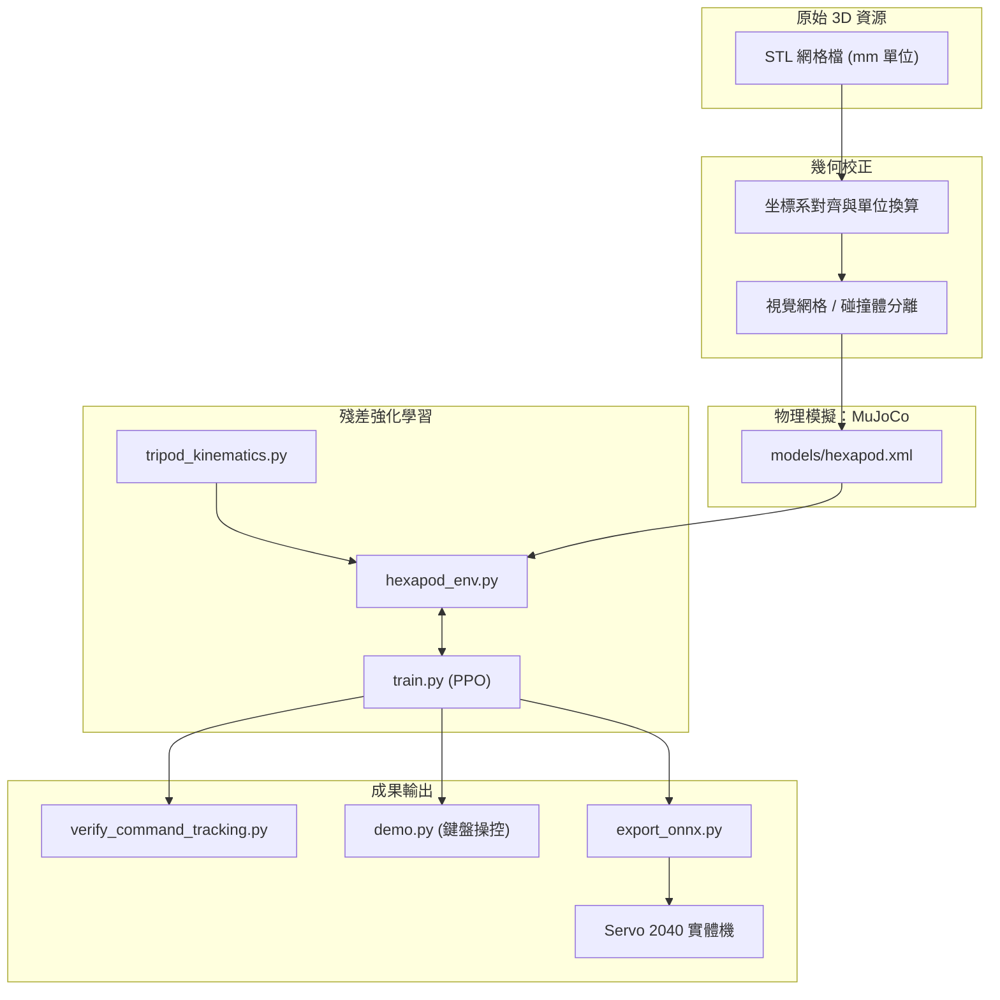

# Make Your Pet 六足機器人：數位孿生與 AI 步態學習操作手冊（第三版）

> **開源硬體專案**：[MakeYourPet/hexapod](https://github.com/MakeYourPet/hexapod)
> **版本**：Third Edition (3ed · 2026 年 9 月)
> **適用對象**：具備基礎 Python 知識，想在模擬器中訓練六足機器人走路、並把訓練好的模型部署到實體機器人的使用者。

---

## 目錄

1. [系統總覽](#一系統總覽)
2. [環境準備（階段 0）](#二環境準備階段-0)
3. [3D 模型組裝與物理建模（階段 1）](#三3d-模型組裝與物理建模階段-1)
4. [三角步態前饋運動學（階段 2）](#四三角步態前饋運動學階段-2)
5. [強化學習環境封裝（階段 3）](#五強化學習環境封裝階段-3)
6. [訓練（階段 4）](#六訓練階段-4)
7. [驗證、操控與模型導出（階段 5）](#七驗證操控與模型導出階段-5)
8. [Blender 影像渲染（階段 6）](#八blender-影像渲染階段-6)
9. [實體機器人部署（階段 7）](#九實體機器人部署階段-7)
10. [常見問題](#十常見問題)
11. [里程碑檢核表](#十一里程碑檢核表)

---

## 一、系統總覽

### 1.1 這個專案在做什麼

把 MakeYourPet 開源六足機器人的 3D 列印零件，匯入 MuJoCo 物理模擬器建立數位孿生（Digital Twin），接著用強化學習讓它自己學會走路，最後把訓練好的神經網路部署到實體機器人上。

### 1.2 採用的方法：殘差強化學習（Residual RL）

控制架構的核心公式：

$$\mathbf{q}_{\text{ctrl}}(t) = \mathbf{q}_{\text{ref}}(t) + \alpha \cdot \Delta \mathbf{q}_{\text{RL}}(s)$$

- $\mathbf{q}_{\text{ref}}$（前饋層）：用數學公式直接算出「三角步態」的標準動作，保證機器人從訓練第一步就能行走。
- $\Delta \mathbf{q}_{\text{RL}}$（殘差層）：神經網路輸出小幅度的關節修正量（$\pm 0.15 \text{ rad} \approx \pm 8.6°$），負責平衡姿態、抵抗外力、適應地面摩擦變化。
- $\alpha$：殘差縮放係數，本專案設為 `0.15`。

這個做法的好處是：前饋層把「怎麼邁步」的問題先解掉了，RL 只需要專心做微調，所以訓練速度快、結果穩定。

### 1.3 資料流向



### 1.4 專案檔案結構

```text
Make Your Pet - Digital Twin/
├── MakeYourPet-DigitalTwin/           # 數位孿生核心原始碼與訓練模型目錄
│   ├── models/                        # MuJoCo XML 模型、貼圖與 RL 權重檔
│   │   ├── hexapod.xml                # MuJoCo 物理模型描述檔（18 自由度高精模型）
│   │   ├── one_leg.xml                # 單腿原型測試模型
│   │   ├── best_model/                # 訓練過程中的最佳權重目錄（best_model.zip）
│   │   ├── hexapod_final_policy.zip   # 訓練結束時的最終權重
│   │   ├── hexapod_policy.onnx        # 導出的輕量神經網路（1.9 KB）
│   │   ├── hexapod_policy.onnx.data   # ONNX 外部權重張量檔
│   │   ├── arena_10x10_preview.png    # 地形競技場預覽圖
│   │   └── wood.png                   # 地面木紋貼圖
│   │
│   ├── KnownIssue/                    # 技術避坑與除錯分析報告
│   │   ├── coordinate_transformation_issues.md # CAD 坐標系衝突與逆向工程修正
│   │   ├── training_issues.md                  # 強化學習十大訓練錯誤與對策
│   │   └── DEBUG/                              # 歷史除錯腳本與校正記錄
│   │       └── test_kinematics_openloop.py     # 開環步態運動學校驗腳本
│   │
│   ├── tripod_kinematics.py           # 三角步態前饋運動學引擎
│   ├── hexapod_env.py                 # Gymnasium 強化學習環境封裝
│   ├── train.py                       # PPO 向量化平行訓練主程式
│   ├── verify_command_tracking.py     # 指令跟隨性能驗證基準
│   ├── demo.py                        # 3D 鍵盤即時遙控工作站
│   ├── export_onnx.py                 # PPO Actor → ONNX 輕量模型導出腳本
│   ├── generate_hexapod_xml.py        # 18 自由度 XML 動態產生與參數校準腳本
│   ├── record_trajectory.py           # 50 FPS 步態軌跡錄製腳本（供 Blender 用）
│   ├── blender_cinematic.py           # Blender 5.2 自動化電影級算圖腳本
│   ├── make_video.py                  # 算圖影格合成 MP4 影片腳本
│   │
│   ├── experiment_log.md              # 實驗日誌與里程碑追蹤表
│   ├── KnownIssue.md                  # 全域已知問題快速導覽
│   ├── LICENSE                        # Apache 2.0 開源授權
│   └── hexapod_rl_env/                # Python 虛擬環境（建議建於此目錄下）
│
├── MakeYourPet-hexapod/               # 開源硬體原始資源與 CAD 檔案
│   └── hexapod-main/                  # 官方 MakeYourPet 儲存庫資源（STEP、STL、Chipo 等）
│
├── Demo Recording 2026-09-27.mp4      # 完整錄影示範檔
├── demo_locomotion.gif                # 自主盲行展示動圖
├── Demo1.png / Demo2.png              # 透視視角與正視角渲染圖
├── Make_Your_Pet_Digital_Twin_and_AI_Gait_Learning_Implementation_Guide_3ed-en.md  # 實作教學指引（英文版）
├── Make_Your_Pet_數位孿生與AI步態學習實作計畫3ed-zh.md                                # 實作教學指引（中文版）
└── README.md                          # 專案首頁說明文件
```

---

## 二、環境準備（階段 0）

### 需求

- Python 3.10 或以上
- 支援 CUDA 的 NVIDIA 顯示卡（訓練用 CPU 即可，GPU 用於加速可選）
- Blender 4.x 或 5.x（僅渲染階段需要，可稍後安裝）
- Windows 10/11 或 Linux

### 步驟 0-1：設定 PowerShell 執行權限（Windows）

Windows 預設不允許執行虛擬環境啟動腳本，需先放行：

```powershell
Set-ExecutionPolicy -ExecutionPolicy RemoteSigned -Scope CurrentUser
```

出現提示時輸入 `Y` 確認。

### 步驟 0-2：建立 Python 虛擬環境

先進入數位孿生核心專案目錄 `MakeYourPet-DigitalTwin`（後續的所有模擬、訓練與模型導出指令皆在此目錄下執行）：

```powershell
# 1. 進入數位孿生核心專案目錄
cd MakeYourPet-DigitalTwin

# 2. 建立並啟動 Python 虛擬環境
python -m venv hexapod_rl_env
.\hexapod_rl_env\Scripts\Activate.ps1
```

終端機開頭出現 `(hexapod_rl_env)` 即代表啟動成功。

### 步驟 0-3：安裝套件

```powershell
# PyTorch（含 CUDA 支援）
pip install torch torchvision --index-url https://download.pytorch.org/whl/cu124

# 物理引擎、強化學習、工具
pip install mujoco gymnasium stable-baselines3[extra] tensorboard
pip install numpy matplotlib onnx onnxruntime trimesh pyyaml scipy
```

### 步驟 0-4：驗證安裝

```powershell
python -c "import torch, mujoco, gymnasium, stable_baselines3; print('PyTorch:', torch.__version__); print('CUDA:', torch.cuda.is_available()); print('MuJoCo:', mujoco.__version__)"
```

確認輸出中 `PyTorch` 與 `MuJoCo` 版本號正確顯示即可。

> [!NOTE]
> **Windows 中文編碼注意**：Windows 繁體中文終端機的預設編碼為 cp950，遇到 UTF-8 特殊字元（如 emoji）會報錯。在所有 Python 腳本開頭加入以下兩行即可避免：
> ```python
> import sys
> if hasattr(sys.stdout, "reconfigure"):
>     sys.stdout.reconfigure(encoding="utf-8")
> if hasattr(sys.stderr, "reconfigure"):
>     sys.stderr.reconfigure(encoding="utf-8")
> ```

---

## 三、3D 模型組裝與物理建模（階段 1）

### 3.1 機器人硬體規格

MakeYourPet 六足機器人有 6 條腿、18 個舵機關節（每條腿 3 個）：

| 關節名稱 | 功能 | 連桿長度 |
|:---|:---|:---|
| **Coxa（底座）** | 水平偏航，控制腿的前後擺動 | 43 mm |
| **Femur（大腿）** | 垂直俯仰，控制抬腿與下壓 | 80 mm（斜挑高度 46 mm） |
| **Tibia（小腿）** | 垂直俯仰，控制足端對地蹬踏 | 134 mm |

腿的編號：L1（左前）、L2（左中）、L3（左後）、R1（右前）、R2（右中）、R3（右後）。

### 3.2 STL 網格匯入時的坐標校正

原始 CAD 檔案的坐標系定義與 MuJoCo 不一致，需要在 XML 中做以下校正：

| 零件 | 問題 | 校正方式 |
|:---|:---|:---|
| 機身（Frame / Top Cover） | 長軸對在 Y 軸，但行進方向是 +X | Z 軸旋轉 90°：`euler="0 0 90"` |
| 大腿（Femur） | 斜挑角 35.26°，左右鏡像不同 | 左腿 `euler="90 0 35.26"`，右腿 `euler="-90 0 -35.26"` |
| 小腿（Tibia / Shield） | 零度時朝機身內側反折 | 旋轉 180°：`euler="0 0 180"` |
| 膝關節銜接 | 大腿末端與小腿起點在 X 軸錯開 24 mm | 小腿加偏置：左 `pos="0.0490 -0.0070 0.0065"`，右 `pos="0.0490 0.0070 0.0065"` |
| 左側護甲 | 原廠只提供右側 `shield.stl` | 用負縮放鏡像：`scale="0.001 -0.001 0.001"` |
| 足端球頭 | 網格碰撞會穿透 | 改用半徑 10 mm 的 Sphere，摩擦力 `friction="1.2 0.05 0.001"` |

### 3.3 視覺層與碰撞層分離

模型採用雙層結構：

- **視覺層**（`group="1"`）：掛載原始 STL 網格與材質塗裝，設 `contype="0" conaffinity="0"` 使其不參與物理碰撞。
- **碰撞層**（`group="3"`）：用簡化的幾何體（Box、Capsule、Sphere）包覆機身與肢體，設為透明 `rgba="0 0 0 0"`。

這樣做的好處：畫面好看，同時物理計算很快。

### 3.4 物理模型描述檔：`models/hexapod.xml`

核心配置段落如下（該檔案位於 `MakeYourPet-DigitalTwin/models/hexapod.xml`）：

```xml
<mujoco model="makeyourpet_hexapod">
  <compiler angle="degree" coordinate="local"/>
  <option gravity="0 0 -9.81" timestep="0.002" integrator="implicitfast"/>

  <asset>
    <!-- STL 網格（mm 轉 m，縮放 0.001） -->
    <mesh name="mesh_frame" file="../MakeYourPet-hexapod/hexapod-main/STL/frame.stl"
          scale="0.001 0.001 0.001"/>
    <!-- 其餘零件依此類推 -->

    <material name="mat_frame" rgba="0.18 0.20 0.24 1.0" specular="0.5"/>
    <material name="mat_armor" rgba="0.95 0.70 0.12 1.0" specular="0.8"/>
    <material name="mat_leg_dark" rgba="0.15 0.15 0.16 1.0"/>
    <material name="mat_rubber" rgba="0.85 0.15 0.15 1.0"/>
  </asset>

  <worldbody>
    <light diffuse="0.9 0.9 0.9" pos="0 0 2.5" dir="0 0 -1"/>
    <geom name="ground" type="plane" size="2 2 0.01"
          rgba="0.92 0.92 0.94 1" friction="1.2 0.05 0.001"/>

    <body name="trunk" pos="0 0 0.065">
      <freejoint name="root"/>
      <!-- 機身視覺與碰撞體 -->
      <geom name="vis_frame" type="mesh" mesh="mesh_frame"
            pos="0 0 -0.008" euler="0 0 90" material="mat_frame"
            contype="0" conaffinity="0" group="1"/>
      <geom name="col_frame" type="box" size="0.095 0.065 0.012"
            mass="0.50" group="3"/>

      <!-- 6 條腿依序定義（完整內容見 hexapod.xml） -->
    </body>
  </worldbody>

  <!-- 18 軸舵機（位置控制） -->
  <actuator>
    <position name="mot_L1_c" joint="joint_L1_coxa"
              kp="12.0" kv="1.2" ctrlrange="-45 45" forcerange="-3.0 3.0"/>
    <position name="mot_L1_f" joint="joint_L1_femur"
              kp="12.0" kv="1.2" ctrlrange="-45 45" forcerange="-3.0 3.0"/>
    <position name="mot_L1_t" joint="joint_L1_tibia"
              kp="12.0" kv="1.2" ctrlrange="-60 60" forcerange="-3.0 3.0"/>
    <!-- L2, L3, R1, R2, R3 共 18 組 -->
  </actuator>
</mujoco>
```

> [!NOTE]
> 由於物理模擬與訓練腳本皆以 `MakeYourPet-DigitalTwin/` 作為工作目錄執行，XML 中的相對路徑 `file="../MakeYourPet-hexapod/hexapod-main/STL/frame.stl"` 可直接向上索引並正確讀取同級的 `MakeYourPet-hexapod/` 開源硬體資源目錄。

建好後可以在 `MakeYourPet-DigitalTwin` 目錄下透過 MuJoCo 內建檢視器確認組裝是否正確：

```powershell
python -m mujoco.viewer --mjcf=models/hexapod.xml
```

用滑鼠可以旋轉視角、拖拉機器人，確認零件沒有脫臼或穿透。

---

## 四、三角步態前饋運動學（階段 2）

三角步態是昆蟲最常見的行走方式：6 條腿分成兩組（A 組：L1、L3、R2；B 組：L2、R1、R3），兩組交替抬腿邁步。

### 4.1 `tripod_kinematics.py`

位於 `MakeYourPet-DigitalTwin/tripod_kinematics.py`（在 `MakeYourPet-DigitalTwin/` 目錄下建立或編輯此檔案）：

```python
"""
tripod_kinematics.py
三角步態逆向運動學前饋產生器
提供殘差 RL 的基準軌跡 q_ref。
"""
import numpy as np

class TripodKinematics:
    def __init__(self, step_frequency=1.5):
        self.step_frequency = step_frequency

        # 擺動期抬腿幅度 (rad)
        self.lift_femur = 0.32   # 大腿向上抬 ~18.3°
        self.lift_tibia = 0.20   # 小腿向內屈 ~11.5°

        # 行程增益
        self.stride_gain = 2.0   # 前進速度 → 步幅換算
        self.yaw_gain = 0.40     # 轉向速度 → 左右差速

        # 六條腿的配置：(腿編號, 是否屬於 A 組, 是否右腿, 轉向乘數)
        self.legs_cfg = [
            (0, True,  False, -1.0),  # L1
            (1, False, False, -1.0),  # L2
            (2, True,  False, -1.0),  # L3
            (3, False, True,   1.0),  # R1
            (4, True,  True,   1.0),  # R2
            (5, False, True,   1.0),  # R3
        ]

    def get_reference_angles(self, phase: float, command: np.ndarray) -> np.ndarray:
        """
        計算 18 個關節的基準角度 q_ref (rad)。
        phase: 步態相位 [0, 2π)
        command: [vx, vy, yaw_rate]
        回傳: (18,) ndarray
        """
        vx = float(command[0])
        vy = float(command[1])
        yaw = float(command[2])

        q_ref = np.zeros(18, dtype=np.float32)
        speed = abs(vx) + abs(vy) + abs(yaw)

        # 速度接近零時回歸自然站姿
        if speed < 0.02:
            return q_ref

        phase_A = phase % (2.0 * np.pi)
        phase_B = (phase + np.pi) % (2.0 * np.pi)
        stride_base = vx * self.stride_gain

        for leg_idx, is_tripod_A, is_right, yaw_mult in self.legs_cfg:
            p = phase_A if is_tripod_A else phase_B
            leg_stride = np.clip(
                stride_base + yaw * self.yaw_gain * yaw_mult,
                -0.65, 0.65
            )

            # Coxa 前後擺動
            q_coxa = np.cos(p) * leg_stride
            if is_right:
                q_coxa = -q_coxa

            # Femur / Tibia 升降
            if p < np.pi:
                # 擺動期：抬腿騰空
                h = np.sin(p)
                q_femur = -self.lift_femur * h
                q_tibia = -self.lift_tibia * h
            else:
                # 支撐期：貼地推進
                q_femur = 0.02
                q_tibia = 0.01

            base_j = leg_idx * 3
            q_ref[base_j + 0] = q_coxa
            q_ref[base_j + 1] = q_femur
            q_ref[base_j + 2] = q_tibia

        return q_ref
```

### 4.2 驗證前饋運動學

在 `MakeYourPet-DigitalTwin/` 目錄下執行 `KnownIssue/DEBUG/test_kinematics_openloop.py`，確認純粹靠數學公式就能讓機器人以約 0.26 m/s 的速度穩定前進，無需強化學習介入：

```powershell
python KnownIssue/DEBUG/test_kinematics_openloop.py
```

---

## 五、強化學習環境封裝（階段 3）

### 5.1 觀測空間（67 維）

| 索引 | 維度 | 內容 | 用途 |
|:---|:---:|:---|:---|
| `[0:2]` | 2 | 機身 Roll, Pitch | 偵測水平度 |
| `[2:5]` | 3 | 機身角速度 | 阻尼震盪 |
| `[5:8]` | 3 | 機身本體坐標系線速度 | 感知實際行進方向 |
| `[8:26]` | 18 | 關節角度與前饋的偏差 | 感知負載與地形 |
| `[26:44]` | 18 | 關節角速度 ×0.1 | 防止抽搐 |
| `[44:62]` | 18 | 上一步的殘差動作 | 平滑控制 |
| `[62:65]` | 3 | 目標指令 [vx, vy, yaw_rate] | 遙控輸入 |
| `[65:67]` | 2 | 步態相位 [sin φ, cos φ] | 步態節奏時鐘 |

### 5.2 動作空間（18 維）

神經網路輸出 18 個值（範圍 [-1, 1]），乘以 `residual_scale = 0.15` 後加到前饋角度上。

### 5.3 環境原始碼：`hexapod_env.py`

位於 `MakeYourPet-DigitalTwin/hexapod_env.py`（在 `MakeYourPet-DigitalTwin/` 目錄下建立或編輯此檔案）：

```python
"""
hexapod_env.py
MakeYourPet 18-DOF 六足機器人 Gymnasium 環境
架構：殘差 RL + 三角步態前饋
"""
import os
import math
import numpy as np
import gymnasium as gym
from gymnasium import spaces
import mujoco
from tripod_kinematics import TripodKinematics

class HexapodEnv(gym.Env):
    metadata = {"render_modes": ["human", "rgb_array"], "render_fps": 50}

    def __init__(self, render_mode=None, domain_randomization=True,
                 auto_resample_commands=True):
        super().__init__()
        self.render_mode = render_mode
        self.domain_randomization = domain_randomization
        self.auto_resample_commands = auto_resample_commands

        model_path = os.path.join(os.path.dirname(__file__), "models", "hexapod.xml")
        if not os.path.exists(model_path):
            raise FileNotFoundError(f"找不到模型檔案: {model_path}")

        self.model = mujoco.MjModel.from_xml_path(model_path)
        self.data = mujoco.MjData(self.model)
        self.trunk_id = mujoco.mj_name2id(
            self.model, mujoco.mjtObj.mjOBJ_BODY, "trunk"
        )
        self.ground_id = mujoco.mj_name2id(
            self.model, mujoco.mjtObj.mjOBJ_GEOM, "ground"
        )

        self.default_trunk_mass = float(self.model.body_mass[self.trunk_id])
        if self.ground_id >= 0:
            self.default_ground_friction = float(
                self.model.geom_friction[self.ground_id, 0]
            )
        else:
            self.default_ground_friction = 1.2

        # 控制週期：50 Hz（每次 step 做 10 次物理子步進 × 2 ms = 20 ms）
        self.substeps = 10
        self.dt = self.model.opt.timestep * self.substeps

        self.step_frequency = 1.5
        self.phase = 0.0
        self.kinematics = TripodKinematics(step_frequency=self.step_frequency)
        self.residual_scale = 0.15

        self.action_space = spaces.Box(
            low=-1.0, high=1.0, shape=(18,), dtype=np.float32
        )
        self.observation_space = spaces.Box(
            low=-np.inf, high=np.inf, shape=(67,), dtype=np.float32
        )

        self.default_joint_angles = np.zeros(18, dtype=np.float32)
        self.nominal_height = 0.065
        self.command = np.array([0.0, 0.0, 0.0], dtype=np.float32)
        self.command_timer = 350
        self.command_step = 0
        self.prev_action = np.zeros(18, dtype=np.float32)
        self.step_count = 0
        self.max_steps = 1000

    def _sample_command(self):
        """隨機產生運動指令 [vx, vy, yaw_rate]"""
        r = np.random.rand()
        if r < 0.20:
            vx, vy, yaw = 0.0, 0.0, 0.0
        elif r < 0.70:
            vx = float(np.random.uniform(0.15, 0.35))
            vy = 0.0
            yaw = float(np.random.uniform(-0.20, 0.20))
        elif r < 0.90:
            vx = float(np.random.uniform(0.0, 0.10))
            vy = 0.0
            yaw_sign = 1.0 if np.random.rand() > 0.5 else -1.0
            yaw = float(yaw_sign * np.random.uniform(0.35, 0.75))
        else:
            vx = float(np.random.uniform(-0.25, -0.10))
            vy = 0.0
            yaw = float(np.random.uniform(-0.20, 0.20))

        self.command = np.array([vx, vy, yaw], dtype=np.float32)

    def reset(self, seed=None, options=None):
        super().reset(seed=seed)
        mujoco.mj_resetData(self.model, self.data)

        if self.domain_randomization:
            mass_scale = np.random.uniform(0.90, 1.10)
            self.model.body_mass[self.trunk_id] = (
                self.default_trunk_mass * mass_scale
            )
            if self.ground_id >= 0:
                self.model.geom_friction[self.ground_id, 0] = (
                    np.random.uniform(0.85, 1.45)
                )
        else:
            self.model.body_mass[self.trunk_id] = self.default_trunk_mass
            if self.ground_id >= 0:
                self.model.geom_friction[self.ground_id, 0] = (
                    self.default_ground_friction
                )

        self.data.qpos[0] = 0.0
        self.data.qpos[1] = 0.0
        self.data.qpos[2] = self.nominal_height + np.random.uniform(-0.003, 0.003)
        self.data.qpos[3:7] = np.array([1.0, 0.0, 0.0, 0.0])

        for i in range(18):
            noise = np.random.uniform(-0.02, 0.02)
            self.data.qpos[7 + i] = self.default_joint_angles[i] + noise
            self.data.ctrl[i] = self.data.qpos[7 + i]

        self.data.qvel[:] = 0.0
        mujoco.mj_forward(self.model, self.data)

        self.prev_action = np.zeros(18, dtype=np.float32)
        self.step_count = 0
        self.command_step = 0
        self.command_timer = int(np.random.randint(300, 500))
        self.phase = 0.0

        if self.auto_resample_commands:
            self._sample_command()

        return self._get_obs(), {}

    def step(self, action):
        self.step_count += 1
        action = np.clip(action, -1.0, 1.0).astype(np.float32)

        q_ref = self.kinematics.get_reference_angles(self.phase, self.command)
        target_angles = q_ref + action * self.residual_scale

        # 舵機物理極限保護
        for leg_idx in range(6):
            base_j = leg_idx * 3
            target_angles[base_j + 0] = np.clip(
                target_angles[base_j + 0], -0.785, 0.785
            )
            target_angles[base_j + 1] = np.clip(
                target_angles[base_j + 1], -0.785, 0.785
            )
            target_angles[base_j + 2] = np.clip(
                target_angles[base_j + 2], -1.047, 1.047
            )

        for i in range(18):
            self.data.ctrl[i] = target_angles[i]

        for _ in range(self.substeps):
            if self.domain_randomization and np.random.rand() < 0.005:
                push = np.random.uniform(-0.03, 0.03, size=2)
                self.data.qvel[0:2] += push
            mujoco.mj_step(self.model, self.data)

        is_moving = (
            abs(self.command[0]) > 0.02 or abs(self.command[2]) > 0.05
        )
        if is_moving:
            self.phase = (
                self.phase + 2.0 * np.pi * self.step_frequency * self.dt
            ) % (2.0 * np.pi)
        else:
            self.phase = 0.0

        if self.auto_resample_commands:
            self.command_step += 1
            if self.command_step >= self.command_timer:
                self._sample_command()
                self.command_step = 0
                self.command_timer = int(np.random.randint(300, 500))

        obs = self._get_obs()
        reward = self._compute_reward(action)
        terminated = self._is_terminated()
        truncated = self.step_count >= self.max_steps

        self.prev_action = action.copy()
        R = self.data.xmat[self.trunk_id].reshape(3, 3)
        v_body = R.T @ self.data.qvel[0:3]
        info = {
            "vx": float(v_body[0]),
            "vy": float(v_body[1]),
            "yaw_rate": float(self.data.qvel[5]),
            "cmd_vx": float(self.command[0]),
            "cmd_yaw": float(self.command[2]),
            "height": float(self.data.qpos[2]),
        }

        return obs, reward, terminated, truncated, info

    def _get_obs(self):
        quat = self.data.qpos[3:7]
        w, x, y, z = quat
        roll = math.atan2(2 * (w * x + y * z), 1 - 2 * (x * x + y * y))
        pitch = math.asin(np.clip(2 * (w * y - z * x), -1.0, 1.0))

        omega = self.data.qvel[3:6]
        R = self.data.xmat[self.trunk_id].reshape(3, 3)
        v_body = R.T @ self.data.qvel[0:3]

        q_ref = self.kinematics.get_reference_angles(self.phase, self.command)
        joint_error = self.data.qpos[7:25] - q_ref
        joint_vel = self.data.qvel[6:24]

        is_moving = (
            abs(self.command[0]) > 0.02 or abs(self.command[2]) > 0.05
        )
        sin_phase = np.sin(self.phase) if is_moving else 0.0
        cos_phase = np.cos(self.phase) if is_moving else 0.0

        return np.concatenate([
            np.array([roll, pitch], dtype=np.float32),
            omega.astype(np.float32),
            v_body.astype(np.float32),
            joint_error.astype(np.float32),
            joint_vel.astype(np.float32) * 0.1,
            self.prev_action.astype(np.float32),
            self.command.astype(np.float32),
            np.array([sin_phase, cos_phase], dtype=np.float32),
        ]).astype(np.float32)

    def _compute_reward(self, action):
        R = self.data.xmat[self.trunk_id].reshape(3, 3)
        v_body = R.T @ self.data.qvel[0:3]
        vx = float(v_body[0])
        vy = float(v_body[1])
        omega_z = float(self.data.qvel[5])

        cmd_vx = float(self.command[0])
        cmd_yaw = float(self.command[2])

        quat = self.data.qpos[3:7]
        w, x, y, z = quat
        roll = math.atan2(2 * (w * x + y * z), 1 - 2 * (x * x + y * y))
        pitch = math.asin(np.clip(2 * (w * y - z * x), -1.0, 1.0))
        height = float(self.data.qpos[2])

        action_diff = action - self.prev_action
        is_stop = abs(cmd_vx) < 0.02 and abs(cmd_yaw) < 0.05

        if is_stop:
            r_stop_v = 3.0 * np.exp(-(vx**2 + vy**2) / 0.005)
            r_stop_yaw = 2.0 * np.exp(-(omega_z**2) / 0.01)
            r_stop_action = -0.5 * float(np.sum(np.square(action)))
            r_motion = r_stop_v + r_stop_yaw + r_stop_action
        else:
            r_track_vx = 3.5 * np.exp(-((vx - cmd_vx) ** 2) / 0.02)
            r_lateral = -2.0 * (vy**2)
            r_track_yaw = 2.5 * np.exp(-((omega_z - cmd_yaw) ** 2) / 0.03)
            r_motion = r_track_vx + r_lateral + r_track_yaw

        r_posture = 2.0 * np.exp(-(roll**2 + pitch**2) / 0.015)
        r_height = 1.5 * np.exp(-((height - self.nominal_height) ** 2) / 0.002)
        r_res_mag = -0.05 * float(np.sum(np.square(action)))
        r_res_smooth = -0.03 * float(np.sum(np.square(action_diff)))
        r_alive = 1.0

        return float(
            r_motion + r_posture + r_height + r_res_mag + r_res_smooth + r_alive
        )

    def _is_terminated(self):
        height = self.data.qpos[2]
        if height < 0.035 or height > 0.12:
            return True
        quat = self.data.qpos[3:7]
        w, x, y, z = quat
        roll = abs(math.atan2(2 * (w * x + y * z), 1 - 2 * (x * x + y * y)))
        pitch = abs(math.asin(np.clip(2 * (w * y - z * x), -1.0, 1.0)))
        if roll > math.radians(35.0) or pitch > math.radians(35.0):
            return True
        return False
```

### 5.4 獎勵函數說明

| 獎勵項 | 作用 |
|:---|:---|
| `r_track_vx` | 鼓勵前進速度跟上指令 |
| `r_track_yaw` | 鼓勵轉向角速度跟上指令 |
| `r_lateral` | 懲罰側滑 |
| `r_stop_*` | 煞車時鼓勵完全靜止 |
| `r_posture` | 鼓勵機身保持水平 |
| `r_height` | 鼓勵維持標準站高 |
| `r_res_mag` | 懲罰過大的殘差輸出 |
| `r_res_smooth` | 懲罰動作跳變，減少抽搐 |
| `r_alive` | 每步存活固定加 1 分 |

---

## 六、訓練（階段 4）

### 6.1 訓練主程式：`train.py`

位於 `MakeYourPet-DigitalTwin/train.py`。

```python
"""
train.py
PPO 殘差強化學習訓練主程式
"""
import os
import sys

if hasattr(sys.stdout, "reconfigure"):
    sys.stdout.reconfigure(encoding="utf-8")
if hasattr(sys.stderr, "reconfigure"):
    sys.stderr.reconfigure(encoding="utf-8")

import time
import argparse
import numpy as np
import torch
import gymnasium as gym

from stable_baselines3 import PPO
from stable_baselines3.common.vec_env import SubprocVecEnv, VecMonitor
from stable_baselines3.common.callbacks import (
    CheckpointCallback, EvalCallback, CallbackList,
)
from hexapod_env import HexapodEnv

def make_env(rank, seed=0, domain_rand=True, resample_cmd=True):
    def _init():
        env = HexapodEnv(
            domain_randomization=domain_rand,
            auto_resample_commands=resample_cmd,
        )
        env.reset(seed=seed + rank)
        return env
    return _init

def parse_args():
    parser = argparse.ArgumentParser()
    parser.add_argument("--timesteps", type=int, default=100_000)
    parser.add_argument("--num-envs", type=int, default=12)
    parser.add_argument("--device", type=str, default="cpu",
                        choices=["cpu", "cuda", "auto"])
    parser.add_argument("--lr", type=float, default=3e-4)
    parser.add_argument("--n-steps", type=int, default=1024)
    parser.add_argument("--batch-size", type=int, default=256)
    parser.add_argument("--n-epochs", type=int, default=10)
    parser.add_argument("--ent-coef", type=float, default=0.008)
    parser.add_argument("--eval-freq", type=int, default=25_000)
    parser.add_argument("--save-freq", type=int, default=100_000)
    return parser.parse_args()

def main():
    args = parse_args()

    print("=" * 60)
    print("  Make Your Pet — 殘差強化學習訓練")
    print("=" * 60)
    print(f"  總步數: {args.timesteps:,}")
    print(f"  並行環境: {args.num_envs}")
    print(f"  裝置: {args.device}")

    log_dir = "tensorboard_logs"
    chkpt_dir = "checkpoints"
    best_model_dir = os.path.join("models", "best_model")
    os.makedirs(log_dir, exist_ok=True)
    os.makedirs(chkpt_dir, exist_ok=True)
    os.makedirs(best_model_dir, exist_ok=True)

    env = SubprocVecEnv(
        [make_env(i, seed=42) for i in range(args.num_envs)]
    )
    env = VecMonitor(env)

    eval_env = SubprocVecEnv(
        [make_env(999, seed=1234, domain_rand=False) for _ in range(1)]
    )
    eval_env = VecMonitor(eval_env)

    eval_callback = EvalCallback(
        eval_env,
        best_model_save_path=best_model_dir,
        log_path=log_dir,
        eval_freq=max(args.eval_freq // args.num_envs, 1),
        n_eval_episodes=5,
        deterministic=True,
        verbose=1,
    )
    checkpoint_callback = CheckpointCallback(
        save_freq=max(args.save_freq // args.num_envs, 1),
        save_path=chkpt_dir,
        name_prefix="hexapod_ppo",
    )

    policy_kwargs = dict(
        net_arch=dict(pi=[256, 256], vf=[256, 256]),
        activation_fn=torch.nn.Tanh,
    )
    model = PPO(
        policy="MlpPolicy",
        env=env,
        learning_rate=args.lr,
        n_steps=args.n_steps,
        batch_size=args.batch_size,
        n_epochs=args.n_epochs,
        gamma=0.99,
        gae_lambda=0.95,
        clip_range=0.2,
        ent_coef=args.ent_coef,
        policy_kwargs=policy_kwargs,
        verbose=1,
        device=args.device,
        tensorboard_log=log_dir,
    )

    start_time = time.time()
    try:
        model.learn(
            total_timesteps=args.timesteps,
            callback=CallbackList([eval_callback, checkpoint_callback]),
            progress_bar=True,
        )
    except KeyboardInterrupt:
        print("\n使用者中斷，正在儲存...")
    finally:
        elapsed = time.time() - start_time
        final_path = os.path.join("models", "hexapod_final_policy")
        model.save(final_path)
        print("=" * 60)
        print(f"  訓練完成，耗時 {elapsed:.1f} 秒 ({elapsed / 60:.1f} 分鐘)")
        print(f"  最終模型: {final_path}.zip")
        print(f"  最佳模型: {os.path.join(best_model_dir, 'best_model.zip')}")
        print("=" * 60)
        env.close()
        eval_env.close()

if __name__ == "__main__":
    main()
```

### 6.2 開始訓練

在 `MakeYourPet-DigitalTwin/` 目錄下執行：

```powershell
python train.py --timesteps 100000 --num-envs 12
```

**參數說明**：

| 參數 | 預設值 | 說明 |
|:---|:---|:---|
| `--timesteps` | 100,000 | 總訓練步數，殘差 RL 通常 10 萬步就足夠 |
| `--num-envs` | 12 | 並行模擬環境數量，依 CPU 核心數調整 |
| `--device` | cpu | 此規模的 MLP 用 CPU 訓練即可 |

**預期結果**：
- 訓練在 1～2 分鐘內完成
- 評估回報達到 8,000 分以上
- 全回合 1,000 步無跌倒

> [!TIP]
> 這個 MLP 網路結構很小（兩層 256 神經元），用 CPU 訓練反而比 GPU 快，因為省去了 CPU ↔ GPU 之間反覆搬運小批次資料的時間。

---

## 七、驗證、操控與模型導出（階段 5）

### 7.1 指令跟隨驗證：`verify_command_tracking.py`

位於 `MakeYourPet-DigitalTwin/verify_command_tracking.py`。在 `MakeYourPet-DigitalTwin/` 目錄下執行，驗證不同指令下的 AI 表現：

```powershell
python verify_command_tracking.py
```

測試包含 5 個情境：煞車待命、前進巡航、原地左轉、原地右轉、恢復煞車。

**預期表現**：
- 前進巡航目標 0.25 m/s → 實際約 0.255 m/s
- 原地旋轉目標 ±0.50 rad/s → 實際約 ±0.68 rad/s
- 煞車 → 速度收斂至 0.000 m/s

### 7.2 鍵盤即時操控：`demo.py`

位於 `MakeYourPet-DigitalTwin/demo.py`。在 `MakeYourPet-DigitalTwin/` 目錄下執行：

```powershell
python demo.py
```

會開啟 MuJoCo 3D 視窗，可以用鍵盤操控機器人：

| 按鍵 | 功能 |
|:---|:---|
| `↑` | 按住前進（0.25 m/s），放開停步 |
| `Shift + ↑` | 加速前進（0.35 m/s） |
| `↓` | 後退 |
| `← / →` | 原地轉向 |
| `↑ + ← / →` | 弧形轉彎 |
| `R` | 重置位置 |
| `T` | 鏡頭追隨開關 |
| `Ctrl + 滑鼠拖拉` | 對機器人施加外力，測試平衡能力 |

### 7.3 導出 ONNX 模型：`export_onnx.py`

位於 `MakeYourPet-DigitalTwin/export_onnx.py`。

```python
"""
export_onnx.py
將 PPO 策略網路導出為 ONNX 格式
"""
import os
import sys
if hasattr(sys.stdout, "reconfigure"):
    sys.stdout.reconfigure(encoding="utf-8")

import numpy as np
import torch
import onnx
import onnxruntime as ort
from stable_baselines3 import PPO

class HexapodActor(torch.nn.Module):
    def __init__(self, policy):
        super().__init__()
        self.mlp_extractor = policy.mlp_extractor.policy_net
        self.action_net = policy.action_net

    def forward(self, obs):
        latent = self.mlp_extractor(obs)
        action = self.action_net(latent)
        return torch.clamp(action, -1.0, 1.0)

def main():
    model_path = os.path.join("models", "best_model", "best_model.zip")
    output_path = "models/hexapod_policy.onnx"

    print(f"載入模型: {model_path}")
    model = PPO.load(model_path, device="cpu")
    actor = HexapodActor(model.policy)
    actor.eval()

    dummy_input = torch.zeros((1, 67), dtype=torch.float32)
    os.makedirs(os.path.dirname(output_path), exist_ok=True)

    torch.onnx.export(
        actor,
        dummy_input,
        output_path,
        input_names=["observation"],
        output_names=["action"],
        dynamic_axes={
            "observation": {0: "batch_size"},
            "action": {0: "batch_size"},
        },
        opset_version=18,
    )

    onnx_model = onnx.load(output_path)
    onnx.checker.check_model(onnx_model)
    file_size_kb = os.path.getsize(output_path) / 1024.0
    print(f"ONNX 驗證通過，檔案大小: {file_size_kb:.1f} KB")

    session = ort.InferenceSession(output_path)
    ort_inputs = {
        session.get_inputs()[0].name: np.random.randn(1, 67).astype(np.float32)
    }
    ort_outs = session.run(None, ort_inputs)
    print(f"推論測試通過，輸出維度: {ort_outs[0].shape}")

if __name__ == "__main__":
    main()
```

在 `MakeYourPet-DigitalTwin/` 目錄下執行：

```powershell
python export_onnx.py
```

導出的 ONNX 檔儲存於 `models/hexapod_policy.onnx`（位於 `MakeYourPet-DigitalTwin/` 內，約 1.9 KB），可以在 Raspberry Pi、ESP32-S3 或 Servo 2040 等嵌入式板子上運行。

---

## 八、Blender 影像渲染（階段 6）

這個階段是可選的。如果需要製作展示影片或劇照，可以把模擬器中的步態軌跡匯入 Blender 渲染。

### 8.1 錄製步態軌跡

在 `MakeYourPet-DigitalTwin/` 目錄下執行（`record_trajectory.py`）：

```powershell
python record_trajectory.py --duration 5.0 --motion combo
```

`--motion` 可選模式：`combo`（多動作切換）、`forward`（直行）、`sprint`（衝刺）、`turn`（旋轉）。

輸出檔案（儲存於 `MakeYourPet-DigitalTwin/` 內）：
- `blender_exports/` 目錄下的 11 個 `.obj` 網格檔
- `gait_trajectory.json`：250 幀（5 秒 × 50 FPS）的姿態資料

### 8.2 自動建構 Blender 場景

在 `MakeYourPet-DigitalTwin/` 目錄下執行：

```powershell
& "C:\Program Files\Blender Foundation\Blender 5.2\blender.exe" --background --python blender_cinematic.py
```

> [!NOTE]
> 請將上方路徑替換成你自己安裝的 Blender 路徑。

自動完成的設定：
- 32 個零件定位與 250 幀關鍵影格
- PBR 材質（金色裝甲、消光鈦黑、紅色矽膠腳墊、LED 燈條）
- 三點式布光（主光、補光、輪廓光）
- 50 mm 追蹤運鏡與景深
- 輸出 `hexapod_cinematic.blend`

### 8.3 預覽與輸出

開啟 `hexapod_cinematic.blend` 後：

| 操作 | 快捷鍵 |
|:---|:---|
| 播放動畫 | `Space` |
| 切換攝影機視角 | `Numpad 0` |
| 開啟即時光影渲染 | `Z` → `Rendered` |
| 隱藏輔助標線 | `Shift + Alt + Z` |
| 算圖單張劇照 | `F12` |

批次輸出 MP4：

```powershell
& "C:\Program Files\Blender Foundation\Blender 5.2\blender.exe" -b hexapod_cinematic.blend -a
python make_video.py --fps 50 --output hexapod_cinematic.mp4
```

---

## 九、實體機器人部署（階段 7）

### 9.1 硬體連接

```
[電腦 (執行 ONNX 推論)]
       │
       │  USB 串列通訊 (115200 baud)
       ▼
[Servo 2040 控制板 (RP2040)]
       │
       ├── 18 路 PWM 訊號 (50 Hz)
       ▼
[18 顆金屬齒輪舵機]
```

### 9.2 角度轉換為 PWM 脈寬

模擬器輸出的是弧度值，實體舵機需要 PWM 微秒脈寬。換算公式：

$$\text{PWM}(\mu s) = 1500 + \left(\frac{\theta_{\text{rad}}}{\pi} \times 180\right) \times 11.11$$

| 角度 | 弧度 | PWM |
|:---|:---|:---|
| 0° | 0.000 rad | 1500 μs（中心） |
| +45° | +0.785 rad | 2000 μs |
| -45° | -0.785 rad | 1000 μs |

---

## 十、常見問題

### Q1：出現 `UnicodeEncodeError: 'cp950' codec can't encode character...`

Windows 繁體中文終端機的預設編碼無法印出 emoji。在腳本開頭加上：

```python
import sys
if hasattr(sys.stdout, "reconfigure"):
    sys.stdout.reconfigure(encoding="utf-8")
```

### Q2：`train.py` 報錯 `RuntimeError: An attempt has been made to start a new process...`

Windows 的多行程機制要求主程式碼放在 `if __name__ == '__main__':` 內。請確認 `train.py` 的 `main()` 呼叫有被這行保護。

### Q3：觀測切片寫錯導致行為異常

67 維觀測的指令位於 `obs[62:65]`（也就是 `obs[-5:-2]`），步態時鐘位於 `obs[65:67]`（`obs[-2:]`）。如果用 `obs[-3:]` 來寫入指令，會覆蓋掉時鐘，導致步態混亂。

### Q4：大腿與小腿在膝關節處脫開

原始 STL 的旋轉銷孔中心與網格邊界有 24 mm 偏移。在 XML 中對小腿定位點加上偏置即可：
- 左腿：`pos="0.0490 -0.0070 0.0065"`
- 右腿：`pos="0.0490 0.0070 0.0065"`

### Q5：小腿和護甲朝機身內側反折

原始 STL 的零度方向是收合狀態，加上 180° 旋轉即可：`euler="0 0 180"`。

### Q6：左側沒有護甲 STL 怎麼辦

用負縮放鏡像：在 `<asset>` 中定義 `scale="0.001 -0.001 0.001"`。

### Q7：舵機部署時發燙或抽搐

兩個處理方式：
1. 訓練時的獎勵函數已包含動作平滑懲罰（`r_res_smooth`）。
2. 部署端再加一層低通濾波或指數平滑（EMA）。

### Q8：機器人行進時偏航

微調 `tripod_kinematics.py` 中的 `yaw_gain`，或在獎勵函數中加大側滑懲罰 `r_lateral`。

### Q9：Blender 畫面有黑色三角形和虛線

那些是編輯輔助標記（攝影機視錐體、約束線），算圖時不會出現。按 `Numpad 0` 進入攝影機視角，或按 `Shift + Alt + Z` 隱藏所有標記。

> [!TIP]
> 更多深入技術成因分析與除錯紀錄，請參閱：
> - [CAD 幾何與坐標系衝突技術文檔](file:///c:/Users/chean/OneDrive/Desktop/Antigravity/Make%20Your%20Pet%20-%20Digital%20Twin/MakeYourPet-DigitalTwin/KnownIssue/coordinate_transformation_issues.md)
> - [AI 強化學習訓練錯誤與對策手冊](file:///c:/Users/chean/OneDrive/Desktop/Antigravity/Make%20Your%20Pet%20-%20Digital%20Twin/MakeYourPet-DigitalTwin/KnownIssue/training_issues.md)
> - [全域已知問題快速導覽手冊](file:///c:/Users/chean/OneDrive/Desktop/Antigravity/Make%20Your%20Pet%20-%20Digital%20Twin/MakeYourPet-DigitalTwin/KnownIssue.md)

---

## 十一、里程碑檢核表

逐步完成，每完成一項打勾：

- [ ] **M1 環境就緒**：在 `MakeYourPet-DigitalTwin/` 下建立虛擬環境，確認 PyTorch 與 MuJoCo 安裝無誤。
- [ ] **M2 物理模型組裝**：`models/hexapod.xml` 完成，在 `MakeYourPet-DigitalTwin/` 下執行 `python -m mujoco.viewer --mjcf=models/hexapod.xml` 確認零件正確組裝、可用滑鼠拖拉。
- [ ] **M3 前饋驗證**：`tripod_kinematics.py` 完成，執行 `KnownIssue/DEBUG/test_kinematics_openloop.py` 開環測試確認能驅動機器人前進約 0.26 m/s。
- [ ] **M4 環境封裝**：`hexapod_env.py` 完成，67 維觀測、18 維殘差動作空間正常運作。
- [ ] **M5 訓練完成**：在 `MakeYourPet-DigitalTwin/` 下執行 `python train.py --timesteps 100000 --num-envs 12`，評估回報超過 8,000 分。
- [ ] **M6 指令跟隨驗證**：在 `MakeYourPet-DigitalTwin/` 下執行 `python verify_command_tracking.py`，前進、轉向、煞車均正確回應。
- [ ] **M7 操控與導出**：`demo.py` 可用鍵盤操控；`export_onnx.py` 成功導出 ONNX 模型至 `models/hexapod_policy.onnx`。
- [ ] **M8 渲染（可選）**：`record_trajectory.py` → `blender_cinematic.py`，步態匯入 Blender 完成渲染。
