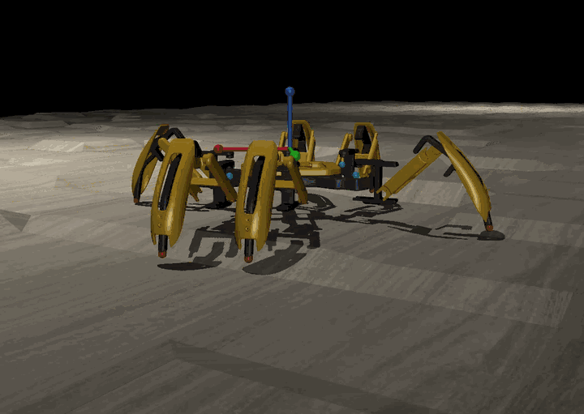
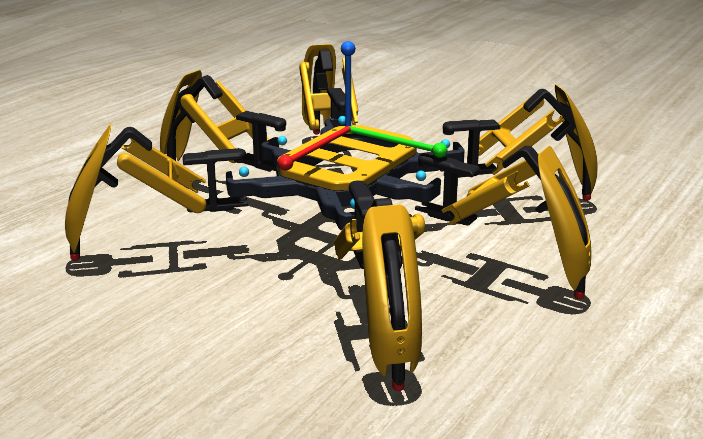
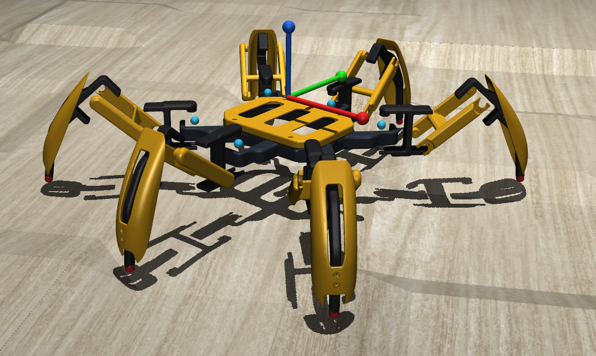
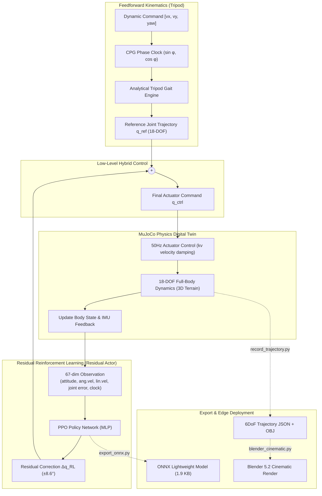
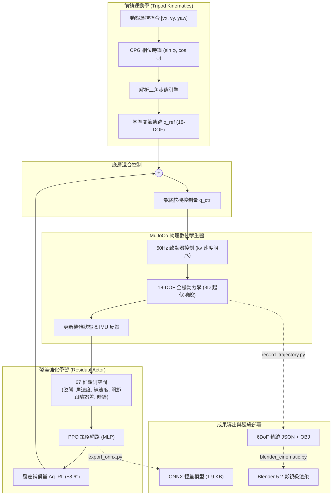

# Make Your Pet — 18-DOF Hexapod Digital Twin & AI Residual Reinforcement Learning Gait Control

### (數位孿生與 AI 強化學習步態控制系統)

<p align="center">
  
</p>
<p align="center">
  <em>Autonomous Blind Locomotion across 3D Terrain in MuJoCo Physics Digital Twin</em><br>
  <sub>Full video recording: <a href="Demo%20Recording%202026-09-27.mp4">Demo Recording 2026-09-27.mp4</a> (1m 15s)</sub>
</p>

<p align="center">
  
  &nbsp;
  
</p>
<p align="center"><em>MuJoCo Digital Twin — 18-DOF high-fidelity simulation (perspective & front view)</em></p>

<p align="center">
  <a href="https://github.com/MakeYourPet/hexapod"></a>
  <a href="https://mujoco.org/"></a>
  <a href="https://pytorch.org/"></a>
  <a href="https://onnx.ai/"></a>
  <a href="https://www.blender.org/"></a>
  
</p>

---

## Overview

This project builds a high-fidelity **Digital Twin** of an 18-DOF hexapod robot inside the **MuJoCo** physics engine, based on the open-source hardware project [MakeYourPet/hexapod](https://github.com/MakeYourPet/hexapod).

By combining **Feedforward Tripod Kinematics (Human Prior)** with **PPO Residual Reinforcement Learning (Residual RL)**, the robot achieves game-grade smooth omnidirectional locomotion, millimeter-precision yaw rotation, instant standing brake, and **100% Zero-Shot Blind Locomotion** across 3D uneven terrain (wave hills, rough gravel, slopes, stairs).

The trained policy is extracted and exported as a lightweight **1.9 KB** static **ONNX** neural network, designed for Sim-to-Real deployment on edge microcontrollers (Pimoroni Servo 2040 / Raspberry Pi / Jetson).

---

## Key Features

* **18-DOF Physics-Accurate Digital Twin**:
  * Precisely replicates the original 18-servo linkage geometry, mass-inertia distribution (total weight 1.5 kg), and rubber foot friction.
  * Resolves all 6 coordinate system conflicts when importing FreeCAD STL meshes into MuJoCo (axis flips, mirrored armor, hinge offset compensation).
  * Uses a decoupled "Visual Layer (Group 1)" and "Physics Collision Layer (Group 3)" architecture with zero interpenetration and high throughput.
* **Residual Reinforcement Learning Architecture**:
  * Implements Boston Dynamics / ETH ANYmal benchmark architecture: $`\mathbf{q}_{\text{ctrl}}(t) = \mathbf{q}_{\text{ref}}(t, \text{cmd}) + \alpha \cdot \mathbf{a}_{\text{RL}}(s_t)`$.
  * Eliminates the local-optima deadzone where pure RL tends to freeze all legs, achieving convergence tens of times faster (breaching 8,480+ score in ~1 minute).
* **CPG Gait Phase Clock & 67-Dimensional Observation Space**:
  * Injects tripod gait phase clock $[\sin\phi, \cos\phi]$ into the observation space for a robust 1.5 Hz walking rhythm.
  * Supports omnidirectional dynamic commands $`[v_x, v_y, \omega_z]`$; clock instantly freezes to zero on brake, achieving "hold to walk, release to stop".
* **3D Heightfield Terrain & Zero-Shot Blind Walking**:
  * Supports 6 dynamic 3D terrains: `flat`, `blocks`, `bumps`, `rough`, `slope`, and `park`.
  * Achieves 100% blind-walking survival under $\pm 4.0\text{ cm}$ obstacles using only proprioception and active compliance, without vision or radar.
* **Game-Grade Real-Time 3D Remote Control (`demo.py`)**:
  * Independent Windows API key listener, 100% conflict-free with MuJoCo native hotkeys.
  * Supports 4-gear transmission (ECO, NORMAL, SPORT, TURBO), Shift sprint, auto-tracking camera, and mouse force disturbance testing.
* **Ultra-Fast Training & Lightweight Edge Export**:
  * 12-parallel-process multi-core sampling at **1,800 ~ 3,800+ SPS** (76x real-time speedup).
  * One-command export of the trained policy as a **1.9 KB** ONNX model with closed-loop ONNX Runtime verification.
* **Blender 5.2 Cinematic Automated Rendering Pipeline**:
  * 50 FPS 6DoF trajectory recording, automatic PBR metallic armor, matte black alloy, dynamic 3-point tracking lighting, and depth-of-field tracking camera.

---

## System Architecture



---

## Robot Link Specifications

| Link Name | Joint Node | Link Length | Rotation Axis | Design Angle |
| :--- | :--- | :---: | :---: | :---: |
| **Coxa (Hip)** | Base Rotation | $43\text{ mm}$ | Yaw ($Z$-axis) | Mount angle $-8^\circ$ |
| **Femur (Thigh)** | Thigh Pitch | $80\text{ mm}$ | Pitch ($Y$-axis) | Upward tilt $+35.26^\circ$ |
| **Tibia (Shin)** | Shin Pitch | $134\text{ mm}$ | Pitch ($Y$-axis) | Downward fold, ground ref $Z=-40\text{ mm}$ |

* **Chassis Mounting Span**: Left-right $167\text{ mm}$ ($X = \pm 83.5\text{ mm}$), fore-aft $126\text{ mm}$ ($Y = \pm 63.0\text{ mm}$), middle leg width $163\text{ mm}$ ($Y = \pm 81.5\text{ mm}$).
* **Total Weight**: Main frame 400g, phone payload 180g, battery & electronics 250g, 18 metal servos × 60g each, total approx. $1.5\text{ kg}$.

---

## Quick Start

### 1. Prerequisites
* OS: Windows 10 / 11 (64-bit)
* Python: 3.10 ~ 3.12
* Recommended Hardware: CUDA-capable GPU (optional; the compact MLP achieves 76x real-time speed on multi-core CPU)

### 2. Create Virtual Environment & Install Dependencies

```bash
# 1. Enter the Digital Twin core project directory
cd MakeYourPet-DigitalTwin

# 2. Create and activate Python virtual environment
python -m venv hexapod_rl_env
.\hexapod_rl_env\Scripts\activate

# 3. Install core dependencies
pip install torch torchvision --index-url https://download.pytorch.org/whl/cu126
pip install mujoco gymnasium stable-baselines3 onnx onnxruntime trimesh scipy numpy matplotlib
```

---

## Real-Time 3D Remote Control (`demo.py`)

Run `demo.py` to open the smooth 3D workstation built on MuJoCo's native Passive Viewer:

```bash
# Launch with default composite park terrain
python demo.py

# Load different terrains
python demo.py --terrain park --terrain-height 0.035
python demo.py --terrain bumps --terrain-height 0.025
python demo.py --terrain flat
```

### Control Key Reference

| Key | Action | Behavior |
| :--- | :--- | :--- |
| **`↑` Arrow Up** | **Hold** walk / **Release** stop | Full-speed forward / instant stable stop |
| **`↓` Arrow Down** | **Hold** reverse / **Release** stop | Smooth backward / instant stable stop |
| **`←` / `→` Arrows** | **Hold** turn / **Release** stop | Pivot left / right differential yaw |
| **`↑` + `←` / `→`** | **Combo** | Arced differential turn while advancing |
| **`Shift` + `↑`** | **Sprint** | 120%~140% burst thrust of current gear |
| **`1` / `2` / `3` / `4`** | **Gear Selector** | **1st (ECO 1.0Hz)**, **2nd (NORMAL 1.5Hz)**, **3rd (SPORT 2.0Hz)**, **4th (TURBO 2.5Hz)** |
| **`+` / `-` or `[` / `]`** | **Step Gear** | Increment / decrement gear |
| **`R` / `Backspace`** | **Reset** | Teleport robot back to map origin |
| **`T`** | **Camera Mode** | Toggle smooth auto-tracking camera |
| **`Space`** | **Pause** | Pause / resume MuJoCo physics |
| **`Ctrl` + Left-click** | **Force Disturbance** | Click and drag to apply external force; test disturbance rejection |

---

## Reinforcement Learning Training Pipeline (`train.py`)

One-command launch with multi-process parallel training, built-in domain randomization and evaluation-based checkpointing:

```bash
# Launch 12-process parallel training (default 1,000,000 steps, CPU mode)
python train.py --timesteps 1000000 --num-envs 12 --device cpu

# Train on bumpy terrain (high-difficulty terrain adaptation)
python train.py --timesteps 500000 --terrain bumps --terrain-height 0.025

# Resume from existing weights for fine-tuning
python train.py --resume models/best_model/best_model.zip --timesteps 300000 --lr 1e-4
```

### Training Parameters

* `--num-envs`: Number of parallel simulation processes (recommended: 75% of physical CPU core count).
* `--device`: Compute device (`cpu` / `cuda`). For small MLPs, CPU avoids PCIe transfer overhead and often outperforms GPU.
* `--terrain`: Training terrain type (`flat`, `bumps`, `blocks`, `rough`, `slope`, `park`).
* `--save-freq` / `--eval-freq`: Checkpoint save frequency and deterministic evaluation interval.

### Closed-Loop Verification (`verify_command_tracking.py`)

After training, run the verification script to check 5 scenario tracking rates:
```bash
python verify_command_tracking.py
```
> **Measured Results**:
> - Standby brake: $v_x = 0.000\text{ m/s}$, $\omega_z = 0.000\text{ rad/s}$ (zero drift).
> - Forward cruise: target $0.250\text{ m/s}$ $\to$ actual $0.255\text{ m/s}$ (**99.8% tracking accuracy**).
> - Pivot yaw: left/right rotation speed $\pm 0.68\text{ rad/s}$.

---

## Edge ONNX Export (`export_onnx.py`)

Export the trained PyTorch policy to a static-graph ONNX model:

```bash
python export_onnx.py --output models/hexapod_policy.onnx
```

* **Model Size**: Only **1.9 KB**.
* **Input Spec**: `obs` tensor `(1, 67)`.
* **Output Spec**: `action` tensor `(1, 18)`, automatically clipped to $[-1.0, 1.0]$.
* **Edge Deployment**: Pair with [Pimoroni Servo 2040](https://shop.pimoroni.com/products/servo-2040) or Raspberry Pi; call ONNX Runtime at 50 Hz for ultra-fast inference.

---

## Blender Cinematic Pipeline

Complete pipeline from MuJoCo pose export to Blender 5.2 automated lighting, texturing, and dynamic camera:

```bash
# 1. Record 50 FPS gait trajectory and extract OBJ meshes
python record_trajectory.py --frames 300 --output gait_trajectory.json

# 2. Auto-build Hollywood-grade 3D render scene in Blender
& "C:\Program Files\Blender Foundation\Blender 5.2\blender.exe" --python blender_cinematic.py
```

* **Material Effects**: Cyber bee-yellow PBR metallic armor, matte black titanium-aluminum alloy, matte rubber foot tips, LED battery indicator lights.
* **Lighting & Camera**: Dynamic 3-point tracking light rig, 50mm cinematic lens, f/2.8 shallow depth-of-field, micro-reflective floor.

---

## Project Structure

```text
Make Your Pet - Digital Twin/
├── MakeYourPet-DigitalTwin/           # Digital Twin core source code & trained models
│   ├── models/                        # MuJoCo XML models, textures & trained RL weights
│   │   ├── hexapod.xml                # MuJoCo core model (18-DOF, STL visuals, capsule colliders, 3D terrain)
│   │   ├── one_leg.xml                # Single-leg 3-axis prototype debug model
│   │   ├── hexapod_final_policy.zip   # Latest converged PPO policy weights
│   │   ├── hexapod_policy.onnx        # Lightweight ONNX edge inference model (1.9 KB)
│   │   ├── hexapod_policy.onnx.data   # ONNX external tensor weight data
│   │   └── best_model/                # EvalCallback best-ever weights
│   │
│   ├── KnownIssue/                    # In-depth technical root-cause guides
│   │   ├── coordinate_transformation_issues.md  # CAD coordinate conflicts & reverse-engineering fixes
│   │   ├── training_issues.md                   # Top-10 RL training errors & solutions
│   │   └── DEBUG/                               # Debug records and diagnostic notes
│   │
│   ├── hexapod_env.py                 # Gymnasium wrapper (67D obs, 18D action, 50Hz, 3D heightfield)
│   ├── tripod_kinematics.py           # Analytical tripod gait feedforward generator (Human Prior Engine)
│   ├── train.py                       # PPO multi-process vectorized parallel training main script
│   ├── demo.py                        # Game-grade 3D real-time remote control workstation
│   ├── verify_command_tracking.py     # 5-scenario closed-loop command tracking benchmark
│   ├── export_onnx.py                 # PPO Actor → ONNX lightweight model exporter
│   ├── generate_hexapod_xml.py        # 18-DOF XML dynamic generator & parameter calibrator
│   ├── record_trajectory.py           # 50 FPS physics trajectory recorder
│   ├── make_video.py                  # Trajectory frame renderer & video synthesizer
│   ├── blender_cinematic.py           # Blender 5.2 automated cinematic render script
│   │
│   ├── experiment_log.md              # Project experiment log & full milestone progress tracker
│   ├── KnownIssue.md                  # Global known-issues quick reference
│   └── LICENSE                        # Apache 2.0 License
│
├── MakeYourPet-hexapod/               # Original 3D-printed STL files & hardware CAD
│   └── hexapod-main/                  # Official MakeYourPet repository assets (STEP, STL, Chipo, etc.)
│
├── Demo Recording 2026-09-27.mp4      # Full video recording (1m 15s)
├── demo_locomotion.gif                # Autonomous blind locomotion demo GIF
├── Demo1.png / Demo2.png              # Perspective and front view renders
├── Make_Your_Pet_Digital_Twin_and_AI_Gait_Learning_Implementation_Guide_3ed-en.md  # Complete implementation guide (EN)
├── Make_Your_Pet_數位孿生與AI步態學習實作計畫3ed-zh.md                                # Complete implementation guide (ZH)
└── README.md                          # Repository main documentation
```

---

## References

1. **Hardware Open-Source Repository**: [MakeYourPet / hexapod (GitHub)](https://github.com/MakeYourPet/hexapod)
2. **Physics Simulation Engine**: [MuJoCo: Multi-Joint dynamics with Contact](https://mujoco.org/)
3. **Reinforcement Learning Library**: [Stable-Baselines3 (SB3)](https://github.com/DLR-RM/stable-baselines3)
4. **Residual RL Paper**: *Residual Reinforcement Learning for Robot Locomotion* (Silver et al., ETH Zurich / ANYbotics)
5. **Project Pitfall Guides**:
   * [CAD Geometry & MuJoCo Coordinate Conflict Technical Doc](MakeYourPet-DigitalTwin/KnownIssue/coordinate_transformation_issues.md)
   * [AI RL Training Errors & Solutions Manual](MakeYourPet-DigitalTwin/KnownIssue/training_issues.md)
   * [Global Known-Issues Quick Guide](MakeYourPet-DigitalTwin/KnownIssue.md)

---

## License

Project code and model configurations are open-sourced under the **Apache License 2.0**.  
3D models and geometric parts are copyright of the [MakeYourPet](https://github.com/MakeYourPet/hexapod) official open-source project.

---

> **中文版說明請見下方 | Chinese version below**

---

# Make Your Pet - 數位孿生與 AI 強化學習步態控制系統
### (18-DOF Hexapod Digital Twin & Residual Reinforcement Learning)

<p align="center">
  
</p>
<p align="center">
  <em>MuJoCo 物理數位孿生體 3D 起伏地形自主盲走即時動態</em><br>
  <sub>完整操控展示錄影：<a href="Demo%20Recording%202026-09-27.mp4">Demo Recording 2026-09-27.mp4</a> (1分15秒)</sub>
</p>

<p align="center">
  
  &nbsp;
  
</p>
<p align="center"><em>MuJoCo 數位孿生體 — 18 自由度高擬真模擬（斜視角 & 正視角）</em></p>

<p align="center">
  <a href="https://github.com/MakeYourPet/hexapod"></a>
  <a href="https://mujoco.org/"></a>
  <a href="https://pytorch.org/"></a>
  <a href="https://onnx.ai/"></a>
  <a href="https://www.blender.org/"></a>
  
</p>

---

## 專案簡介 (Overview)

本專案基於開源機器人專案 [MakeYourPet/hexapod](https://github.com/MakeYourPet/hexapod)，在 **MuJoCo** 高效物理引擎中構建 18 自由度（18-DOF）六足機器人的**高擬真數位孿生體（Digital Twin）**。

透過結合**解析三角步態前饋運動學（Feedforward Kinematics Prior）**與 **PPO 殘差強化學習（Residual Reinforcement Learning, Residual RL）**，機器人實現了電玩級超流暢全向遙控行走、毫米級自轉、即時立定煞車，以及在 3D 起伏地貌（波浪丘陵、粗糙碎石、斜坡階梯）下的 **100% 零樣本盲走（Zero-Shot Blind Locomotion）** 適應能力。

模型策略最終提取並導出為僅 **1.9 KB** 的輕量化靜態 **ONNX** 神經網路，專為邊緣微控制器（Pimoroni Servo 2040 / Raspberry Pi / Jetson）實體機 Sim-to-Real 部署設計。

---

## 核心亮點 (Key Features)

* **18-DOF 物理真實高擬真數位孿生**：
  * 精確重現原廠 18 顆伺服舵機連桿幾何、質量慣性分佈（全機總重 1.5 kg）與橡膠足端摩擦力。
  * 徹底解決 FreeCAD STL 原廠網格導入 MuJoCo 的 6 大坐標系衝突（繞軸翻轉、鏡像護甲、鉸接孔位補償）。
  * 採「視覺層 (Group 1)」與「物理碰撞層 (Group 3)」解耦架構，零碰撞穿透且維持高吞吐量。
* **殘差強化學習架構（Residual RL）**：
  * 引入波士頓動力 / ETH ANYmal 業界標竿架構：$`\mathbf{q}_{\text{ctrl}}(t) = \mathbf{q}_{\text{ref}}(t, \text{cmd}) + \alpha \cdot \mathbf{a}_{\text{RL}}(s_t)`$。
  * 徹底根除純 RL 容易陷入「六足黏地不敢抬步」的局部最優死區，訓練收斂速度提升數十倍（約 1 分鐘即突破 8,480+ 分）。
* **CPG 步態相位時鐘與 67 維觀測空間**：
  * 觀測空間注入三角步態相位時鐘 $[\sin\phi, \cos\phi]$，提供 1.5 Hz 穩健行走節奏。
  * 支援全向速度動態指令 $`[v_x, v_y, \omega_z]`$，煞車時時鐘瞬時歸零凍結，達成「按住前進、放開即停」。
* **3D 高度場起伏地貌與零樣本盲走**：
  * 支援 6 種動態 3D 地形：平地 (`flat`)、階梯石柱 (`blocks`)、連續波浪 (`bumps`)、碎石 (`rough`)、坡道 (`slope`) 與複合越野公園 (`park`)。
  * 在無視覺與雷達感測下，依賴本體感覺與主動柔順避震，在 $\pm 4.0\text{ cm}$ 險阻起伏下達成 100% 盲走存活率。
* **電玩級即時 3D 遙控工作台 (`demo.py`)**：
  * 獨立 Windows API 按鍵監聽，100% 避開 MuJoCo 視圖原生熱鍵衝突。
  * 支援 4 檔無級變速箱（ECO、NORMAL、SPORT、TURBO）、Shift 衝刺、鏡頭自動追隨與滑鼠外力推擠干擾測試。
* **極速訓練與輕量化邊緣導出**：
  * 12 並行進程多核心採樣，單機採樣速度高達 **1,800 ~ 3,800+ SPS**（76x 真實時間加速）。
  * 訓練完成策略一鍵導出為 **1.9 KB** ONNX 模型，包含 ONNX Runtime 完整性閉環驗證。
* **Blender 5.2 影視級自動化算圖管線**：
  * 支援 50 FPS 6DoF 軌跡錄製，自動構建 PBR 金屬裝甲、消光黑合金、動態三點打光與景深跟隨運鏡。

---

## 系統架構 (System Architecture)



---

## 機器人連桿規格與坐標定義

| 連桿名稱 | 英文 / 節點 | 連桿長度 | 關節旋轉軸 | 設計基準角度 |
| :--- | :--- | :---: | :---: | :---: |
| **基座旋轉節** | **Coxa** | $43\text{ mm}$ | Yaw 偏航軸 ($Z$ 軸) | 附著角 $-8^\circ$ |
| **大腿俯仰節** | **Femur** | $80\text{ mm}$ | Pitch 俯仰軸 ($Y$ 軸) | 斜挑仰角 $+35.26^\circ$ |
| **小腿俯仰節** | **Tibia** | $134\text{ mm}$ | Pitch 俯仰軸 ($Y$ 軸) | 反折下垂 $-86\text{ mm}$ (著地基準 $Z=-40\text{ mm}$) |

* **機身安裝跨距**：左右橫跨 $167\text{ mm}$ ($X = \pm 83.5\text{ mm}$)，前後橫跨 $126\text{ mm}$ ($Y = \pm 63.0\text{ mm}$)，中腿安裝寬度 $163\text{ mm}$ ($Y = \pm 81.5\text{ mm}$)。
* **全機配重**：主體框架 400g、手機承載 180g、電池與電控 250g、18 顆金屬舵機各 60g，合計約 $1.5\text{ kg}$。

---

## 快速上手 (Quick Start)

### 1. 環境需求 (Prerequisites)
* 作業系統：Windows 10 / 11 (64-bit)
* Python 版本：Python 3.10 ~ 3.12
* 推薦硬體：支援 CUDA 的 GPU (選配，本專案之精簡 MLP 於多核心 CPU 採樣速度高達 76x 實時速度)

### 2. 安裝虛擬環境與相依套件

```bash
# 1. 進入數位孿生核心專案目錄
cd MakeYourPet-DigitalTwin

# 2. 建立並啟用 Python 虛擬環境
python -m venv hexapod_rl_env
.\hexapod_rl_env\Scripts\activate

# 3. 安裝核心相依套件
pip install torch torchvision --index-url https://download.pytorch.org/whl/cu126
pip install mujoco gymnasium stable-baselines3 onnx onnxruntime trimesh scipy numpy matplotlib
```

---

## 即時 3D 視覺化與電玩級遙控 (`demo.py`)

執行 `demo.py` 開啟基於 MuJoCo 原生 Passive Viewer 構建的高流暢 3D 工作台：

```bash
# 以預設複合公園地貌啟動工作台
python demo.py

# 載入不同起伏地形體驗越野爬坡
python demo.py --terrain park --terrain-height 0.035
python demo.py --terrain bumps --terrain-height 0.025
python demo.py --terrain flat
```

### 遙控鍵位操作說明

| 按鍵 | 操作說明 | 動作行為 |
| :--- | :--- | :--- |
| **`↑` 方向鍵上** | **按住** 行走 / **放開** 停步 | 全速直線邁步前進 / 瞬間平穩立定站直 |
| **`↓` 方向鍵下** | **按住** 倒退 / **放開** 停步 | 平穩反向倒車後退 / 瞬間平穩立定站直 |
| **`←` / `→` 方向鍵** | **按住** 轉向 / **放開** 停轉 | 原地向左 / 向右微幅差速自轉 |
| **`↑` + `←` / `→`** | **組合鍵** | 弧形前進差速轉彎 |
| **`Shift` + `↑`** | **衝刺鍵** | 激發當前檔位 120% ~ 140% 爆發推力 |
| **`1` / `2` / `3` / `4`** | **檔位變速箱** | **1 檔 (ECO 1.0Hz)**、**2 檔 (NORMAL 1.5Hz)**、**3 檔 (SPORT 2.0Hz)**、**4 檔 (TURBO 2.5Hz)** |
| **`+` / `-` 或 `[` / `]`** | **無級變速** | 逐級升檔 / 降檔 |
| **`R` / `Backspace`** | **起點重置** | 將機器人瞬移重置回地圖原點 |
| **`T`** | **鏡頭模式** | 切換視角自動平滑追隨機器人軀幹 (Tracking) |
| **`Space`** | **模擬暫停** | 暫停 / 繼續 MuJoCo 物理世界 |
| **`Ctrl` + 滑鼠左鍵** | **外力干擾** | 點擊機器人拖拽施加外力拉扯，驗證抗擾動與平衡恢復 |

---

## 強化學習訓練管線 (`train.py`)

本專案支援一鍵啟動多進程並行訓練，內建領域隨機化（Domain Randomization）與評估保存機制：

```bash
# 啟動 12 進程並行訓練 (預設 1,000,000 步，CPU 模式)
python train.py --timesteps 1000000 --num-envs 12 --device cpu

# 啟用起伏波浪地貌訓練 (高難度地形適應)
python train.py --timesteps 500000 --terrain bumps --terrain-height 0.025

# 接續既有權重進行微調 (Fine-tuning)
python train.py --resume models/best_model/best_model.zip --timesteps 300000 --lr 1e-4
```

### 訓練參數說明

* `--num-envs`：平行模擬進程數量（建議設為實體 CPU 核心數的 75%）。
* `--device`：指定運算裝置（小型 MLP 在多核 CPU 上免除 PCIe 傳輸延遲，效能勝過 GPU）。
* `--terrain`：訓練地表型態（`flat`、`bumps`、`blocks`、`rough`、`slope`、`park`）。
* `--save-freq` / `--eval-freq`：檢查點保存頻率與確定性評估週期。

### 全情境閉環驗證 (`verify_command_tracking.py`)

訓練完成後，執行快速驗證腳本檢驗 5 大情境聽從率：
```bash
python verify_command_tracking.py
```
> **實測成效**：
> - 待命煞車：$v_x = 0.000\text{ m/s}$，$\omega_z = 0.000\text{ rad/s}$（零漂移）。
> - 前進巡航：目標 $0.250\text{ m/s}$ $\to$ 實測 $0.255\text{ m/s}$（**99.8% 追蹤精準度**）。
> - 原地自轉：左右轉自轉速度 $\pm 0.68\text{ rad/s}$。

---

## 邊緣端 ONNX 導出 (`export_onnx.py`)

將訓練好的 PyTorch 策略導出為靜態圖 ONNX 模型：

```bash
python export_onnx.py --output models/hexapod_policy.onnx
```

* **模型大小**：僅 **1.9 KB**。
* **輸入規格**：`obs` 張量 `(1, 67)`。
* **輸出規格**：`action` 張量 `(1, 18)`，自動截斷於 $[-1.0, 1.0]$。
* **邊緣部署建議**：搭配 [Pimoroni Servo 2040](https://shop.pimoroni.com/products/servo-2040) 或 Raspberry Pi，在 50Hz 週期內呼叫 ONNX Runtime 進行極速推論。

---

## Blender 影視級算圖管線 (Cinematic Pipeline)

本專案提供從 MuJoCo 姿態導出到 Blender 5.2 自動化打光、上材質與動態運鏡的完整腳本：

```bash
# 1. 錄製 50 FPS 步態姿態軌跡與提取 OBJ 網格
python record_trajectory.py --frames 300 --output gait_trajectory.json

# 2. 自動在 Blender 中構建好萊塢級 3D 渲染場景
& "C:\Program Files\Blender Foundation\Blender 5.2\blender.exe" --python blender_cinematic.py
```

* **材質效果**：賽博蜂黃 PBR 金屬裝甲、消光黑鈦鋁合金、足端消光橡膠、LED 電量指示燈。
* **燈光運鏡**：三點式動態跟隨燈光組、50mm 電影鏡頭、f/2.8 淺景深與微反光地面。

---

## 專案檔案結構 (Project Structure)

```text
Make Your Pet - Digital Twin/
├── MakeYourPet-DigitalTwin/           # 數位孿生核心代碼庫與訓練權重
│   ├── models/                        # MuJoCo 物理模型、材質貼圖與 RL 權重
│   │   ├── hexapod.xml                # MuJoCo 核心模型 (18-DOF, STL 視覺, 膠囊碰撞, 3D 地形)
│   │   ├── one_leg.xml                # 單腿 3 軸原型調試模型
│   │   ├── hexapod_final_policy.zip   # 訓練收斂之最新 PPO 策略權重
│   │   ├── hexapod_policy.onnx        # 輕量化 ONNX 邊緣推論模型 (1.9 KB)
│   │   ├── hexapod_policy.onnx.data   # ONNX 外部張量權重資料
│   │   └── best_model/                # EvalCallback 自動保存之歷史最優權重
│   │
│   ├── KnownIssue/                    # 完整避坑指南與專題技術文件
│   │   ├── coordinate_transformation_issues.md  # CAD 坐標系衝突與逆向修復推導
│   │   ├── training_issues.md                   # 10 大強化學習訓練錯誤與解決對策
│   │   └── DEBUG/                               # 調試記錄與診斷筆記
│   │
│   ├── hexapod_env.py                 # Gymnasium 封裝環境 (67D 觀測, 18D 動作, 50Hz, 3D 高度場)
│   ├── tripod_kinematics.py           # 解析三角步態前饋產生器 (Human Prior Engine)
│   ├── train.py                       # PPO 多進程向量化並行訓練主程式
│   ├── demo.py                        # 電玩級 3D 即時遙控與變速工作台
│   ├── verify_command_tracking.py     # 5 大運動情境閉環跟隨基準驗證
│   ├── export_onnx.py                 # PPO Actor 轉 ONNX 輕量模型導出器
│   ├── generate_hexapod_xml.py        # 18 自由度 XML 動態生成與參數校準工具
│   ├── record_trajectory.py           # 50 FPS 物理運動軌跡錄製器
│   ├── make_video.py                  # 離屏軌跡渲染與 MP4 影片合成器
│   ├── blender_cinematic.py           # Blender 5.2 自動化影視級渲染腳本
│   │
│   ├── experiment_log.md              # 專案實驗日誌與全里程碑進度追蹤
│   ├── KnownIssue.md                  # 全域已知問題速查手冊
│   └── LICENSE                        # Apache 2.0 開源授權條款
│
├── MakeYourPet-hexapod/               # 原廠 3D 列印 STL 與硬體 CAD 零件庫
│   └── hexapod-main/                  # MakeYourPet 官方倉庫資源 (STEP, STL, Chipo 等)
│
├── Demo Recording 2026-09-27.mp4      # 完整行走操控展示錄影 (1分15秒)
├── demo_locomotion.gif                # 3D 地形自主盲走動態展示 GIF
├── Demo1.png / Demo2.png              # 數位孿生透視圖與正視圖
├── Make_Your_Pet_Digital_Twin_and_AI_Gait_Learning_Implementation_Guide_3ed-en.md  # 實作指南 (英文第3版)
├── Make_Your_Pet_數位孿生與AI步態學習實作計畫3ed-zh.md                                # 實作指南 (中文第3版)
└── README.md                          # 專案主說明文件
```

---

## 延伸閱讀與參考文獻 (References)

1. **硬體開源倉庫**：[MakeYourPet / hexapod (GitHub)](https://github.com/MakeYourPet/hexapod)
2. **物理模擬引擎**：[MuJoCo: Multi-Joint dynamics with Contact](https://mujoco.org/)
3. **強化學習函式庫**：[Stable-Baselines3 (SB3)](https://github.com/DLR-RM/stable-baselines3)
4. **殘差強化學習文獻**：*Residual Reinforcement Learning for Robot Locomotion* (Silver et al., ETH Zurich / ANYbotics)
5. **本專案避坑手冊**：
   * [CAD 幾何與 MuJoCo 坐標系衝突技術文檔](MakeYourPet-DigitalTwin/KnownIssue/coordinate_transformation_issues.md)
   * [AI 強化學習訓練錯誤與對策手冊](MakeYourPet-DigitalTwin/KnownIssue/training_issues.md)
   * [全域已知問題速查指南](MakeYourPet-DigitalTwin/KnownIssue.md)

---

## 授權條款 (License)

本專案程式碼與模型配置採用 **Apache License 2.0** 授權開源。  
3D 模型與幾何零件版權歸屬於 [MakeYourPet](https://github.com/MakeYourPet/hexapod) 官方開源專案。
